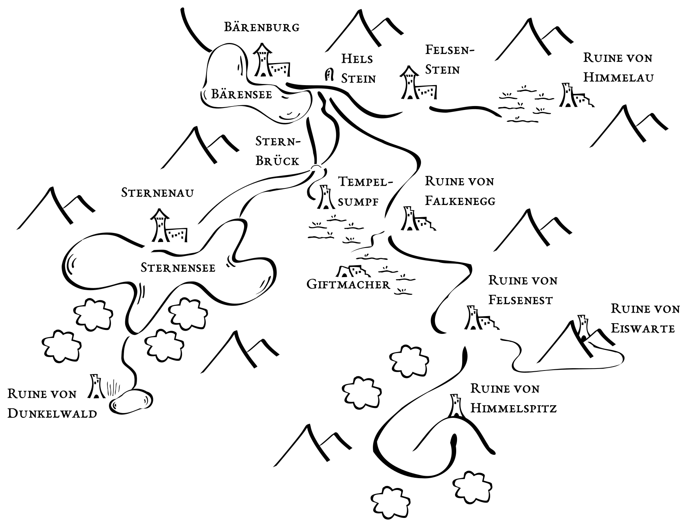
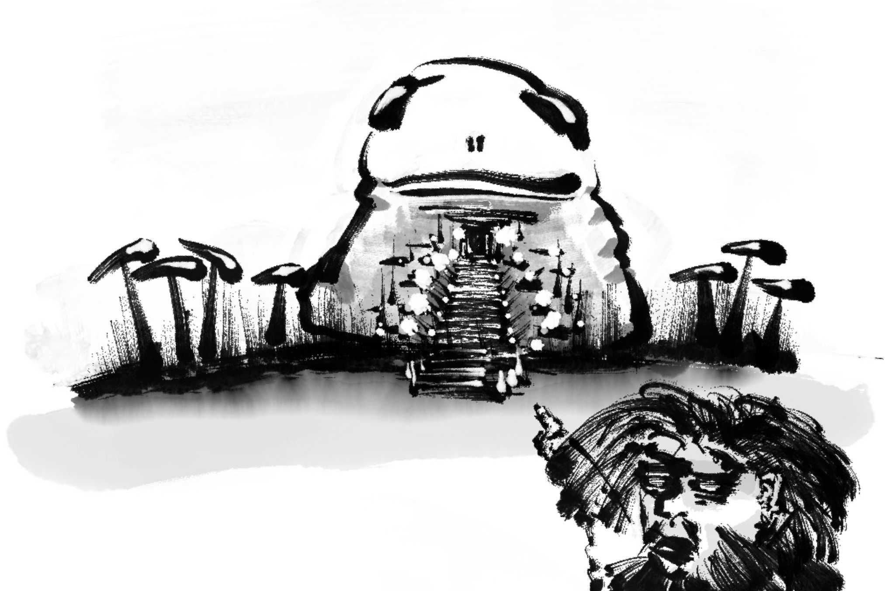
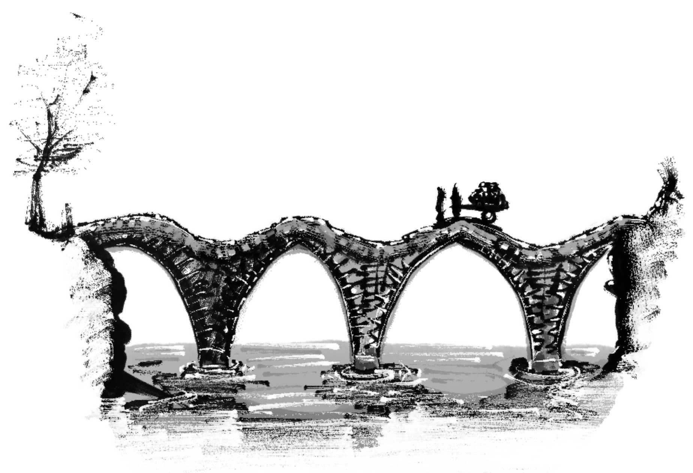

<address>Alex Schroeder, YYYY-MM-DD</address>

# Altenstein

## Introduction

This is a setting for a short campaign of *Halberts*. The rules suggest the following setup: a dozen people, in three secret societies, three castles, three temples, three magic school, each of them with names and headquarters, each of the people and organisations want three things each, and offer three rewards. I think the map can be given to players as-is. There's no point keeping the various locations a secret.

The world is at a turning point. The age of chivalry is ending. Mounted knights with lances are losing against massed infantry armed with pikes, but in remote valleys, on a small scale, this doesn't matter too much. The towns and cities are still small and their mercenary companies fight in far away lands. When they come back, they hand back their pike, cuirass and Schaller helmet, and return to civilian life. A rowdy people, poor. Always prone to cattle theft and ruin.

⚠ There are no non-player characters with Healing-3, and that means mortal wounds cannot be treated. Having two attributes drop to zero is deadly.

The regional map
{: .pic }

## Overview

### Twelve People

**Baldsind** lives in castle Bärenburg.

**Gundehard** also lives in castle Bärenburg. He’s a knight-errant who has lost his horse. Baldsind has a wonderful horse… He’s a member of the Friends of the Mountain, a secret society organising resistance to the reeve from the big city in the low lands.

**Baldweche** also lives in castle Bärenburg. She’s Baldsind’s sister and a pyromancer. She used to be Chlodoman’s student. Like him, she is a member of the Blessed of the People, a secret society of afarit worshippers.

**Ingohard** is Baldsind’s and Baldweche’s enemy and a bandit, and also a member of the Friends of the Mountain, and therefore Gundehard is bound to help him if he gets himself into trouble. He’s trying to bring down Chlodoman who is staunch defender of the (still nameless) reeve.

**Vuldeberga** lives in castle Felsenstein.

**Crotberga** also lives in castle Felsenstein. She’s a chronicler and runs the Library of Learning. She is a member of the Society of Eternal Peace, a secret society intent on keeping the Dark Lord bound in his prison.

**Osman** also lives in castle Felsenstein. He’s a wizard botanist.

**Brunman** is Crotberga’s enemy, a book thief and necromancer intent on reviving the Dark Lord, a servant of Hel. He hangs about Hel’s stone, a small temple to the goddess of witchcraft, crossroads, and the dead.

**Chlodoman** lives in castle Sternenau and is Vuldeberga’s enemy. He is a member of the Blessed of the People, a secret society of afarit worshippers, and the most famous pyromancer in the area.

**Dodo** is Clodoman’s henchman, one of Sutr’s Servants maintaining the Eternal Fire.

**Meromer** is a mercenary recently returned from a war in foreign lands. He has a nice horse and knows how to ride, deeds for the ruins of Felsenfest (currently occupied by the giant Feuerhammer) and Eiswarte (currently occupied by harpies).

**Ingolind** is Meromer’s sworn enemy, a victim of his plundering abroad, come here on his trail to take revenge.

### Three Giants

The giant **Feuerhammer** made his lair in the ruins of castle Felsenfest. He guards the Spear of Vanaheim.

The giant **Schattenschmied** made his lair in the ruins of castle Himmelau. He guards the jewels of the Dark Lord.

The giant **Giftmacher** made its lair in the Tempelsumpf, the temple’s swamp. It guards Ingoger’s Chalice.

### Three Dragons

The dragon **Eisatem** made its lair in the ruins of castle Falkenegg. It guards the Sceptre of Invincibility.

The dragon **Feuerrachen** made its lair in the ruins of Himmelspitz. It guards the necklace of Asgard. It was given to Freya by Odin and stolen by Loki who impersonated Freya, ran off with it, and used it to charm the giant Angrboda, giving birth to Hel…

The dragon **Schattenrauch** made its lair in the ruins of Dunkelwald. It guards the Sword of the Witcher.

### The Three Castles

* Bärenburg
* Sternenau
* Felsenstein

### The Three Secret Societies

* The Friends of the Mountain
* The Society of Eternal Peace
* The Blessed of the People

### The Three Temples

* Nergal, in the devil’s swamp
* Hel, at the crossroads
* Sutr, in Sternenau

### The Three Magic Schools

* The pyromancer Chlodoman in Sternenau
* The librarian Crotberga in Felsenstein
* The free botanist Osman in Felsenstein

## Bärenburg

The Bärensee (the bear lake) is foggy and cold. The castle itself is protected by a water-filled ditch and a drawbridge.

### Baldsind

The lord of this watercastle is a young and ambitious man.

> Gentleman Baldsind, 32 years old. Strength-2 Dexterity-5 Endurance-12 Intelligence-8 Education-2 Status-12 Behaviour-4 Bow-1 Bureaucracy-3 Culture-2 Diplomacy-1 Literacy-3 Tactics-3.

Baldsind owns a very nice horse:

> Baldsind’s chestnut horse: Damage-11 Endurance-27 Life-6 Attack-8 Hit-8 Escape-4.

The three obvious trails lead to Felsenstein, Sternenau, and the ruin of Falkenegg. The trail to Tempelsumpf is hard to find.

> Baldsind says: “I have inherited the tower of Tempelsumpf (the temple swamp) but it has been taken over by a dozen devils. If you get rid of these devils for me, I shall reward you all. Turn left before crossing Sternbrück (the Starbridge) and you’ll find the tower in the devils’ swamp.” → Those devils are there because Nergal was promised a hundred souls by the former owner those have not yet been delivered!

> Baldsind says: “Many years ago, my brother Baldwin was lost in castle Falkenegg when the dragon Eisatem arrived. Return our family heirloom to me, a small sceptre. I shall reward you with the hand of my sister when you do.”

### Baldweche

There is a teacher of fire magic living on a small island not far from the castle. This is Baldweche, Baldsind’s older sister.

> Pyromancer Baldweche, 36 years old. Strength-3 Dexterity-6 Endurance-6 Intelligence-6 Education-14 Status-5 Air-1 Brewing-2 Charm-1 Diplomacy-1 Doors-2 Eyes-2 Fire-3 Healing-1 Illusion-1 Knife-2 Literacy-1 People-1 Plants-1 Storm-1 Water-1.

She owns a cat that keeps badmouthing other people.

> The cat says: “You all deserve to die.”

> Baldweche says: “Don’t mind the cat.”

There is a small altar to Sutr on the island, the fire demon. Baldweche is a member of the Blessed of the People, a secret society of afarit worshippers. When surprising Baldweche, there is a 1 in 6 chance that she is conversing with a burning ifrit.

> The ifrit says: “My lord demands the death of the ice dragon. See to it.”

> Baldweche says: “I am Baldsind’s sister and a lady of the holy fire. There is a man that has been the cause of much turmoil in this vale. His name is Ingohard. A bandit and a miscreant, trying to cut off Sternensee and take it. Bring him to me, dead or alive, and I shall reward you with a boon.”

Brother and sister have each other’s back but they don’t necessarily like each other.

> Baldweche says: “I shall never marry anybody just because my brother says so. The man I might marry must be honorable and just, and the greatest wizard of the land.” But not Chlodoman.

### Gundehard

There is a knight-errant called Gundehard. He moves quietly, like a snake. Everybody thinks he’s a sneaky fellow but he is in fact an honorable man, possibly an ally for the player characters.

> Spy Gundehard, 28 years old. Strength-11 Dexterity-3 Endurance-12 Intelligence-10 Education-6 Status-6 Culture-1 Knife-1 Lance-2 Riding-3 Singing-1 Spying-3 Tactics-2.

He was granted a bit of land past Sternensee (the star lake) and wouldn’t mind taking the ruins of Dunkelwald (the dark forest) for himself. Sadly, the dragon Schattenrauch (shadow smoke) rules Dunkelwald so even Gundehard had the necessary funds to build a castle, he’d never be safe.

> Gundehard says: “My valiant horse was slain by Schattenschmied (the shadow smith), the giant guarding the jewels of the Dark Lord. Help me get a horse and I shall help you in your endeavours while I am able.” → Gundehard is a member of the Friends of the Mountain secret society and an honorable man.

> Gundehard says: “I own some land beyond Sternensee. Accompany me there and we shall have a most wonderful time. Do you sing?”

Gundehard is not afraid of the bandits but also avoids talking about them. Both he and Ingohard are members of a secret society sworn to resist the reeve’s influence.

> Gundehard says: “Beware Chlodoman the craven servant of the reeve. He’s not a good friend to have.”

## Tempelsumpf

The ruins of the Tempelsumpf (the devil’s swamp) are full of devils. This is a rotten place. It stinks. It’s dark. The main hall holds a temple of Nergal. Human bones have been been collected, here. People have been killed in the swamp and brought here, as sacrifice.

> 11 swamp devils: Damage-7 Endurance-1 Life-2 Attack-8 Hit-8 Escape-4.

> The devils expect worshippers and call out to any that approach: “Who have you brought? Who have you killed? We are hungry for souls! Nergal seeks new servants! A boon for a kill! A boon for a kill!”

Baldsind has come here to sacrifice in the past. His last victim was Ingrid, sister of Ingohard. In exchange, his brother Baldwin was able to take Falkenegg. And then, in an ironic twist, the ice dragon came and undid it all. Now, Baldsind no longer trusts the devils, of course.

## Hels Stein

Hel is the demon goddess of the underworld; the caretaker of all those who died in their beds, of old age and disease. She’s also the goddess of magic, of witchcraft, of crossroads, and of multi-headed animals. Here, a the crossroads behind the Bärensee (the bear lake), it stands, a black rock showing a woman with a tree-headed dog at her feet. This is the Altenstein (the old stone) that gave this valley its name.

### Brunman

Near the stone is a small camp of a travelling necromancer. Hidden away under bushes and stones is book wrapped in oilskin protected by a spell of disinterest. The person camping here shapechanges into a crow if he notices anybody approaching. As one of his companions is a foulmouthed crow, that now makes two of them.

> Brunman, 34 years old. Strength-6 Dexterity-5 Endurance-4 Intelligence-10 Education-13 Status-5 Air-1 Animals-1 Climb-2 Distract-2 Fire-1 Fusion-1 Literacy-1 Necromancy-1 Pick-1 Shapeshift-1 Sneaking-2 Spying-1 Storm-2.

> Herd dog: Damage-7 Endurance-14 Life-7 Attack-10 Hit-11 Escape-3.

> The crow says: “Touch anything and your skin shall rot while you live and worms shall eat your heart. Turn back while you still can.”

> Brunman says: “I am looking for courageous people willing to fight the nobles. Help me steal the book about the giant Schattenschmied (the shadow smith) from the library in Felsenstein and I’ll owe you a boon. This giant is the blight of Himmelau!

## Felsenstein

High above the village stands the fortress Felsenstein (a rocky rock). The valley is quite narrow and whoever controls the fortress controls access the upper valley, i.e. the swamp of Himmelau. Trails lead both to Bärenburg and Himmelau.

### Vuldeberga

> Speaker Vuldeberga, 28 years old. Strength-8 Dexterity-9 Endurance-5 Intelligence-8 Education-9 Status-11 Behaviour-2 Bureaucracy-1 Culture-2 Literacy-2 Oratory-3 Running-1 Trade-2.

Vuldeberga does not like Chlodoman and the reeve, but she’s weak and needs stronger friends before she can make a move.

> Vuldeberga says: “Everybody hates the bandits but both Baldsind and Chlodoman stole so much more than Ingohard ever did. Bring me the Sceptre of Invincibility that Balsind’s brother Baldwin brought to Falkenegg and I’ll tell you more.”

> Vuldeberga says: “I don’t mind the giant Schattenschmied as long as he stays in his tower.”

### Crotberga

> Chronicler Crotberga, 32 years old. Strength-6 Dexterity-8 Endurance-7 Intelligence-3 Education-11 Status-7 Air-1 Brewing-2 Charm-1 Diplomacy-1 Earth-1 Fire-1 Healing-1 Illusion-1 Literacy-3 People-1 Plants-1 Singing-2 Water-1.

She maintains the Library of Learning, an old archive with records that were preserved during the reign of the Dark Lord. She is a member of the Society of Eternal Peace, a secret society intent on keeping the Dark Lord bound in his prison.

> Crotberga says: “We must rebuild what we have lost. Already nobody knows how to build roads and how to drain the swamps. Brunman is a necromancer and a book thief who took a book from my library. Bring it back to me.”

> Crotberga says: “We must make sure the Dark Lord never returns. I have heard that the giant Schattenschmied (the shadow smith) in the ruins of Himmelau has reforged the jewels of the Dark Lord. Discover whether there is any truth to that and destroy these jewels, if you can.”

There is a book about shadow magic in the library. With it, you pull power from Myrkheim. It was a favourite technique of the Dark Lord. They say that to stop it, one has to visit Myrkheim, the realm of the dwarves, of dreary darkness, of fens.

### Osman

Osman is a few years younger than Crotberga, a travelling botanist currently visiting the library. He’s a bit of a free agent, possibly an ally for the player characters, like Gundehard.

> Osman, 29 years old. Strength-5 Dexterity-7 Endurance-3 Intelligence-8 Education-11 Status-6 Doors-2 Eyes-2 Healing-1 Literacy-1 Plants-2 Sleep-1.

He’s here trying to research the Necklace of Asgard at the library.

> Osman says: “I’m looking for the Necklace of Asgard. Hermegiselus, king of the Warna, king of the crows, last wore it and when he died during the mountain crossing when the Heruli went to war against Thrakia in the south. Perhaps he died somewhere in this valley. Help me search for it and I shall take you to Asgard to see the gods themselves.”

## Ruine von Himmelau

The Himmel (heaven) river originates back here, from a long and narrow lake that silted up, full of brown reeds and white birches, cold mud and and black water. Somewhere in there lies a rock that fell from the cliffs above ages ago and on it stands the old tower of Himmelau (heaven’s river island), reachable by boat, or not at all. There is no boat.

The trail follows the water as it runs down past Felsenstein to Bärenburg.

The giant who lives in this ruined tower is as tall as three men, muscular and grey, with white eyes as if he were blind, but he’s not. He sees you, feels you. You disturb his shadow weaving and he resents it.

> Schattenschmied, giant. Damage-17 Endurance-32 Life-12 Attack-6 Escape-5.

He’s not fast, but he knows how to weave shadows, building up a grey storm of fog, smoke, and dying light, shaping it into a tentacle that whips through the air, builds up, and when it finds you, it crushes you.

The valley walls cast long shadows across the swamp. The giant living here gives these shadows a life of its own.

> 2 shadows. Damage-6 Endurance-11 Life-18 Attack-9 Hit-8 Escape-5.

The power of shadow weaponry is an arcane art bound to the jewel of the Dark Lord. The giant found it many years ago and mastered it. Now he sits here and sends his shadowy tendrils out to contact other agents of evil.

## Myrkheim

One way to weaken Schattenschmied is to take away his shadow weaving powers by cutting them at the source: no more spying, no more shadow tendrils. The roots of Yggdrasil lead from a dark passage between the reeds of Himmelau to a lake deep beneath the earth, in eternal night, to Myrkheim – the land of dwarves, mykonids, and froglings.

Schattenschmied’s jewel draws its shadow magic from the Lake of Eyes via a shadow tendril pinned to the lake’s bottom by the Moonlight Spear, an artefact that belonged to the order of Lunar Knights from Alfheim, allowing the bearer to see magic energies and to pin them in place. The lake gets it name from the beholder below which spawns eyes when it is excited. They bubble up when things are afoot. Right now, they wash ashore putrid and drained.

Brá Alderfist is leading a party of wild dwarves to find and capture Banupal, the high priest of Tsathoggua. He lives in a frog temple of Tsathoggua overlooking the lake, supported by a spear bearing servant. Banupal can see through the eyes rotting along the shore. How to enter the frog sanctum and surprise the all-seeing priest who keeps bottled eyes on shelves?

> 8 wild dwarves, including Brá Alderfist. Damage-6 Endurance-4 Life-2 Attack-9 Hit-7 Escape-4.

> Banupal, frogling high priest. Damage-3 Endurance-11 Life-8 Attack-6 Hit-8 Escape-6 Shadow-2 Lightning-2 Eyes-2. Hide in shadows and shadow jump. Lightning bolt for 2d6. See through floating eyes.

> Stich, the spear bearing frogling servant: Damage-7 Endurance-1 Life-2 Attack-7 Hit-11 Escape-6. Beware the jumping charge!

Brá pointing across the Lake of Eyes at the Tsathoggua temple
{: .pic }

## Sternenbrück

The bridge going over the Sternen (the star river) is ancient and narrow, with two tall arches. The Sternental (the star valley) is very narrow, with bare cliffs and secret caverns and hiding places up there. Upriver leads to Sternenau, downriver leads to Bärenburg.

Two peasants on their way to Sternenau
{: .pic }

### Ingohard

Ingohard is a member of the Friends of the Mountain secret society and an honorable man, like Gundehard. The secret society is sworn to resist the reeve’s influence. He also hates Baldsind for having killed Ingrid many years ago.

> Ingohard, 32 years old. Strength-6 Dexterity-6 Endurance-8 Intelligence-7 Education-6 Status-11 First Aid-1 Behaviour-2 Brewing-1 Crafts-1 Distract-2 Epee-2 Oratory-2 Running-1 Singing-1 Sneaking-1 Spying-1 Tactics-1 Tinker-1.

> Ingohard says: “Listen to me! Baldsind and Baldweche are agents of corruption. They killed my sister Ingrid many years ago. I have proof! I can show you where she lies. Come with me to the Tempelsumpf and you shall see.”

He is the captain of a bunch of peasant bandits. They don’t actually harm anybody, fleeing at the first opportunity. He’s mostly trying to scare away messengers, merchants, nobles with their wannbe-wizard children, isolating Sternenau and then perhaps one day taking it by trickery.

> Bandits: Damage-3 Endurance-7 Life-6 Attack-8 Hit-5 Escape-11

## Sternenau

The fortress stands on shores of the Sternensee (star lake), covered in mist. A moat and drawing bridge control the aproach.

A trail leads along the river to Sternenbrück and Bärenburg. Up river is yet another lake, much smaller, hidden away behind a dark forest. There lies the ruined tower of Dunkewald.

> Pyromancer Chlodoman, 49 years old. Strength-9 Dexterity-6 Endurance-4 Intelligence-12 Education-10 Status-10 Air-3 Culture-2 Fire-5 Fusion-2 Literacy-1 Singing-1 Spying-1 Storm-3 Transmutation-2 Water-1. Owns an intelligent cat.

Chlodoman is a member of the Blessed of the People, a secret society of afarit worshippers. 

> Chlodoman says: “My best student is Baldweche, Baldsind’s sister at Bärenburg.”

> Chlodoman says, “Unfortunately, Baldsind is a fool. He’s not going to make a move against Vuldeberga in Felsenstein. She’s a rebel and a traitor and the reeve and I would reward any just and honourable fellow who brings her down.”

Chlodoman worships at the altar of Sutr and maintains a fire pit in the cellar beneath his castle. From the lake, you can see the flickering orange lights through the mist. It looks like a grinning demon.

> Dodo is Chlodoman’s loyal servant and the acting priest of Sutr. Strength-5 Dexterity-11 Endurance-4 Intelligence-7 Education-9 Status-3.

## Ruin of Falkenegg

The ruined castle is built above a village of husks and rubble. The view from up there is excellent, but the dragon Eisatem (ice breath) keeps all away.

> Eisatem, ice dragon. Damage-22 Endurance-35 Life-16 Attack-6 Escape-1. White and hard to spot when it lies hidden in the ice on the mountain above.

Many people died, here. One of them was Baldsind’s brother Baldwin. He carried the Sceptre of Invincibility. Instead of challenging him to a fight, the dragon brought down an avalanche on him and killed him with cold and ice. Baldwin died, undefeated, from hypothermia.

The trail from Bärenburg hugs the foot of the mountain, trying to keep above the swamp to the west, passes beneath the village and continues south to Felsenfest.

## Ruine von Felsenfest

A small ruin wins itself up the rock upon which the fortress was built. Down below is a burnt down village. The trail from Bärensee and Falkenegg (falcon’s corner) starts it’s ascent towards the pass south past the ruin of Himmelspitz (sky peak). There is also the narrow and steep Eisthal (ice valley) that ends at a glacier. Overlooking that glacier stands the ruined tower of Eiswarte (ice watch).

Fortress Felsenfest has been occupied by the giant Feuerhammer (fire hammer). He was once a war giant in a demonic army on Vanaheim but made his escape to Midgard. He brought with him the Spear of Vanaheim. It bears the runes of Pazuzu and gives off fumes that are said to poison the wombs of all who bear children and to destroy the lungs of all who do not.

> Feuerhammer, giant. Damage-10 Endurance-31 Life-13 Attack-7 Escape-5. He looks like a dwarf as big as three men, with legs like tree trunks and arms to bend steel bars.

> Feuerhammer says: “I have found my peace in this place. Leave now and never return, for I claim this land as my own. You are not welcome here.”

### Meromer

Outside the village camps a black haired youth, a simple young man from Felsenstein who had run afoul of Vuldeberga as a youth, trying to extort money from the locals. He fled, joined a company mercenaries, fought, got rewarded with deeds to the Eisthal and decided to return. Now he finds the fortress at the opening of Eisthal and the tower at the end of it both in ruins and occupied.

> Meromer, 28 years old. Strength-5 Dexterity-4 Endurance-3 Intelligence-2 Education-5 Status-4 Building-2 Bureaucracy-2 Crafts-1 Culture-2 Brawling-1 Riding-1 Singing-1 Spear-2.

> Meromer’s white horse: Damage-11 Endurance-19 Life-12 Attack-5 Hit-7 Escape-6.

> Meromer says: “Help me reconquer what is rightfully mine and I shall reward you.”

## Eiswarte

A ruined tower, now a nesting place for two harpies.

> Harpies: Damage-5 Endurance-3 Life-6 Attack-9 Escape-9. They can fly.

> They sing songs of lust and violence: “Stay with us! Father of our children.”

## Ruine von Himmelspitz

Der Turm steht weit oben auf einem Hügel im Wald. Hier hat man eine gute Aussicht über den Talboden.

🐉 Feuerrachen
Damage-25 Endurance-29 Life-20 Attack-3 Escape-4
Ein Drachen so gross wie ein Haus, Flügel sicher zehn Spannen lang, die Zähne sicher ein Fuss lang.

Er bewacht die Halskette von Asgard.

Ein Weg führt zur Ruine von Felsenfest.

## Ruine von Dunkelwald

Der Turm steht gut versteckt an einem kleinen, verwunschenen See im Wald. Sonnenschein glitzert auf dem Wasser. Vögel pfeifen im Schilf.

🐉 Schattenrauch
Damage-23 Endurance-36 Life-20 Attack-5 Escape-5
Ein drahtiges Wesen, langbeinig, langarmig, mit riesigen Schwingen.

Er bewacht das Schwert des Hexers.

Ein Weg führt zur Sternenau.

## Riesen in der Wildnis

### Giftmacher

🧔 Giftmacher
Damage-11 Endurance-18 Life-17 Attack-4 Escape-4
Ein bärtiger Mann, so gross wie drei Mensch, langsam, sorgfältig. Die Proportionen stimmen irgendwie nicht. Die Beine sind zu breit, die Arme zu dick.

Er bewacht den Kelch des Heiligen Ingoger.

In einem fernen Sumpf, wo grauer Nebel über grauem Schlick die Sicht behindert, lebt er in einer halb versunkenen Festung. Nehmt euch in acht vor den Irrlichtern, welche euch Heim und Herd vorgaukeln und doch nur immer weiter in die Irre führen. Am Ende seid ihr den Nachtlingen hilflos ausgeliefert. Teufel (Damage-3 Endurance-6 Life-5 Attack-10 Escape-6 Number-9)

Ein Weg führt zur Ruine von Falkenegg.
