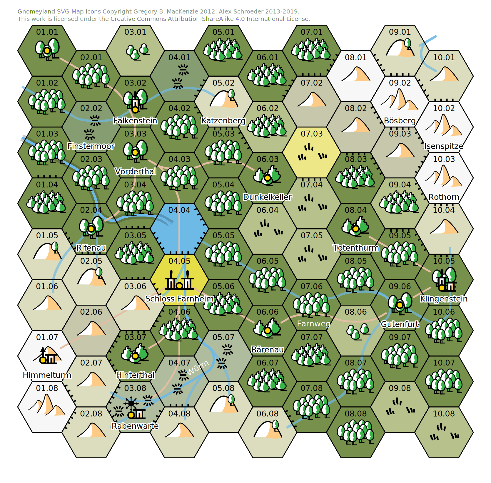
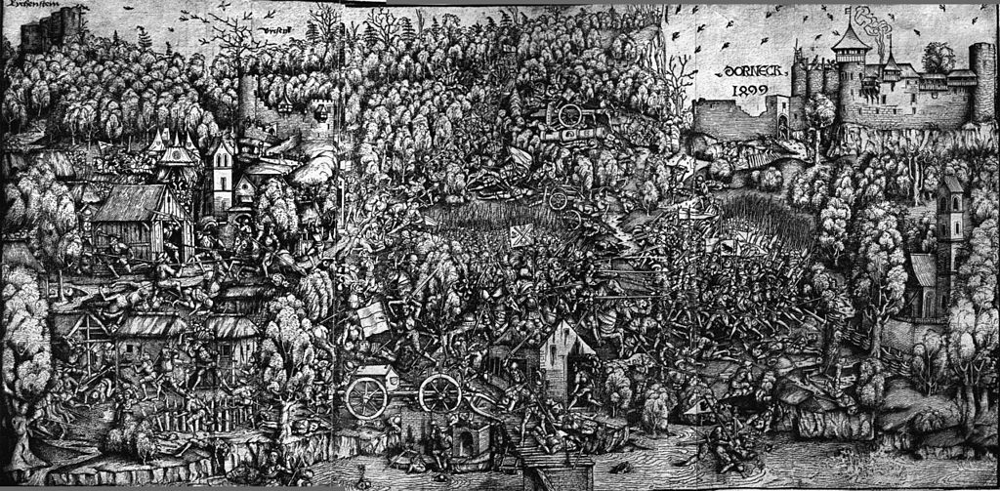

# Das Farnthal

## Einleitung

Das Farnthal ist ein Dokument, in dem ich erzähle, wie ich die
Kampagne entwickelt habe, basierend auf dem Weltenbau Kapitel in den
[Helmbarten](https://alexschroeder.ch/pdfs/Helmbarten.pdf) Regeln und
dem Sammelsurium von Vorlieben und Entscheidungen früherer Kampagnen.

## Anpassung der Karte

Mit [Text Mapper](https://campaignwiki.org/text-mapper/) habe ich die
Karte etwas angepasst: Es gibt nun einen durchgehenden Weg von Osten
nach Westen. Der Fluss im Osten fliesst nun ebenfalls nach Westen, Tal
abwärts. Die bekannten Ortsnamen habe ich verteilt und die restlichen
Ortschaften benannt.

Die angepasste Karte
{: .pic }

## Götter und Dämonen

In meinen Kampagnen verwende ich immer wieder dieselben Götter und
Dämonen: **Odin**, der einäugige, weise, fiese, harte Vater, mit
seinem Speer und seiner Wilden Jagd. **Freya**, der alle zu Dank
verpflichtet sind, die sich von Feld, Wald und Wiese ernähren.
**Thor** mit seinem Hammer, jähzornig, einfach gestrickt,
abenteuerlustig. **Mitra** mit ihren Schwüren und Bunden, den
unterirdischen Ritualen, der Verehrung von Stier und Waage.
**Marduk**, der Monsterjäger, der Keulenträger, der wilde Mann.
**Ishtar**, die Göttin von Schönheit, der Verliebten, der
Eifersüchtigen, der Grausamen, der Rächenden. **Set**, der Dämon der
Mörder, der Schlangen, der Giftmischer, der Echsenmenschen. **Orcus**,
der Schlaumeier, der Ziegenkopf, der Herr der Untoten. **Pazuzu**,
Herr der Geier und der Pest, mit seinen vier Flügeln. **Nergal**, der
Herr der Unterwelt, der Toten, der Lähmung, der Angst. **Hel**,
Schutzherrin der Hexen, der Wegscheiden und Kreuzungen, Hunde und
Wölfe. **Zathogga**, der Herr der Frösche, der Sümpfe, der Untätigkeit
und der Völlerei.

Je nachdem gibt es dann natürlich immer auch noch andere Götter und
Dämonen, die immer wieder mal auftauchen: **Loki**, der Freund aller
Gestaltwandler und Halunken; **Garaskis**, die Herrin der Krebse, der
Rache, Verführerin der Fischer, und so weiter.

Mir gefällt auch der Gedanke, dass jeder Stadtstaat ursprünglich eine
eigene Göttin oder einen eigenen Gott hat und sich die „Portfolios“
deswegen auch ohne weiteres überschneiden, und dass auch die
schlimmsten von ihnen noch geduldet werden, weil jemand davon
profitieren könnte: Wer einen Mörder anheuern will, sucht den Set
Tempel auf; wer jemanden wiederauferstehen lassen will, sucht den
Orcus Tempel auf; wer Angst vor der nächsten Pandemie hat, sucht den
Pazuzu Tempel auf; wer seine Gegner verfluchen will, sucht den Nergal
Tempel auf; wer Ratschlag braucht, sucht den Hel Tempel auf; wer
unverdient reich werden will, sucht den Zathogga Tempel auf.

Meine Lieblinge tauchen halt auch immer wieder auf, weil sie mir
geläufig sind. Wem also die Zwölfgötter von Aventurien geläufiger sind
oder wer seinen eigenen Pantheon aufgestellt hat, verwendet diese, das
ist klar.

Generell halte ich es auch mit einer einfachen Faustregel: Die Götter
der Ordnung und ihre Tempel findet man in den Bergen, in der Nähe vom
ewigen Eis, nahe am Himmel und der Sonne, in weiss und blau. Die
Dämonen des Chaos hingegen leben in den Sümpfen, bei den Mücken,
Krokodilen, dem Fieber, wo man sich benommen durch den Schlamm kämpft
und wo die Blutegel auf uns warten. Ihre Farben sind grün, braun und
rot.

Was die Ebenen anbelangt, verwende ich ein nordisch inspiriertes
System: **Asgard** ist das Reich der Götter, **Alfheim** das Reich der
Elfen, **Midgard** das Reich der Menschen, **Myrkheim** das Reich der
Zwerge, **Jötunheim** das Reich der Riesen, **Vanaheim** das Reich der
Dämonen, **Niflheim** das Reich der Trolle und **Muspelheim** das
Reich der Salamander.

## Ausgangslage

Wo soll das Spiel beginnen? Im grössten Ort, also auf Schloss
Farnheim. Das gibt uns schon mal zwei Personen, Vuldetrada und
Wisigarde. Also fange ich mal mit einer kleinen Beschreibung des Ortes
auf der Wiki an. Der Fluss hat neuerdings einen Namen.

> Das Schloss steht weit oberhalb des Farnsees. Ein steiler Weg führt
> neben dem Wasserfall der Würm hinab zum See. Unten hat es einen
> kleinen Hafen für die Fischer und den Fährmann, der Reisende zur
> Strasse nach Falkenstein führt.

Die Beschreibung der Damen ist aus dem Regelwerk kopiert:

> **Vuldetrada** ist die Baronin vom Schloss Farnheim, reich und
> ledig.
>
> **Wisigarde** ist die berühmte Sängerin vom Schloss Farnheim und die
> Geliebte der Vuldetrada. Ihr Chor ist gleichzeitig auch eine Schule
> für Diplomatie, Menschenkenntnis, Illusionsmagie und vieles mehr.

Wen könnte ich noch auf der Burg haben? Ich habe nochmals die
Beschreibungen durchgelesen und finde den Gundobad, der Vuldetrada
heiraten will.

> **Gundobad** ist Ritter von Rifenau und zu Besuch.

Damit ich schnell was zur Hand habe, schreibe ich gerne ein oder zwei
Sätze direkter Rede auf. Wenn ich ins Rotieren komme, kann ich etwas
ablesen.

Wisigarde mag Gundobad nicht und würde ihn gerne loswerden. Wer sich
mit ihr also gut stellen will, hilft ihr, Vuldetrada davon zu
überzeugen, dass Gundobad ein Selbstmordkommando übernehmen soll.
Gundobad will mehr über den Kelch erfahren. Wer ihm dabei hilft,
Wisigarde zu überstimmen, stellt sich bei ihm gut. Beides geht nicht.

> Wisigarde sagt: “Gundobad der Widerling ist zu Besuch. Wie sehr ich
> mir doch wünschte, er würde sich für das Tal nützlich machen. Soll
> er doch den Drachen von der Rabenwarte erschlagen! Das wäre eine
> Tat, eines Ritters würdig!”
> 
> Gundobad sagt: “Holde Vuldetrada, euer Ruhm und euer Reichtum sind
> ohnegleichen. Vor allem heisst es, dass Wisigarde aber die schönste
> Sängerin in diesem Land sei, und ihr Wissen die Geschichte der
> ganzen Menschheit umfasst! Darum bitte ich euch, lasst Wisigarde das
> Lied vom Kelch der Erlösung singen!”
> 
> Vuldetrada sagt: “Nun denn, so sei es. Doch euch will ich im
> Gegenzug auftragen, in meinem Namen zum Himmelturm aufzusteigen und
> meiner Cousine Frieda meine Grüsse zu überbringen.”

Und am Ende noch ein Schuss ins Blaue. Vielleicht passiert ja im
Himmelturm etwas interessantes? Da muss ich noch Gegner vorbereiten.
Banditen!

## Was fehlt?

**Banditen**… Menschen fehlen auf der Monster Tabelle! Ritter und
Mörder sind meist alleine unterwegs, für die anderen gilt Anzahl 2W6.

| 1W6 | Menschen | Schaden | Ausdauer | Leben | Angriff | Treffen | Flucht |
|:---:|---------:|:-------:|:--------:|:-----:|:-------:|:-------:|:------:|
| 1   |   Bauern | 2W6     | 2W6      | 2W6   | 1W6+2   | 1W6+3   |  1W6+5 |
| 2   | Banditen | 2W6     | 2W6      | 2W6   | 1W6+3   | 1W6+4   |  1W6+3 |
| 4   |   Reiter | 2W6     | 1W6+4    | 2W6   | 1W6+5   | 1W6+6   |  1W6+2 |
| 3   |  Söldner | 3W6     | 1W6+5    | 2W6   | 1W6+4   | 1W6+5   |  1W6+1 |
| 5   |   Ritter | 3W6     | 1W6+6    | 2W6   | 1W6+5   | 1W6+6   |  1W6+1 |
| 6   |   Mörder | 2W6     | 2W6      | 1W+6  | 1W6+6   | 1W6+7   |  1W6+0 |

Für die 9 **Banditen** auf Weg zum Himmelturm soll gelten: Schaden-7,
Ausdauer-7, Leben-10, Angriff-7, Treffen-6, Flucht-5. Ihr Anführer ist
**Adalgard** Kraft-5, Geschick-10, Ausdauer-2, Intelligenz-5,
Bildung-7, Status-6, Kämpfen-2, Taktik-2, Feldscher-2, Schleichen-1,
Bauen-1, Benehmen-1. Hier habe ich einfach ein paar Talente
ausgewürfelt. Wie man sieht, hätte es auch gepasst, wenn Adalgard
einfach überall einen Wert von 2 hat.

Wenn ich mir die Tabelle der Tätigkeiten anschaue, stelle ich fest,
dass es in meiner Liste der Personen keine Diebe gibt! Obwohl einer
der drei Geheimbunde eine Diebesgilde ist? Vielleicht eher nicht.

Ich habe drei Drachen aber nur zwei Riesen. Wo ist er dritte?
Vielleicht ist er der Chef einer Diebesgilde? Der Dieb mit den
längsten Fingern, König Langfinger vom Berg! Und von welchem Berg? Der
Berg von 08.01 ist noch unbesetzt, aber alle Berge daneben sind schon
besetzt: Bösberg hat einen Riesen, Isenspitze einen Drachen, Rothorn
wieder einen Riesen… Vielleicht ist der dritte Riese nicht auf der
Karte! Entweder bei 05.09 im Süden, oder irgendwo im Westen, Tal
aufwärts. Oder in der mythischen Unterwelt! König Langfinger vom
Unterberg!

Bleiben wir mal bei den Goblins bzw. Schattenelfen und Riesenspinnen
aus den Helmbarten Regeln und denken uns noch vier weitere aus.

| 1W6 |        Gegner | Schaden | Ausdauer | Leben | Angriff | Treffen | Flucht |
|:---:|--------------:|:-------:|:--------:|:-----:|:-------:|:-------:|:------:|
| 1   | Schattenelfen | 3       | 1        | 5     | 5       | 9       |      4 |
| 2   | Riesenspinnen | 15      | 16       | 12    | 9       | 5       |      7 |
| 3   |   Froschlinge | 4       | 4        | 1     | 6       | 6       |      5 |
| 4   |  Waldmenschen | 9       | 6        | 7     | 4       | 7       |     10 |
| 5   |     Bergwölfe | 4       | 14       | 2     | 10      | 9       |      5 |
| 6   |   Tote Büsser | 7       | 5        | 20    | 12      | 13      |      4 |

## Der erste Spielabend

Mal schauen, wofür sich Claudia (meine Spielerin) interessiert. Dort
will ich mehr vorbereiten, alles andere lasse ich sein.

Charaktererschaffung. Das erste Problem ist der Name. Wir würfeln und
finden „Theuderica“ – genannt Teriki. Die Attribute: Kraft-5,
Geschick-7, Ausdauer-9, Intelligenz-4, Bildung-11, Status-8. Sieht
nach einer Magierin aus!

Mit 16 fängt das Leben an. Die Talente: Luft-1, Brauen-2, Türen-1.
Teriki hat Glück und es gibt keinen Schicksalsschlag. Mit 20 geht es
weiter: Illusion-1, Diplomatie-1, Nekromantie-1, Messer-1, und wieder
gibt es keinen Schicksalsschlag. Mit 24 noch einmal Magier sein:
Feuer-1, Augen-1, Singen-1, Weltenwandeln-1. Und nun kommt es doch zu
einem Schicksalsschlag, doch Teriki hat Glück und handelt sich nur
eine Todfeind ein. Wir bestimmen später, wer es ist. Es ist Zeit für
den Austritt – und die Belohnungen.

Es gibt einen Gefährten (eine Krähe namens Rax), die Mitgliedschaft in
einem Geheimbund (nach einer kurzen Vorstellungsrunde der drei
Optionen wählt sie die Pentarchen des Kreises und wird damit eine der
fünf), und Bildung +1, was Bildung-12 bedeutet. Wahnsinn!

Mir fällt auf, wie breit gestreut man ist, wenn man mal hier und mal
da würfelt. Claudia wählt: Agressiv, 3× Passiv, 2×Manipulativ,
Transgressiv, 2× Agressiv, Passiv, Manipulativ, Transgressiv. Also
sehr gleichmässig verteilt. Ich sage ihr, dass ein Talent von 1 gut
genug ist, um damit einen Beruf auszuüben.

Wir schauen auf die Karte und ich erzähle, wer Theudetrud (Trudi) von
Bärenau ist (die Anführerin des Geheimbundes), und wer die drei
Drachen sind, welche die Pentarchen zu schützen versuchen, damit die
Kriegstreiber dieser Welt zuhause bleiben: Pesthauch bei der
Rabenwarte, wo Hildegard lebt, die Hohepriesterin des Pazuzu;
Frostatem von der Isenspitze, und Schattenspeier vom Finstermoor.
Ausserdem erzähle ich, dass Trudi das Buch der Macht sucht, welches
der letzte dunkle Herrscher geschrieben hat.

Da wir schon auf die Karte schauen, stellt sich die Frage, woher
Teriki denn kommt. Ich sage ihr, dass Chlodogunda Feldherrin von
Klingenstein ist, und wenn sie dort daheim ist, dann wird das Spiel um
den Konflikt zwischen Chlodogunda und Vuldetrada sein. Gertrud ist die
Hexe vom Katzenberg, welche versucht, die Pentarchen des Kreises zu
finden und zu beseitigen. Wenn Teriki dort daheim ist, dann ist sie
eine Doppelagentin! Super spannend, aber auch heikel! Amalgund ist der
Baron von Falkenstein, einem grossen Dorf Richtung Talausgang. Oder
sonst halt eines der kleinen Dörfer ohne Burg? Und so kommt Teriki aus
Vorderthal, und das Spiel wird sich im Moment auch mehr um diese
Gegend drehen. Passt!

## Schloss Farnheim

Teriki ist auf Schloss Farnheim und redet mit Wisigarde. Teriki war
einmal ihre Schülerin, beschliessen wir. Wisigarde würde gerne den
Gundobad, der im Moment auf Besuch ist, gegen den Drachen Pesthauch
schicken. So wäre er aus dem Weg – oder hätte sich wenigstens nützlich
gemacht. Nur widerspricht das leider den Zielen der Pentarchen.

Als sie mit Vuldetrada reden will, ist Gundobad schon bei ihr und sie
streiten. Teriki will lauschen. Wir machen das so: Sie hört Gundobads
Ansage, dann machen wir eine Probe auf Geschick und Schleichen (was
Teriki nicht kann), und falls es gelingt, hört sie auch Vuldetradas
Antwort. Die Probe gelingt und so hört sie, wie Gundobad das Lied vom
Kelch der Erlösung hören will, und wie Vuldetrada ihn zu ihrer Cousine
Frieda vom Himmelturm schicken will. Und Frieda ist Hohepriesterin von
Marduk, welcher wiederum die Monster jagt, so dass zu vermuten steht,
dass Frieda ebenfalls versuchen wird, Gundobad gegen den Drachen zu
hetzen, da dieser ja ganz in der Nähe ist, was Teriki verhindern will.
Claudia beschliesst, dass Teriki Gundobad begleiten wird.
Ausgezeichnet! Sie will am Abendessen mit dabei sein. Ich verlange
eine Status+Diplomatie Probe, welche bestanden wird. Sie ist
willkommener Gast.

Bleibt noch die Sache mit dem Lied. Mit Bildung 12 ist klar, dass
Teriki weiss, dass der Kelch Wasser zu Gift verwandelt. Claudia sagt
mir, dass sie nicht versteht, was an dem Kelch so toll sein soll.
Ehrlicherweise verstehe ich es auch nicht. Ich denke an den
Nibelungenring und an den Zwerg Alberich, den Wotan und Loge gefangen
und beraubt haben, und wie der Zwerg sie und den Ring verflucht: „Wer
ihn besitzt, den sehre die Sorge, und wer ihn nicht hat, den nage der
Neid … So lang’ er lebt, sterb’ er lechzend dahin, des Ringes Herr als
des Ringes Knecht!“ und so fange ich an, eine Geschichte zu spinnen:
Der Kelch wurde vom Zwerg Angrim geschmiedet. Wer ihn besitzt, wird
reich; Silber und Gold sind immer zum greifen nah. Angrim hat den
Kelch verflucht, nur wissen das viele nicht: Aus dem Kelch darf man
nicht trinken. Doch wer sich gierig zeigt, den holt der Fluch ein. Sei
es, weil der König zufällig in der Nähe ist und verlangt, dass aus dem
Kelch getrunken werde, oder aus sonst einem Grund: Am Ende trinkt man
aus dem Kelch und ist des Todes. Der letzte bekannte Besitzer des
Kelchs war der Grossvater von Amalgund von Falkenstein. Ich denke mir,
dass Teriki nicht gleich erfahren wird, wo der Kelch genau liegt.

Wisigarde singt das Lied vom Kelch, und nun weiss auch Gundobad, dass
der Kelch verflucht ist, und wer ihn zuletzt hatte. Ich mache
deutlich, dass Gundobad nickt, als er vom Ende der früheren Besitzer
hört. Teriki hakt nach und erfährt, dass Gundobad nur den ersten Teil
des Liedes kannte, den bekannten Teil, wo erzählt wird, wie der Kelch
reich macht. Der zweite Teil war ihm unbekannt.

Das nächste Mal geht es weiter mit der Reise von Teriki und Gundobad
in die Berge, zu Frieda und dem Himmelturm, an Banditen vorbei und in
einen Marduk Tempel.

Ich muss mir mal überlegen, welche Talente Wisigarde und Frieda haben.

## Vorbereitung und losmarschieren

Zur Vorbereitung habe ich mir die Werte von einem Typen generiert, den
man als Sidekick gut brauchen könnte.

> Spion **Baldmer** 947A54 Kultur-2 Messer-3 Singen-3 Spionieren-4
> Taktik-1, besitzt ein Stück Wald mit einem Teich.

Wir verwenden diesen als Knappen für Gundobad, den Teriki heute nach
Himmelturm begleiten soll. Und es stellt sich die Frage, was für Werte
Gundobad haben soll. Ich generiere so lange Charaktere, bis ein
passender Krieger erscheint.

> **Gundobad** C9482A Benehmen-3 Bürokratie-2 Diplomatie-1 Kultur-1
> Messer-3 Schrift-1 Singen-1 Spionieren-1.

Mir fällt auf, dass hier jeder singen kann. Der Einfluss von
Wisigardes Chor steigt… Ausserdem habe ich wieder angefangen, die Hex
Notation zu verwenden: A ist 10, B ist 11, C ist 12, und so weiter.
Ich habe auch angefangen, die Monster so zu notieren. Statt Kraft,
Geschick, Ausdauer, Intelligenz, Bildung und Status sind die sechs
Attribute Schaden, Ausdauer, Leben, Angriff, Flucht, Anzahl. Für die
Banditen also 77A759.

Interessanterweise fragt Claudia zu Beginn, ob Teriki und Gundobad
Wachen anheuern sollen oder ob Gundobad nicht Wachen hat. Ich sage
ihr, dass wir wie Ritter der Tafelrunde seien. Lancelot würde auch
nicht sechs Wachen anheuern. Claudia meint dazu: „Aber das sind ja
Helden!“ Ja, genau. In Helmbarten ist es wie in Traveller: Man ist
kein Erststüfler mehr, sondern ein Held! Dafür wird natürlich auch
nicht mehr gesteigert.

Auf dem Weg fragt Gundobad Teriki nach ihrem Verhältnis zu Wisigarde,
dann zu ihrem Verhältnis zu Vuldetrude, und schlussendlich nach dem
Verhältnis der beiden Frauen untereinander. Wir reden über Terikis
Eltern. Leben sie noch? Ja, sie leben noch. Terikis Mutter war eine
Freundin von Wisigarde, hat dann aber Kinder bekommen; sie ist
ebenfalls Sängerin und hat deswegen ihre Tochter zu Wisigarde in den
Chor geschickt. Wisigarde und Teriki sind sehr vertraut, aber ihre
Mitgliedschaft im Kreis der Pentarchen hat Teriki trotzdem geheim
gehalten.

Ich sage Claudia, dass Teriki merkt, dass Gundobad am fischen ist. Er
würde wohl gerne etwas hören, was er gegen Wisigarde einsetzen könnte,
aber Teriki gibt nichts preis. Ich sage Claudia, dass es sicher ein
Gerücht gibt, nachdem Wisigarde und Vuldetrude ein Verhältnis haben,
aber dass Wisigarde ihr so etwas auch nie erzählen würde. Claudia
nickt und versteht beide Seiten. Wie geht Vuldetrude denn mit den
Anwärtern um, die sich immer wieder zeigen, fragt sie mich? Gute
Frage. Wahrscheinlich trägt sie ihnen auf, gegen Drachen zu kämpfen,
oder ins heilige Land zu ziehen. Das ist hart.

Claudia findet gefallen an Gundobad. Irgendwie ist er ja nett, und
jetzt will er eine gute Partie finden, das sei ja sein gutes Recht.

## Die Banditen und Himmelturm

Mit Intelligenz 10 und Spionieren-4 muss Baldmer nicht würfeln, wenn
er die Banditen sucht. Da Adalgard Bauen-1 hat, erzähle ich, wie die
Banditen eine Palisade an einer engen Stelle errichtet haben, mit
einem Tor. Nun verlangen sie „Zoll“. Wieviel denn genau, will Claudia
wissen. Ich probiere so lange wie möglich an der Vorstellung einer
Welt ohne Geld festzuhalten und sage, dass sie dir einfach alles
wegnehmen, bis auf die Unterhosen.

Gundobad will die Torwachen bekämpfen; Baldmer will eine Wache
herauslocken und abmurksen. Und Claudia? Wir reden über die Magie,
dass sie mit Luft-1 über das Tor fliegen könnte, mit Augen-1 und ihrer
Krähe Rax die Gegend auskundschaften kann, und mit Türen-1 das Tor
öffnen könnte. Baldmer schlägt vor, dies nachts zu machen: Er lockt
eine Wache vor das Tor, indem er eine Wunde vortäuscht; Teriki soll
dann das Palisadentor öffnen und Gundobad die zweite Wache fertig
machen. Teriki will vorher mit der Krähe noch den Weg auskundschaften.
Ich erkläre, dass mit Bildung-12 und Augen-1 das Spähen nicht
fehlschlagen kann, und selbst wenn die Bildung dann für das Zaubern um
einen Punkt sinkt, ist 11 und Türen-1 immer noch so hoch, dass es
nicht fehlschlagen kann. Claudia ist erfreut.

Für Baldmer gilt: Intelligenz-10 und Taktik-1 machen die gespielte
Verletzung des nachts sehr glaubhaft. Claudia würfelt keine 12. Sein
Angriff ist Kraft-9 und Messer-3, wieder eine todsichere Sache.
Claudia darf sofort den Schaden würfeln und kriegt eine 7, genau
gleich wie die Ausdauer des Banditen. Dieser sinkt ohnmächtig zu Boden
(und darf nicht gleichzeitig zuschlagen, wegen Terikis gelungenem
Taktik-Wurf). Der zweite Bandit hat Flucht-5 und würfelt höher: er
flieht, schlägt Alarm, die Dreiergruppe hastet den Weg hinauf, die
Banditen trauen sich nicht, die Verfolgung aufzunehmen. Geschafft!
(Aber siehe Seite 11.)

Am dritten Tag erreichen wir Himmelturm. Ist Frieda eine Zauberin? Ich
vermute ja, aber Marduk ist ein Prüglergott. Mal schauen, was der
Charaktergenerator sagt.

> Hohepriesterin **Frieda** A6784A Benehmen-3 Feldscher-3 Messer-2
> Rennen-1 Singen-3 Taktik-2 Tüfteln-4. Mit **Hund** 678974.

Eine Karriere als Schlägerin und Mörderin, eigentlich! Wir
entscheiden, dass der Zugang mit Fallen gespickt ist: Ziehbrücke,
wackelige Planken über Fallgruben gefüllt mit Spiessen, Maschikulis…
Hier oben wird an der Taktik und am Messerstechen trainiert und der
Leib ertüchtigt. Und mit Benehmen-3 und Singen-3 bekommt man gleich
die passende Erziehung für Schloss Farnheim.

Die Begrüssung und das Abendessen verlaufen gut. Frieda will Gundobad
gegen den Drachen hetzen, doch Teriki will, dass etwas gegen die
Banditen unternommen werde. Ich verlange einen Wurf; Intelligenz-4 und
Diplomatie-1 ist nicht einfach, doch Claudia schafft es. Und so lacht
Gundobad, ist einverstanden, und so wird ein Plan geschmiedet, wie man
mehr Bauernkinder nach Himmelturm zur Ausbildung schicken und so eine
Truppe gegen die Banditen bilden könnte. Das nächste Mal geht es
weiter in Hinterthal.

## Die Würfelprobe

Wann soll man würfeln? Wir würfeln, wenn wir nicht entscheiden wollen,
wenn wir uns überraschen lassen wollen, wenn sowohl Erfolg als auch
Fehlschlag zu einer interessanten Weiterentwicklung der Geschichte
führen.

Darüber hinaus wollen wir aber auch Konsequenzen im Spiel: damit die
Erfolge süsser werden, müssen die Fehlschläge bitterer werden. Die
Spieler lieben ihren Charakter und schätzen dessen Bezugspersonen, und
somit ist das Abenteuerspiel darauf ausgelegt, all dies zu riskieren.
Das heisst, wir würfeln, wenn damit Erfolg oder Fehlschlag und dessen
bittere Konsequenzen bestimmt werden: ob wir treffen und wieviel
Schaden wir austeilen, oder ob wir getroffen werden und wieviel
Schaden wir einstecken müssen. Wir würfeln, um herauszufinden, ob wir
dem Schicksal ein Schnippchen schlagen können.

Schlacht bei Dornach 1499
{: .pic }

Das Spiel soll sich nicht um Kämpfe drehen, denn diese sind
gefährlich. Die Gewalt sollte immer nur letztes Mittel sein. Die
Gespräche, das Intrigieren, das Erkunden, all das ist spannend, kann
durch Würfelwürfe fehlschlagen und das Spiel in unvorhergesehene
Richtungen lenken.

Was genau gewürfelt werden soll, wird gemeinsam am Tisch festgelegt.
Damit ist auch bestimmt, wie „schwer“ das Spiel ist. Das mag seltsam
wirken. Die Spielleitung macht nur einen Vorschlag und sie entscheidet
bei Unentschlossenheit, aber sie entscheidet nicht alleine. Wenn
Spieler jedoch immer zum eigenen Vorteil entscheiden, machen sie das
Spiel langweilig. Ist die Spielleitung hingegen zu hart, macht sie das
Spiel frustrierend. Ist das Spiel langweilig oder frustrierend, spielt
mit anderen Leuten.

Es ist wichtig, dass man sich gemeinsam daran erinnert, was früher mal
entschieden wurde. Das macht das Geschehene verständlich und das
Kommende berechenbar. So wird es euer persönliches Spiel. Man muss
dies nicht unbedingt aufschreiben, aber es hilft. Was allerdings immer
wieder vergessen geht, soll man auch getrost wieder streichen.

## Feinde

Ich muss etwas vorbereiten. Teriki und Gundobad werden wohl den
Bergabstieg direkt ins Hinterthal wagen. Ein Blick auf die
Monsterliste sagt mir, das Bergwölfe vielleicht einen Auftritt haben
werden.

Und was ist mit Hinterthal selber? Die Leute leben in der Nähe einer
bösen Magierin, neben einem vergifteten Sumpf, beherrscht von einem
grossen Drachen. Welchen Schatz bewacht Pesthauch? Die Krone der
Zerstörung vom Herrscher der Nacht. Das tönt nach einem untoten Hexer,
aber auch nach der Unterwelt. Das bringt mich wiederum auf den Riesen
Langfinger, den König vom Unterberg, dem Herrn der Diebe. Ich brauche
einen Dieb!

> Akrobat **Siggo** 95899A Ablenken-1 Brauen-1 Bürokratie-3 Degen-3
> Feldscher-1 Klettern-3 Knacken-1 Reden-1 Rennen-3 Schleichen-2
> Taktik-1 Tüfteln-1, Geheimrat der Holzfäller, und Besitzer dreier
> sehr gefährlicher Hunde mit den Werten 7959A6, 68AA3, 9DC9A3.

Siggo will die Krone für seinen Herrn, den Riesen Langfinger, und
deswegen lebt er nun in Hinterthal und sucht Leute, die er gegen den
Drachen hetzen könnte. Dies sagt er natürlich nicht, sondern erfindet
einen Vorwand. Vom Buch der Macht weiss er nichts.

> Siggo sagt: „Ich suche mutige Gesellen, die sich etwas trauen und
> die etwas können. Gemeinsam mit mir und meinen Kumpanen könnten wir
> der Herrin der Rabenwarte ein Schnippchen schlagen und ihren Schatz
> klauen, die Krone des Chardeweche.“

Da Teriki und Gundobad die Dorf‌jugend zum Himmelturm schicken wollen,
treibt sich diese im Umfeld von Siggo um. Die Eltern wiederum wollen
ihre Kinder zurück, und der alte Vogt **Adalad** will Siggo
vertreiben, doch die Dörfler wollen ihre Kinder nicht gefährden.

> Adalad sagt: „Helft mir Siggo und seine verdammten Hirtenhunde zu
> vertreiben und ich helfe euch, die Dorf‌jugend für eure Zwecke zu
> gewinnen!

Eine Freundin? Die Illusionistin **Chrodohild**, 464994, Bezaubern-1
Feuer-1 Illusion-3 Luft-2 Messer-1 Psychologie-2 Schrift-2 Singen-1,
Lehrstuhl für Illusion. Sie ist ebenfalls dem Drachen auf der Spur,
weiss vielleicht auch etwas von der Krone.

> Chrodohild sagt: „Die Krone der Zerstörung gehörte dem Meroric, dem
> Zauberer vom Unterberg, einem Reich in der Tiefe, in der Dunkelheit.
> Dort besiegte er wohl viele Feinde, doch wollte er nicht sterben und
> paktierte mit dem Teufel. Orcus schenkte ihm das lange Leben doch er
> klaute ihm auch die Krone…“

Gundobad wird Chrodohild wohl nach dem Kelch der Erlösung fragen. Sie
weiss, dass es ihn gibt, und das er tödlich ist, und dass der Sumpf
von einem tödlichen Fluch beschützt wird. Ob dies das Werk des Kelches
ist, weiss sie nicht.

## Die Dorf‌jugend

Claudia beschliesst, den Weg nach Osten zu nehmen, abseits der
Strasse. Damit ist klar, dass die Bergwölfe einen Auftritt haben
werden, sich aber auch nicht unbemerkt annähern werden können, weil
Baldmer so ein guter Spion ist. Teriki hält sie mit einem Feuerring
(Bildung-12 und Feuer-1) auf Abstand, würfeln ist nicht nötig. Wir
diskutieren noch, was mit Feuer-1 denn so möglich sein sollte und wir
einigen uns auf folgende Interpretation:

> Ein Feuermagier kann Flammen beschwören, brennende Geschosse
> verschiessen, aber mit einem fetten Feuerball ein dutzend Leute zu
> töten ist „schwer“ und das heisst, man muss seine Probe mit 3W6
> statt mit 2W6 bestehen.

Mit der Feuermagie werden die Wölfe auf Abstand gehalten. Fliehen sie?
Ich musste eine Weile überlegen, wie das genau funktionieren soll mit
Fluch-5. Richtig ist: wenn 2W6 ≤ 5, dann fliehen sie. Das hatte ich
auf Seite 8 falsch überlegt. Was mich zudem gestört hat: Die
Feuermagie erhöht gar nicht die Chance für eine Flucht? Vielleicht
hätte man Flucht-5 plus Feuer-1 verwenden können. Aber da sie auch
ohne Feuer-1 Bonus fliehen, ist es jetzt egal.

Beim Abstieg entscheide ich, dass wir die Schwierigkeit auswürfeln.
Ich würfel 12. Eine steile Felswand, hunderte von Metern hoch! Teriki
ist auch Luftmagierin. Doch was heisst das genau? Wir diskutieren
lange hin und her und einigen uns auf folgendes:

> Ein Luftmagier kann gleiten, fliegen, selbst einen Teppich fliegen
> lassen, mit einer lokalen Windhose Wölfe von der Verfolgung
> abhalten, aber ein Dorf zu plätten, die Häuser abzudecken, das ist
> „schwer“ und braucht 3W6 statt 2W6.

Unten angekommen, treffen Teriki, Gundobad und Baldmer auf einen
Jugendlichen, der auch sofort Siggo mit seinen drei gefährlichen
Hirtenhunden herbeiruft. Gundobad hat Benehmen-3, also spricht er wie
ein Ritter und Sigo eher wie ein Bauer. Als Teriki aber davon erzählt,
die Jugend für Himmelturm zu gewinnen, ist dies gar nicht im Sinne
Siggos ist – und da sie kein Talent für Reden oder Psychologie hat,
Siggo aber Reden-3 hat, gibt es nichts zu würfeln, Teriki hat keine
Chance. Die Jugendlichen lieben ihn!

Unser Trio trennt sich von Siggo und geht zum Dorf, trifft dort auf
den Vogt Adalad, der ihnen anbietet, bei ihm zu übernachten.
Chrodohild sei schon Gast bei ihm, sagt er. Und so wechseln wir zur
Szene beim Nachtessen. Chrodohild ist an Schätzen interessiert und
nicht an der Dorfjugend; Gundobad ist ebenfalls an Schätzen
interessiert und hängt an ihren Lippen; der Vogt und seine Frau sind
sehr an den Jugendlichen interessiert und unterstützen Teriki. Am Ende
wird noch gesungen, alle haben Singen-1, ausser Baldmer – er hat
Singen-3! Die Frau des Vogt ist begeistert.

Später diskutiert Teriki das weitere Vorgehen mit Gundobad und bringt
ihn wieder zur Vernunft. Chrodohild hat ihn bezaubert, das ist ja
klar! Jetzt wo er es realisiert, ist er empört. Sie nehmen sich beide
vor, vorsichtig zu sein.

## Fragen über Fragen

Eine Technik, um sich auf einen Spielabend vorzubereiten, ist das
Erstellen einer kurzen Liste von Fragen. Die Szenen im Spiel sollen
diese Fragen beantworten – mit Taten im Spiel statt durch Worte am
Tisch.

* Wie geht Teriki mit Chrodohild um? Grundsätzlich spricht ja nichts
  gegen eine Freundschaft, aber Chrodohild ist genau so heikel wie
  Teriki.

* Wie geht Teriki mit Siggo um? Er ist bereit, alle dem Drachen zu
  opfern, solange er nur die Krone der Zerstörung erhält.

* Kommt es zur Konfrontation mit Hildegard von der Rabenwarte, der
  Hohepriesterin des Pazuzu?

Ich schreibe mir zu allen ein paar Ideen auf, und brauche noch Werte
für Hildegard.

> Nekromantin **Hildegard** 4787C8 Botanik-1 Brauen-1 Fusion-2
> Gestaltwandlung-1 Heilung-1 Nekromantie-3 Schrift-1 Transmutation-1
> Türen-1 Weltenwandel-2 Zoologie-3. Mit Prinzessin **Adalgund**
> 85436C und einer lästernden **Eule**. Führt die *Brüder und
> Schwestern des Nebels*. Besitzt das *Buch der Macht* vom letzten
> dunklen Herrscher. Priesterin des **Pazuzu**, dem Herrn der
> Pestnebel mit seinen vier Flügeln.

Ein tödlicher Nebel, in dem man sich verirrt, ausser man kann fliegen.
Ein grosser Turm mit Geierschnabel-Verzierungen. Eine Barke, mit
welcher die Prinzessin durch den Sumpf stakt.

> Prinzessin Adalgund sagt: „Ihr habt euch zu tief in den Sumpf gewagt
> und seid des Todes. Es ist schade um euch, aber meine Herrin
> verbietet mir, euch zu helfen. Wenn ihr jedoch die Krone der
> Zerstörung des Herrschers der Nacht dem Drachen Pesthauch entwendet,
> könntet ihr wohl diese Nebel durchdringen und mich in der Rabenwarte
> noch einmal sehen. Es würde mein Herz erfreuen. Adieu!“

Siggo will seine Jungmannschaft in den Sumpf schicken, weil er
befürchten muss, dass Teriki und Gundobad ihm diese abgespenstig
machen werden.

> Siggo sagt: „Jetzt ist die Zeit gekommen, eure Willenskraft unter
> Beweis zu stellen! Jetzt ist die Zeit gekommen, den Sumpf trocken zu
> legen! Morgen sehen wir uns auf der Rabenwarte!“

Möglicherweise weiss Chrodohild auch jemanden, der weiterhelfen
könnte.

> Chrodohild sagt: „Wenn ihr den tödlichen Neben wegblasen wollt,
> müsst ihr die Sturmmagierin Dagoberga in Vanaheim suchen.“

Möglicherweise geht das Abenteuer dann auf Vanaheim weiter: Metall
Mars mit Lava, ewiger Krieg von Teufel gegen Dämon, versteckte Oasen,
Reich der Dschinn, Sitz des Pazuzu.

## Vanaheim

Dagoberga lebt als geflügelter Teufel auf Vanaheim in der Sturmspitze.
Sie gilt als die grösste Sturmmagierin. Bedenke: Intelligenz-16 und
Sturm-7. Damit gelingen selbst legendäre Würfe mit 4W6 fast immer.

> Sturmmagierin **Dagoberga** 583GCA Augen-1 Bezaubern-1 Brauen-2
> Diplomatie-1 Feuer-1 Fusion-1 Gestaltwandlung-3 Luft-2 Messer-2
> Schlaf-1 Schrift-1 Singen-2 Sturm-7 mit Gefährtin **Chlodolind**
> 8756A6. Trägerin der *Dornenkrone*.

Ihr Feind ist Charisind, ein Anführer der Sandmänner welche das Gebiet
um die Sturmspitze beherrschen: eine zerfallene Stadt, ein
ausgetrockneter Fluss, ein paar fliegende Hartaffen, Flüsterschatten
und Hornlinge.

> **Charisind** und die **Sandmänner**: C43A97. Maskierte Gestalten
> mit langen Spiessen, die sich mit den Haaren ihrer Feinde schmücken.

Charisin hat mit dem Teufel **Corbus** paktiert, der ihm nun 6 wilde
Hungerteufel gegeben hat, zähe Biester, die zeternd und kreischend
voran stürmen.

> **Hungerteufel**: 7D9696. Kleine Gestalten mit langen dürren Armen
> und Beinen.

Gemeinsam planen sie, die Sandspitze zu erobern und Dagoberga zu erschlagen.

> Charisind sagt: „Schliesst euch uns an und wir werden Dagoberga die
> Aasfresserin besiegen, die Königin der Lügen. Ich will einzig die
> Dornenkrone, die sie trägt. Die Sturmspitze ist euch geschenkt, wenn
> ihr mir helft.“

Eine Jagd durch die Gassen hoch zum Turm:

* das alte Kloster, wo der Ausguck der Sandmänner wacht (Schleichen)
* das unterirdische Puppenlager, wo Charisind den Angriff plant (Spionieren)
* die nutzlose Hafenmole, welche ins ausgetrocknete Flusstal ragt (Magie)
* das steile Treppenlabyrinth zum Fuss der Sturmspitze (Rennen)
* ein Hinterhalt in einem Hinterhof (Taktik)
* eine Mauer und ein verschlossenes Tor (Klettern)
* die grosse Halle mit Dagobergas Schreibtisch und perfekter Aussicht (Reden)

Die Sturmmagierin ist einem freundlichen Gespräch nicht abgeneigt,
sofern man nicht an Charisinds Seite die Halle betritt.

> Dagoberga sagt: „Den giftigen Nebel um die Rabenwarte will ich euch
> wohl mit einem Sturm hinweg fegen, auf dass ihr Zeit habt, um
> dorthin vorzustossen, doch im Gegenzug gewährt auch ihr mir einen
> Dienst. Ich werde euch zur Wintersonnenwende hier erwarten. Und nun
> zeigt mir den Weg zu eurem Sumpf in Midgard.“

<!-- Aeromantin Chrodomunda    Alter: 40    Karrieren: 6 -->
<!-- Kraft-10 Geschick-8 Ausdauer-9 Intelligenz-11 Bildung-8 Status-9 -->
<!-- Augen-1 Brauen-1 Erde-3 Feuer-3 Fusion-1 Gestaltwandlung-1 Luft-6 Messer-2 Nekromantie-1 Schlaf-1 Schrift-1 Sturm-2 Türen-1 Weltenwandel-1 -->
<!-- Stellen -->
<!-- 💰 Lehrstuhl für Luft -->
<!-- 💰 Lehrstuhl für Erde -->
<!-- 💰 Lehrstuhl für Feuer -->

<!-- Botanikerin Clothild    Alter: 36    Karrieren: 5 -->
<!-- Kraft-7 Geschick-4 Ausdauer-5 Intelligenz-8 Bildung-9 Status-13 -->
<!-- Botanik-4 Erde-1 Feuer-2 Fusion-1 Luft-3 Messer-3 Nekromantie-1 Schrift-1 Sturm-1 Transmutation-1 Wasser-2 Zoologie-1 -->
<!-- Gefährten -->
<!-- 👨 Baldmund (Kraft-10 Geschick-6 Ausdauer-6 Intelligenz-2 Bildung-4 Status-8) -->
<!-- Tiere -->
<!-- 🦉 eine gutmütige Eule -->
<!-- Feinde -->
<!-- 👩 Vuldegere -->
<!-- Stellen -->
<!-- 💰 Lehrstuhl für Botanik -->
