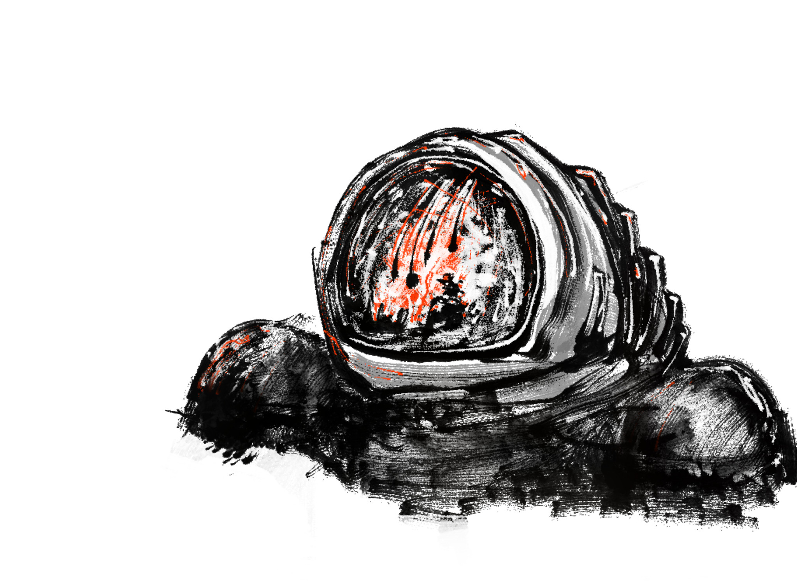

<address>Frotz, Alex, YYYY-MM-DD. To the extent possible under law,
the authors of this work has waived all copyright and related or
neighboring rights to this work.</address>

# Halbardier

## What are we even doing?

You have a super simple RPG in front of you. All you need are some
friends and two regular six-sided dice, maybe some pen and paper, and
you're good to go. One of you will referee the game. Is that you? All
other players think up a person. The referee dreams up a world and
situations for these imaginary people; the players say how they react
and the referee says how the world reacts, and so it goes on and on.
The story of these people is our story.

The dice are rolled when something with exciting consequences happens
and we want to leave the outcome to chance. Do our people succeed in
their project or not? And what happens afterwards?

## Character Creation

If you are a player, you play a fictional person, your character.
Create characters together, at the table.

First you choose your name, then you roll your attributes. You have
six attributes: Strength, Dexterity, Endurance, Intelligence,
Education, and Status. Roll two six-sided dice for each attribute, add
them together (short: 2d6) and write it down.

> Example: Alex names his character Aleph and rolls 8 8 7 9 10 8;
> Berta names her character Bren and rolls 10 6 9 5 4 4.

Your character begins at age 16. Now you choose a first career. The
choices are Security, Exploration or Trade. The process is always
the same: make an admission test if you enter a new career, get an
automatic talent if you are admitted, learn talents, possibly suffer a
twist of fate, grow older by four years. You then decide if your
character continues in the same career for another four years, with no
admission test and no automatic skill; or if you use one year to
change careers, risking a new admission test, but also getting a new
automatic skill; or if your character is ready for a life of
adventure.

Depending on the career, certain attributes are advantageous. Security
needs Strength or Dexterity, Exploration needs Endurance or Education,
and Trade needs Intelligence or Status.

If your character doesn't gain admission to the desired career, that
career can no longer be selected. When there are no more careers to
choose from, the adventurous life begins: roll on the reward table for
each career your character has been admitted to!

A career lasts for four years. Each year, choose one of your career
charts and roll 1d6. Write down that talent with a value of 1, or
increase the value if you learn a talent again. When you learn
“Fighting”, choose a weapon instead: unarmed, knife, rapier, bow,
handgun, rifle.

With every career your character completes, the chance for a twist of
fate increases. Thus it makes perfect sense to stop character
generation at some point and to start adventuring.

If your character is 36 or older at the end of a career, you'll need
to check for physical decline. If an attribute falls to zero, the
character dies.

| 1d6 |     Aging Table |
|:---:|----------------:|
| 1   |     Strength -1 |
| 2   |    Dexterity -1 |
| 3   |    Endurance -1 |
| 4   | Intelligence -1 |
| 5   |          Lucky! |
| 6   |          Lucky! |

## Security Career

**Admission**: Roll 2d6 ≤ Strength or Dexterity (your choice). You
automatically learn Fighting-1.

> Example: Bren has Strength 10 and Berta rolls 2. Bren is accepted!

You spend four years in Security and learn something every year. Each
year, choose one of the following tables and roll 1d6. You may only
roll on the "Officer" table if your character is 20 or older.

| 1d6 |        Guard | Transport |  Assault |     Officer |
|:---:|-------------:|----------:|---------:|------------:|
| 1   | Construction |     Pilot |  Vehicle |    Language |
| 2   |      Gunnery |  Engineer | Sneaking | Bureaucracy |
| 3   |      Tactics |   Vehicle |  Tactics |     Tactics |
| 4   |      Medical |  Computer |   Spying |     Culture |
| 5   |   Mechanical |   Medical |  Culture |      People |
| 6   |     Fighting |  Fighting | Fighting |    Fighting |

> Example: Berta chooses 2× Guard, 2× Assault, and rolls 3 2 5 1,
> resulting in Tactics-1, Gunnery-1, Culture-1, and Vehicle-1. Bren
> also got Fighting-1 for making it into Security. She picks guns and
> changes Fighting-1 to Guns-1.

**Twist of Fate**: Roll 2d6 + number of previous careers ≤ Strength or
Dexterity (your choice) to avoid consequences. Otherwise, you
determine the consequences with 1d6.

1. Blood Feud: The friends and family of the target of a campaign
   continue to hunt you wherever you go.
2. Collateral Damage: Someone was killed outside the scope of a
   campaign, and you were assigned the blame. The reparations from the 
   lawsuit are more than you'll ever be able to repay.
3. Life Debt: A comrade saved you during a campaign. Now you owe them 
   for your life. 
4. Injured: You were injured during a campaign, and received a medical 
   discharge. The Security career is now denied to you.
5. Stranded: Your ride left without you or was destroyed, and you are
   stranded. Roll on the aging table. Roll 3d6 ≤ an attribute of your
   choice to escape. If this fails, another four years pass. Roll
   again on the aging table and try again – until you succeed or die.
   Gain no new skills during this time.
6. Missing in Action: During a campaign, your comms were lost, and you 
   were never heard from again.

> Example: Berta rolls 4+0 and Bellatrix does not suffer a twist of
> fate. Bellatrix is now 20 years old. The aging table does not have
> to be rolled yet.

## Exploration Career

**Admission**: Roll 2d6 ≤ Endurance or Education (your choice). You
automatically learn Pilot-1.

> Example: Aleph has Education 10 and Alex rolls 2. Aleph is accepted!

You spend four years in Exploration and learn something every year.
Each year, choose one of the following tables and roll 1d6.

| 1d6 |   Spacer |   Observer |  Researcher |   Surveyor |
|:---:|---------:|-----------:|------------:|-----------:|
| 1   |    Pilot |    Library |    Computer |   Computer |
| 2   | Engineer | Mechanical |     Library |    Vehicle |
| 3   |  Library |    Medical | Bureaucracy |    Science |
| 4   |  Gunnery |   Survival |    Language |    Library |
| 5   | Computer | Infiltrate |     Science |   Survival |
| 6   | Fighting |    Vehicle |     Culture | Mechanical |

> Example: Alex chooses 1× Spacer, 3× Researcher, and rolls 6 2 2 6,
> resulting in Fighting-1, Library-2, Culture-1. And Pilot-1 for
> entering the career! Alex picks knives and changes Fighting-1 to
> Knives-1.

**Twist of Fate**: Roll 2d6 + number of previous careers ≤ Endurance
or Education (your choice) to avoid consequences. Otherwise, you
determine the consequences with 1d6.

1. War of Words: You have humiliated a rival's research project. He or
   she will never forgive you for that.
2. Blackmailed: Someone caught you accessing restricted data. Now
   they're blackmailing you, and there is no end in sight.
3. Drawn in: You've become embroiled in career politics and chose a
   side. Lines were drawn, and now you owe more than just a favour to
   the powers-that-be for your faction.
4. Caught: You were caught falsifying data in the database and
   cashiered. The Exploration career is now denied to you.
5. Lost: You are stranded far from civilisation. Roll on the aging
   table. Roll 3d6 ≤ an attribute of your choice to escape. If this
   fails, another four years pass. Roll again on the aging table and
   try again – until you succeed or die. Gain no new skills during
   this time.
6. No Carrier: You departed on a routine scouting mission and never
   returned.

> Example: Alex rolls 8 against Education-10. Aapeli suffers no twist
> of fate and is now 20 years old.

## Trade Career

**Admission**: Roll 2d6 ≤ Intelligence or Status (your choice). You
automatically learn Culture-1.

> Example: Aleph switches careers and applies for the Trade career.
> The switch costs him a year. Aleph Status 8 and Alex rolls 2. Aapeli
> is accepted!

You spend four years in Trade and learn something every year. Each
year choose one of the following tables and roll 1d6.

| 1d6 |    Merchant | Technician | Representative |  Traveller |
|:---:|------------:|-----------:|---------------:|-----------:|
| 1   |    Computer | Mechanical |        Culture |  Fast Talk |
| 2   | Bureaucracy |   Robotics |         People | Streetwise |
| 3   |     Vehicle |    Vehicle |        Vehicle |    Culture |
| 4   |  Mercantile |    Medical |       Literacy |   Sneaking |
| 5   |      People |   Computer |        Perform |    Medical |
| 6   |       Pilot |    Science |     Mercantile |   Fighting |

> Example: Alex chooses 2x Representative and 2x Traveller, and rolls
> 6 2 2 6, resulting in Mercantile-1, People-1, Streetwise-1, and
> Fighting-1. And Culture-1 for switch career. Alex picks knives again
> and changes Knives-1 to Knives-2. Culture-1 also increases to
> Culture-2.

**Twist of Fate**: Roll 2d6 + number of previous careers ≤
Dexterity or Status (your choice) to avoid consequences.
Otherwise, you determine the consequences with 1d6.

1. Rivalry: You have a celebrity rival. He or she will never
   stop trying to outshine you.
2. Debt: Plans have gone awry in ways you couldn't imagine. You now
   owe more money than you can ever pay back.
3. Pulled in: You've accepted help from people, gotten more and more
   entangled, and now you owe them more than just a favour.
4. Cancelled: You were accused of something terrible in the public
   eye. Everyone knows your face, and no one will associate with you.
   The Trade career is now denied to you.
5. Detained: The plan has been blown. You got caught. Roll on the
   aging table. Roll 3d6 ≤ an attribute of your choice to escape. If
   this fails, another four years pass. Roll again on the aging table
   and try again – until you succeed or die. Gain no new skills during
   this time.
6. Disappeared: One day you just dropped "off the grid", and your friends
   and family have not heard from you again.

> Example: Alex rolls 8+1 because he already has a career in
> Exploration behind him. Aleph suffers no twist of fate and is now 25
> years old.

## Talents

We roll checks as follows: 2d6 ≤ attribute + talent. On very hard
tests: 3d6 ≤ attribute + talent. If no talent fits, or the matching
talent is missing, then 2d6 or 3d6 ≤ attribute -2.

The chance of rolling a target number or less on 2d6:

| 2    | 3    | 4    | 5     | 6     | 7     | 8     | 9     | 10    | 11    | 12    |
|:----:|:----:|:----:|:-----:|:-----:|:-----:|:-----:|:-----:|:-----:|:-----:|:-----:|
| 3%   | 8%   | 17%  | 28%   | 42%   | 58%   | 72%   | 83%   | 92%   | 97%   | 100%  |
| 1/36 | 3/36 | 6/36 | 10/36 | 15/36 | 21/36 | 26/36 | 30/36 | 33/36 | 35/36 | 36/36 |

A few key words about the individual talents.
**Bureaucracy**: Understand and work with the ins and outs of red tape.
**Computer**: Build, maintain, program or repair computers.
**Construction**: Build, maintain, or repair structures such as buildings and defensive positions.
**Culture**: Know details about cultures, their histories and their norms.
**Engineer**: Build, maintain, or repair systems on spaceships.
**Fast Talk**: Convince, trick, or cajole someone into doing something.
**Fighting**: Know how to use a personal weapon such as knives, rapiers, bows, handguns or rifles.
**Gunnery**: Operate weapons mounted on vehicles or spaceships such as machine guns, plasma guns or rail guns.
**Infiltrate**: Blend seamlessly into social groups.
**Language**: Understand dialects and languages and their history.
**Library**: Use databases and archives in order to find obscure or censored information.
**Literacy**: Familiarity with classical and popular forms of media.
**Medical**: Diagnose and treat injuries and ailments, operate medical equipment, familiarity with the medical jargon.
**Mercantile**: Understand and exploit trade practices and commerce.
**People**: Understand and read individuals and groups.
**Perform**: Entertain and influence an audience.
**Pilot**: Piloting and astrogation for spaceships.
**Robotics**: Build, maintain, program, or repair semi-autonomous creations.
**Science**: Knowledge of disciplines like geology, biology, chemistry, physics or mathematics. 
**Sneaking**: Know how to operate without drawing attention, whether remaining undetected, hiding goods or surreptitiously moving assets.
**Spying**: Observe individuals or groups for the purposes of gathering information, analyse data in search of anomalies or suspicious activities, operating surveillance equipment.
**Streetwise**: Know details about criminal cultures and organisations across space.
**Survival**: Know how to keep yourself alive in a variety of hazardous situations.
**Tactics**: Know how to best deploy assets for maximal benefit in attack or defence.
**Mechanical**: Build, maintain, or repair systems and vehicles apart from spaceships, computers or robots.
**Vehicle**: Operate air, land, or sea vehicles: submarines, boats, planes, cars, possibly even tanks, gliders or shuttles.

A few key words about the importance of weapons. **Knife**: Anything
from small knives to large daggers is a knife. A weapon for the poor.
Messy. **Rapier**: Anybody in high society is expected to know how to
use a rapier. Some questions can only be settled by a duel. **Bow**: A
ranged weapon used in systems without metal. **Handgun**: A ranged
weapon for everybody for the urban population. **Rifle**: A ranged
weapon for hunting and war.

Armour makes you hard to hurt. Attacks against armoured opponents are
always rolled with 3d6. Battle armour is impenetrable for personal
weapons. Use bigger guns.

## Reward

Before you start the adventurous life, there is one more reward. Roll
for each career on the appropriate table.

| 1d6 |        Security |     Exploration |           Trade |
|:---:|----------------:|----------------:|----------------:|
| 1   | Intelligence +2 | Intelligence +2 | Intelligence +1 |
| 2   |    Education +1 |    Education +2 |    Education +2 |
| 3   |       Status +2 |       Status +1 |       Status +2 |
| 4   |      Membership |      Membership |      Membership |
| 5   |          Weapon |         Contact |       Companion |
| 6   |         Contact |          Tenure |          Patron |

> Example: Aleph has had two careers, 1× Exploration and 1× Trade.
> Alex rolls 4 5, resulting in membership in a Secret Society and a
> Companion.

**Membership** depends on the career involved.

| 1d6 |                 Security |         Exploration |              Trade |
|:---:|-------------------------:|--------------------:|-------------------:|
| 1   | Veterans of the last war |          Scout Base | Sector Trade Guild |
| 2   |        Planetary Militia |  Library Membership | Mutual Aid Society |
| 3   |         Museum Volunteer |      Wildlife Guide |        Small Droid |
| 4   |   Secret Service Sleeper | Alumni Organisation |     Secret Retreat |
| 5   |      Security Consultant |        Spacer Guild | Administrative Job |
| 6   |                          |    Small Scout Ship |           Workshop |

* The Ministry of the Evening Light
* The Siblings of the Dawn Treader
* The Descendants of the Frost Giants

**Companion**: A young human who has not made any careers. Name
your companion and roll the six attributes (2d6 each for Strength,
Dexterity, Endurance, Intelligence, Education, and Status).

**Tenure**: 

**Weapon**: 

**Security Contact**:

**Scout Contact**:

**Patron**:

## Adventurer's Life

If you want to do something and the outcome is uncertain, discuss with
the referee an attribute and a talent to use, provided there is a
suitable match. Roll 2d6 ≤ attribute + talent to succeed. If it's very
hard, you might have to roll 3d6 ≤ attribute + talent.

If you attack successfully, you deal 2d6 damage unless you use a
halberd. This deals 3d6 damage. You can only attack as many times in a
fight as you have Endurance.

When you are first hit in combat, you must subtract the damage from a
random physical attribute. Roll 1d6: 1–2 is Strength, 3–4 is
Dexterity, 5–6 is Endurance. For all other hits, you may distribute
the hit dice yourself among the three physical attributes. You must
subtract any carryover from another physical attribute.

If one of your attributes drops to 0, you are slightly injured and
pass out. After 10 minutes you wake up again.

> Example: Bellatrix has Strength 10, Dexterity 6, Endurance 9. She
> gets hit for the first time and has to subtract 4+5=9 damage. Berta
> rolls a 1, so Bellatrix must subtract 9 from Strength (10-9=1). She
> won't pass out! The second time she has to subtract 2+6=8 hits and
> chooses to subtract 2 from Dexterity (6-2=4) and 6 from Endurance
> (9-6=3). Now it's getting close…

After the fight, all attributes recover half of the missing amount
(round down). If you are being treated by First Aid or a healer, you
will be fit again in 30 minutes, otherwise the recovery will take 3
days.

> Example: After being treated with First Aid, she recovers.
> Bellatrix' attributes: Strength 1+4½=5, Dexterity 4+1=5, Endurance
> 3+3=6.

If two of your attributes drop to 0, you are severely wounded and pass
out. You don't wake up again for 3h and only the attributes from 0
recover to 1. With First Aid-3 or Healing-3 you can recover in an
infirmary in 5d6 days, otherwise you die.

If three of your attributes drop to 0, you die.

For all other creatures there are only Endurance and Life instead of
the known six attributes. When Endurance drops to 0, they faint; when
Life drops to 0, they die.

> Example: Aapeli's dog Tix has Endurance 3d6, Life 2d6. Alex rolls
> 1+4+5=10 and 5+2=7 and writes down 10/7 for the dog.

## Opponents

All other chapters in this book are intended for the referee. So for you!

People can be depicted with the well-known six attributes. You may
choose these freely or roll them (2d6). Talents are also freely
determined (often 1 or 2).

Other creatures, bots and mechs on the battlefield have different
characteristics that describe their behavior: damage determines how
much damage they deal if they hit; endurance determines how many
rounds they will fight and how much damage they can take; if it drops
to zero, they faint; excess damage is substracted from life; if it
drops to zero, they are mortally wounded; attack determines whether
they attack in an encounter (2d6 ≤ attack); hit determines how well
they hit (2d6 ≤ hit), and escape determines if they attempt to escape
when they’re not attacking (2d6 ≤ escape). If they neither attack nor
escape, we talk.

| 1d6 |  Opponents | Damage | Endurance | Life | Attack | Hit   | Escape |
|:---:|-----------:|:------:|:---------:|:----:|:------:|:-----:|:------:|
| 1   |   Critters | 2d6    | 1d6       | 1d6  | 1d6+4  | 1d6+5 | 1d6+3  |
| 2   |   Sophonts | 2d6    | 2d6       | 2d6  | 1d6+5  | 1d6+6 | 1d6+2  |
| 3   | Xenomorphs | 2d6    | 3d6       | 4d6  | 1d6+6  | 1d6+7 | 1d6+0  |
| 4   |       Bots | 3d6    | 6d6       | 3d6  | 1d6+4  | 1d6+4 | 1d6+2  |
| 5   |      Mechs | 4d6    | 8d6       | 4d6  | 1d6+3  | 1d6+8 | 1d6+0  |

For each species, for each model, the stats will be slightly
different. Note down when you roll something and stick to it! For the
number of enemies, roll 2d6 for critters and sophont, or 1d6 for
xenomorphs. Bots and mechs are usually loners.

> Example: Claudia referees the game and needs sophonts that ride on a
> giant bot that ambushes the vanguard. There are 7. She rolls them
> up. Gao Ish critters: Damage-3, Endurance-1, Life-5, Attack-5,
> Hit-9, Escape-4. AUK Security Carrier bot: Damage-15, Endurance-16,
> Life-12, Attack-9, Hit-5, Escape-7. The Gao Ish are rather harmless
> opponents who ride on terrible bots, which, oddly enough, are not
> very good at hitting things.

Announce impending danger is always clearly, so that the players can
decide for themselves whether they want to engage in a fight.

> Example: Claudia describes how the shadow of the carrier bot push
> through the undergrowth, the seismometers nervously highlighting the
> location.

If possible, the players should roll the dice, not the referee. For
example, if they want to lure the opponent into an ambush, or notice
an ambush, someone should roll against Intelligence + Tactics in both
cases.

## Spaceships, Travel, Combat

...

## Personal and Vehicle Combat

Combat is divided into rounds. Everyone may attack, cast magic, or do
something else 1×/round. All participants announce their action, roll
the dice and evaluate. Everything happens at the same time.

In some role-playing games, combat tends to be front and center. In
this game, after one round, perhaps half of those involved are already
on the ground. War is terrible. Most of the time it's about avoiding
the fight.

...

## Worldbuilding

The world is best built where the characters get involved. If they go
north, there will be cultivation. When they get interested in
libraries, books and librarians become important. If you are
interested in history, ancient writings and ruins become important.

The game does not offer a "reward" in the sense of gaining power.
Finding money is not worth it, there's no special equipment to buy, no
experience points to gain. That's another reason why it's important to
find out what interests the players. A tragic end? A love story?
Owning an orbital station? To be knighted? Take over a gang? To travel
the world? And then you add helpers, competitors, villains, and
troublemakers to the world. This friction sharpens the profile. Here
we see what kind of people our characters are.

Specifically, I recommend working up a dozen people. All have names,
attributes, a few talents, and a job. Three of them belong to a secret
society each, three belong to a temple each, three belong to a castle
each, and three belong to a magic school each. All of these
organizations have names and headquarters. People as well as
organizations want three things each and offer three rewards each. If
those wishes partly overlap and contradict each other, so much the
better.

...

## Example

## Map

## Reading material

