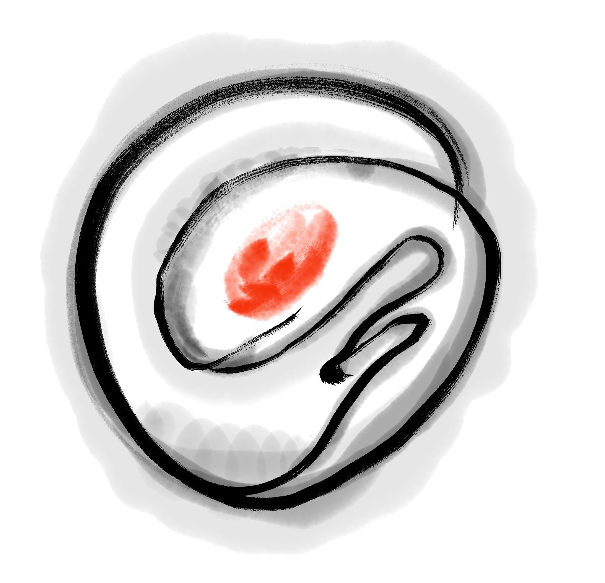
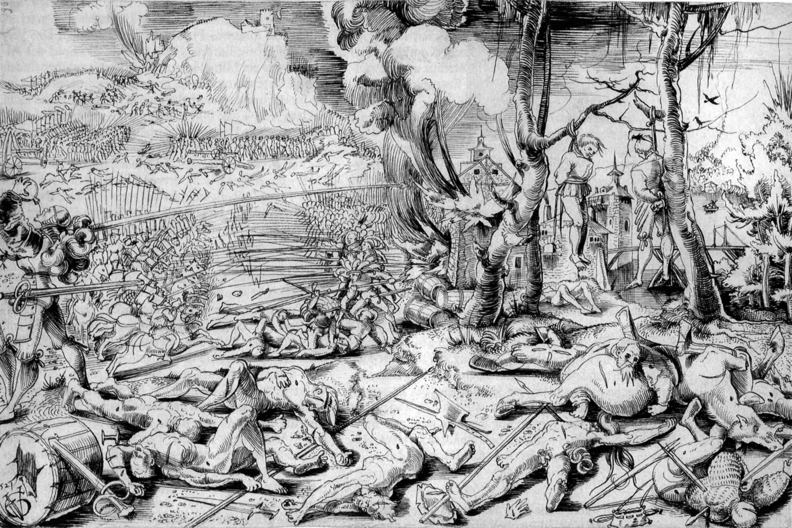

<address>Written and translated by Alex Schroeder, Frotz Self, Peter
Fröhlich, YYYY-MM-DD. Playtesting by Alex Schroeder, Frotz Self, Peter
Fröhlich, Robert Freeman-Day (PresGas). To the extent possible under
law, the authors of this work has waived all copyright and related or
neighboring rights to this work. The map on the last page uses icons
by Gregory B. MacKenzie under <a
href="https://creativecommons.org/licenses/by-sa/4.0/">CC BY-SA
4.0</a>.</address>

# Halberts

## What are we even doing?

You have a super simple RPG in front of you. All you need are some
friends and two regular six-sided dice, maybe some pen and paper, and
you're good to go. One of you will referee the game. Is that you? All
other players think up a person. The referee dreams up a world and
situations for these imaginary people; the players say how they react
and the referee says how the world reacts, and so it goes on and on.
The story of these people is our story.

The dice are rolled when something with exciting consequences happens
and we want to leave the outcome to chance. Do our people succeed in
their project or not? And what happens afterwards?

## Character Creation

If you are a player, you play a fictional person, your character. We
will now create this together.

First you choose your name, then you roll your attributes. You have
six attributes: Strength, Dexterity, Endurance, Intelligence,
Education, and Status. Roll two six-sided dice for each attribute, add
them together (short: 2d6) and write it down.

> Example: Alex names his character Adalric and rolls 8 8 7 9 10
> 8; Berta names her character Brunhilde and rolls 10 6 9 5 4 4.

Your character begins at age 16. Now you choose a first career. The
choices are Warrior, Mage, or Rapscallion. The process is always the
same: make an admission test if you enter a new career, get an
automatic talent if you are admitted, learn talents, possibly suffer a
twist of fate, grow older by four years. And then you have to decide
if your character continues in the same career for another four years,
with no admission test and no automatic skill; or if you use one year
to change careers, risking a new admission test, but also getting a
new automatic skill; or if your character is ready for a life of
adventure.

Depending on the career, certain attributes are advantageous. Warriors
need Strength or Endurance, Mages need Intelligence or Education, and
Rapscallions need Dexterity or Status.

If your character doesn't gain admission to the desired career, that
career can no longer be selected. When there are no more careers to
choose from, the adventurous life begins: roll on the reward table for
each career!

A career lasts for four years. Each year, choose one of your career
charts and roll 1d6. Write down that talent with a value of 1, or
increase the value if you learn a talent again. When you learn
"Fighting", choose a weapon instead: knife, spear, halberd, épée, bow,
lance.

With every career your character completes, the chance for a twist of
fate increases. Thus it makes perfect sense to stop character
generation at some point and to start adventuring.

If your character is 36 or older at the end of a career, you'll need
to check for physical decline. If an attribute falls to zero, the
character dies.

| 1d6 |     Aging Table |
|:---:|----------------:|
| 1   |     Strength -1 |
| 2   |    Dexterity -1 |
| 3   |    Endurance -1 |
| 4   | Intelligence -1 |
| 5   |          Lucky! |
| 6   |          Lucky! |

## Warrior Career

**Admission**: Roll 2d6 ≤ Strength or Endurance (your choice). You
automatically learn Fighting-1.

> Example: Brunhilde has Strength 10 and Berta rolls 2. Brunhilde is
> accepted!

You spend four years as a Warrior and learn something every year. Each
year choose one of the following tables and roll 1d6. You may only
roll on the "Officer" table if your character is 20 or older.

| 1d6 |    Mercenary |        Guard |    Rider |     Officer |
|:---:|-------------:|-------------:|---------:|------------:|
| 1   | Construction |  Bureaucracy |   Riding |    Literacy |
| 2   |      Running |   Discipline |  Singing | Bureaucracy |
| 3   |      Tactics | Construction |  Tactics |     Tactics |
| 4   |    First Aid |     Brawling |   Spying |   Diplomacy |
| 5   |        Craft |      Brewing |  Culture |    Behavior |
| 6   |     Fighting |     Fighting | Fighting |    Fighting |

> Example: Berta chooses 2× Mercenary, 2× Guard, and rolls 3 2 5 1,
> resulting in Tactics-1, Running-1, Brewing-1, and Bureaucracy-1.
> And Fighting-1!

**Twist of Fate**: Roll 2d6 + number of previous careers ≤ Strength or
Endurance (your choice) to avoid consequences. Otherwise, you
determine the consequences with 1d6.

1. Mortal Enemy: The campaign was a success. For three days you
   plundered. The survivors will never forgive you for your actions.
2. Siege: Malnutrition has aged you prematurely. Roll on the aging
   table.
3. Campaign: You were ambushed and badly injured. Roll on the aging
   table.
4. Lame: After an accident, things never went back to the way they
   used to be. The Warrior career is now denied to you.
5. Captivity: The campaign was a fiasco. You have been captured. Roll
   on the aging table. Roll 3d6 ≤ an attribute of your choice to
   escape. If you don't succeed, another four years pass. Roll on the
   aging table again and keep trying to escape – until you succeed or
   die.
6. Lost: The campaign was a big mistake. The army was crushed. The
   fleeing were ridden down. You were never seen again.

> Example: Berta rolls 4+0 and Brunhilde does not suffer a twist of
> fate. Brunhilde is now 20 years old. The aging table does not have
> to be rolled yet.

## Mage Career

**Admission**: Roll 2d6 ≤ Intelligence or Education (your choice). You
will automatically learn Literacy-1.

> Example: Adalric has Education-9 and Alex rolls 9. Adalric is
> accepted!

You spend four years as a Mage and learn something every year. Each
year choose one of the following tables and roll 1d6.

| 1d6 | Aggressive | Passive | Manipulative | Transgressive |
|:---:|-----------:|--------:|-------------:|--------------:|
| 1   |       Fire | Healing |        Charm |    Shapeshift |
| 2   |        Air |   Sleep |      Singing |    Necromancy |
| 3   |      Water |    Eyes |    Diplomacy | Transmutation |
| 4   |      Earth |   Doors |     Illusion |        Fusion |
| 5   |      Storm |  Plants |       People |       Animals |
| 6   |   Fighting | Brewing |     Literacy |    Planeswalk |

> Example: Alex chooses 2× Aggressive, 2× Manipulative, and rolls 5 3
> 5 2, resulting in Storm-1, Water-1, People-1, and Singing-1. And
> Literacy-1!

**Twist of Fate**: Roll 2d6 + number of previous careers ≤
Intelligence or Education (your choice) to avoid consequences.
Otherwise, you determine the consequences with 1d6.

1. Mortal Enemy: You exposed a classmate. You will never be forgiven
   for that.
2. Failure: The experiment went wrong and the energy found a way
   through your body. Roll on the aging table.
3. Crossing borders: Research has taken you to places that cannot be
   unseen again. A demon *saw* you and will find you.
4. Trespass: You ventured too far into the space between the worlds
   and almost lost your mind. The Mage career is now denied to you.
5. Lost: You have traveled to foreign worlds and lost yourself there.
   Roll on the aging table. Roll 3d6 ≤ an attribute of your choice to
   find your way back. If this is not successful, another four years
   pass. Roll again on the aging table and try again – until you
   succeed or die.
6. A Sacrifice: The rift between the planes was too big, the energy
   uncontrollable, your friends were almost lost – but then you
   sacrificed yourself. Those who know the place know where to find
   you, but your screams are not for the faint of heart.

> Example: Alex rolls 4+0 and Adalric does not suffer a twist of fate.
> Adalric is now 20 years old. The aging table does not have to be
> rolled yet.

## Rapscallion Career

**Admission**: Roll 2d6 ≤ Dexterity or Status (your choice). You
automatically learn Running-1.

> Example: Adalric changes careers (so he is now 21 years old) and
> wants to become a Rapscallion; he has Status 10 and Alex rolls 7.
> Adalric is accepted!

You spend four years as a Rapscallion and learn something every year.
Each year choose one of the following tables and roll 1d6.

| 1d6 |    Thief |      Thug |        Liar |  Murderer |
|:---:|---------:|----------:|------------:|----------:|
| 1   | Sneaking |  Fighting |     Culture |  Fighting |
| 2   |   Spying |  Crafting |    Behavior |   Brewing |
| 3   |  Running |   Running | Bureaucracy | First Aid |
| 4   | Climbing | First Aid |    Literacy |  Sneaking |
| 5   | Distract |   Tactics |     Oratory |  Behavior |
| 6   |     Pick |   Singing |     Trading |    Tinker |

> Example: Alex chooses 1× Thief, 3× Murderer, and rolls 6 2 2 6,
> resulting in Pick-1, Brewing-2, Tinker-1. And Running-1!

**Twist of Fate**: Roll 2d6 + number of previous careers ≤
Dexterity or Status (your choice) to avoid consequences.
Otherwise, you determine the consequences with 1d6.

1. Mortal Enemy: You have humiliated your rival. He or she will never
   forgive you for that.
2. Debt: Your plan didn't work out. On the contrary, you have been
   tricked and now you owe someone more money than you can ever pay
   back.
3. Pulled in: You've accepted help from people, gotten more and more
   entangled, and now you owe them more than just a favor.
4. Caught: You were caught and pilloried. Everyone knows your face.
   The Rapscallion career is now denied to you.
5. Imprisonment: The plan has been blown. You got caught. Roll on the
   aging table. Roll 3d6 ≤ an attribute of your choice to escape. If
   this fails, another four years pass. Roll again on the aging table
   and try again – until you succeed or die.
6. Disappeared: There was a gang war and you disappeared. They say the
   street dogs have gotten fat this year.

> Example: Alex rolls 8+1 because he already has a career as a Mage
> behind him. Adalric suffers no twist of fate and is now 25 years
> old.

## Talents

We roll checks as follows: 2d6 ≤ attribute + talent. On very hard
tests: 3d6 ≤ attribute + talent. If no talent fits, or the matching
talent is missing, then +0.

A few key words about the individual talents.
**Air**: Magic related to wind, movement, and sound.
**Animals**: Magic related to animals and handling them.
**Behavior**: How to behave in noble company.
**Brawling**: The unarmed force, threats, and infliction of pain.
**Brewing**: Brew beer, concoct herbal tea, brew potions, mix poison.
**Bureaucracy**: An understanding of every administrative apparatus and the people who work there.
**Charm**: Magic that subdues people, controls their emotions.
**Climbing**: Climbing rocks and walls, moving in the mountains.
**Construction**: Building houses, castles, siege engines, digging pits and shafts.
**Crafts**: Woodworking, metalworking, filing, sawing, decorating and painting things.
**Culture**: An understanding of legends, paintings, songs, manners and customs of foreign countries.
**Diplomacy**: Negotiating treaties, avoiding violence, making peace.
**Discipline**: Control over groups of people and oneself against natural instinct.
**Distract**: Distracting people from something so that something else can be done unnoticed.
**Doors**: Magic that has to do with locking and opening doors and gates.
**Earth**: Magic dealing with rocks, tremors, the earth, and everything subterranean.
**Eyes**: Magic that allows distant or true vision.
**Fighting**: Weapon handling and killing.
**Fire**: Magic dealing with flames, explosions and destruction.
**First Aid**: Cleaning and stitching up wounds, setting bones, caring for the sick.
**Fusion**: Magic that fuses living things with other living things and things.
**Healing**: Magic that restores power to living beings and breaks curses.
**Illusion**: Magic that makes others believe things that are not true.
**Literacy**: Reading and writing.
**Necromancy**: Magic that allows resurrection and contact with the dead.
**Oratory**: Convincing with well-chosen words.
**People**: Magic used to read people's minds and emotions.
**Pick**: Opening locks and doors.
**Planeswalk**: Magic that has to do with contact with other worlds and transition into them.
**Plants**: Magic related to plants and their growth.
**Riding**: Riding on animals, mostly horses.
**Running**: Long Distance Run, Short Distance Run, Rush.
**Shapeshift**: Magic that allows you to change shape.
**Singing**: Singing songs and playing instruments.
**Sleep**: Magic related to sleep and fainting.
**Sneaking**: Moving silently and hiding.
**Spying**: Scouting, tracking, observing.
**Storm**: Magic related to wind, rain, lightning and thunder.
**Tactics**: Setting up ambushes, using the terrain for combat.
**Tinker**: Building mechanical devices and using material properties.
**Trading**: Finding, sourcing, haggling, buying, and selling things.
**Transmutation**: Magic that transforms things into other things.
**Water**: Magic related to water, diving, swimming, and waterwalking.

## Reward

Before you start the adventurous life, there is one more reward. Roll
for each career on the appropriate table.

| 1d6 |         Warrior |            Mage |     Rapscallion |
|:---:|----------------:|----------------:|----------------:|
| 1   | Intelligence +1 | Intelligence +2 | Intelligence +1 |
| 2   |    Education +2 |   Education + 1 |    Education +2 |
| 3   |       Status +1 |       Status +2 |       Status +2 |
| 4   |  Secret Society |  Secret Society |  Secret Society |
| 5   |           Horse |       Companion |             Dog |
| 6   |            Land |           Chair |            Post |

> Example: Adalric has had two careers, 1× Mage and 1× Rapscallion.
> Alex rolls 4 5, resulting in membership in a secret society and a
> dog.

**Secret Society**: The referee offers three societies to choose
from. If necessary, these are the three:

* The Ministry of the Evening Light
* The Siblings of the Dawn Treader
* The Descendants of the Frost Giants

**Companion**: A young human who has not made any careers, or an
intelligent animal such as a cat, an owl, or a raven. If human, name
your companion and roll the six attributes (2d6 each for Strength,
Dexterity, Endurance, Intelligence, Education, and Status).

**Dog**: A loyal companion that needs to be fed. Damage 2d6; Endurance
3d6; Life 2d6.

**Horse**: A loyal mount that requires care and feeding. Damage 3d6;
Endurance 6d6; Life 3d6.

**Land**: A piece of land in the wilderness that has been granted to
you. Taking possession of said land is up to you however. Name your
piece of land.

**Chair**: You are welcome in your magic school and can come back at
any time to teach the young magicians something. Name your sponsor.

**Posts**: There is always a vacancy for you in your town, be it in
your gang or in the administration. Name your sponsor.

## Adventurer's Life

If you want to do something and the outcome is uncertain, discuss with
the referee an attribute and a talent to use, provided there is a
suitable match. Roll 2d6 ≤ attribute + talent to succeed. If it's very
hard, you might have to roll 3d6 ≤ attribute + talent.

If you attack successfully, you deal 2d6 damage unless you use a
halberd. This deals 3d6 damage. You can only attack as many times in a
fight as you have Endurance.

When you are first hit in combat, you must subtract the damage from a
random physical attribute. Roll 1d6: 1–2 is Strength, 3–4 is
Dexterity, 5–6 is Endurance. For all other hits, you may distribute
the hit dice yourself among the three physical attributes. You must
subtract any carryover from another physical attribute.

If one of your attributes drops to 0, you are slightly injured and
pass out. After 10 minutes you wake up again.

> Example: Brunhilde has Strength 10, Dexterity 6, Endurance 9. She
> gets hit for the first time and has to subtract 4+5=9 damage. Berta
> rolls a 1, so Brunhilde must subtract 9 from Strength (10-9=1). She
> won't pass out! The second time she has to subtract 2+6=8 hits and
> chooses to subtract 2 from Dexterity (6-2=4) and 6 from Endurance
> (9-6=3). Now it's getting close…

After the fight, all attributes recover half of the missing amount
(round down). If you are being treated by First Aid or a healer, you
will be fit again in 30 minutes, otherwise the recovery will take 3
days.

> Example: After being treated with First Aid, she recovers.
> Brunhilde's attributes: Strength 1+4½=5, Dexterity 4+1=5, Endurance
> 3+3=6.

If two of your attributes drop to 0, you are severely wounded and pass
out. You don't wake up again for 3h and only the attributes from 0
recover to 1. With First Aid-3 or Healing-3 you can recover in an
infirmary in 5d6 days, otherwise you die.

If three of your attributes drop to 0, you die.

For all other creatures there are only Endurance and Life instead of
the known six attributes. When Endurance drops to 0, they faint; when
Life drops to 0, they die.

> Example: Adalric's dog Tix has Endurance 3d6, Life 2d6. Alex rolls
> 1+4+5=10 and 5+2=7 and writes down 10/7 for the dog.

## Opponents

All other chapters in this book are intended for the referee. So for you!

People can be depicted with the well-known six attributes. You may
choose these freely or roll them (2d6). Talents are also freely
determined (often 1 or 2).

Monsters and animals have different characteristics that describe
their behavior: damage determines how much damage they deal if they
hit; endurance determines how many rounds they will fight and how much
damage they can take; if it drops to zero, they faint; excess damage
is substracted from life; if it drops to zero, they are mortally
wounded; attack determines whether they attack in an encounter (2d6 ≤
attack); hit determines how well they hit (2d6 ≤ hit), and escape
determines if they attempt to escape when they’re not attacking (2d6 ≤
escape). If they neither attack nor escape, we talk.

| 1d6 |  Opponents | Damage | Endurance | Life | Attack | Hit   | Escape |
|:---:|-----------:|:------:|:---------:|:----:|:------:|:-----:|:------:|
| 1   | Nightlings | 2d6    | 1d6       | 1d6  | 1d6+4  | 1d6+5 | 1d6+3  |
| 2   |  Predators | 2d6    | 3d6       | 2d6  | 1d6+5  | 1d6+6 | 1d6+2  |
| 3   |     Undead | 2d6    | 3d6       | 4d6  | 1d6+6  | 1d6+7 | 1d6+0  |
| 4   |     Mounts | 3d6    | 6d6       | 3d6  | 1d6+4  | 1d6+4 | 1d6+2  |
| 5   |     Giants | 4d6    | 8d6       | 4d6  | 1d6+3  | 1d6+8 | 1d6+0  |
| 6   |    Dragons | 6d6    | 10d6      | 5d6  | 1d6+2  | 1d6+9 | 1d6+0  |

For each world, the stats will be slightly different. Note down when
you roll something and stick to it! For the number of enemies, roll
2d6 for nightlings and predators, or 1d6 for undead. Giants and
dragons are always loners.

> Example: Claudia referees the game and needs goblins that
> ride on giant spiders that ambush the vanguard. There are 7.
> She uses the line of nightlings and mounts. Goblins:
> Damage-3, Endurance-1, Life-5, Attack-5, Hit-9, Escape-4.
> Giant Spiders: Damage-15, Endurance-16, Life-12, Attack-9,
> Hit-5, Escape-7. In this world, goblins are rather harmless
> opponents who ride on terrible giant spiders, which,
> oddly enough, are not very good at hitting things.

Always announce impending danger clearly, so that the players can
decide for themselves whether they want to engage in a fight.

> Example: Claudia describes how the car-sized shadows
> push through the undergrowth, how their acrid smell spreads
> and the animals in the barn panic.

If possible, the players should roll the dice, not the referee. For
example, if they want to lure the opponent into an ambush, or notice
an ambush, someone should roll against Intelligence + Tactics in both
cases.

## Magic

Just like you slowly build up a pool of enemies, you need to work out
an understanding of just how powerful magic is with the players.

> Example: How many goblins can Adalric kill with lightning? Alex and
> Claudia agree that lightning can hit a giant spider including its
> rider, doing 5d6 damage to each, or chain lightning can hit five
> goblins, doing 2d6 damage to each.

The same applies here: Make a note of what you negotiate and stick to
it!

> **Lightning**: hits an enemy and what they are carrying for 5d6 damage each  
> **Chain Lightning**: hits up to 5 enemies for 2d6 damage each

Since spells are stronger than weapon attacks, one shouldn't be able
to cast any number of them. With each spell cast, the risk of
exhaustion increases. Therefore, when casting spells, the modified
rule applies: roll 2d6 + number of spells cast today ≤ attribute +
talent to succeed. If the check fails, the talent can no longer be
used today.

> Example: Adalric conjures rain for privacy. He has Education 9,
> Water-1, making a total of 10. Alex rolls 10 + 0 since this was the
> first spell of the day. It's raining because 10 ≤ 10. Chain
> Lightning follows: Alex rolls 5+1=6 and 6 ≤ 10. That kills five
> goblins.

Magic always leads to discussions. You have to like that – otherwise
you should skip the Mage career. How long can you breathe underwater?
Can you do magic underwater? What happens when you cast lightning
underwater? The important thing is to agree at the table and to write
down the result.

Not all magic talents are equally powerful, or equally useful. You
also have to live with that. Certain magic talents lend themselves to
druids, bards, healers.

There is no talent for summoning: instead, this is meant to be handled
with a gate to another plane, or as a planeswalk. You have to
subjugate every demon yourself and force it to do its deeds.

In my games, Charm is always a violent thing: being forced into things
is nauseating and revolting.

It is not possible to foresee the future. That would incapacitate
players. A role-playing game is not a saga; fate is not predetermined.

## Combat

Combat is divided into rounds. Everyone may attack, cast magic, or do
something else 1×/round. All participants announce their action, roll
the dice and evaluate. Everything happens at the same time.

> Example: Adalric casts chain lightning and he is protected by the
> rain. A goblin has seen him anyway and shoots at him with his bow.
> The goblin has attack 5. Claudia rolls 6 – and 6 ≰ 5: misses!

In some role-playing games, combat tends to be front and center. In
this game, after one round, perhaps half of those involved are already
on the ground. War is terrible. Most of the time it's about avoiding
the fight.

> Example: Brunhilde has Strength 10, Dexterity 6, Endurance 9, and
> Fighting-1. She tries to reach the farm, but two goblins are hot on
> her tail, with Damage-3, Endurance-1, Life-5, Attack-5, Hit-9,
> Escape-4. She turns to fight. First round: Berta rolls 6 and hits
> because 6 ≤ 10+1. Claudia rolls 5 and 6, two hits for the goblins,
> since 6 ≤ 9. With the first hit, chance decides which attribute
> Brunhilde must reduce: Berta rolls a 4, which is Dexterity (6-3=3).
> The goblins deal 3 every time they hit. The second hit Brunhilde
> deducts from her Endurance (9-3=4). Berta rolls 6 damage which kills
> the goblin (both Endurance and Life are reduced to zero), but the
> other still stands.

When an advantage is gained through tactics, the result is often a
surprise round where the opponent cannot strike back. That can become
very important.

The horror of war (1521), by Urs Graf
{: .pic }

## Worldbuilding

The world is best built where the characters get involved. If they go
north, there will be cultivation. When they get interested in
libraries, books and librarians become important. If you are
interested in history, ancient writings and ruins become important.

The game does not offer a "reward" in the sense of gaining power.
Finding money is not worth it, there's no special equipment to buy, no
experience points to gain. That's another reason why it's important to
find out what interests the players. A tragic end? A love story?
Owning a castle? To be knighted? Take over a gang? To travel the
world? And then you add helpers, competitors, villains, and
troublemakers to the world. This friction sharpens the profile. Here
we see what kind of people our characters are.

Specifically, I recommend working up a dozen people. All have names,
attributes, a few talents, and a job. Three of them belong to a secret
society each, three belong to a temple each, three belong to a castle
each, and three belong to a magic school each. All of these
organizations have names and headquarters. People as well as
organizations want three things each and offer three rewards each. If
those wishes partly overlap and contradict each other, so much the
better.

| 1d6 | Activity  | Secret Society 1 | Secret Society 2 | Gods   | Demons   |
|:---:|-----------|------------------|------------------|--------|----------|
| 1   | Knight    | Militia          | of the pyramid   | Odin   | Set      |
| 2   | Bard      | Scribes          | of the moon      | Freya  | Orcus    |
| 3   | Thief     | Pentarchs        | of the circle    | Thor   | Pazuzu   |
| 4   | Mage      | Students         | of history       | Mitra  | Nergal   |
| 5   | Librarian | Servants         | of consciousness | Marduk | Hel      |
| 6   | Merchant  | Cooperation      | of order         | Ishtar | Zathogga |

The first few names of villages, castles and witch towers can be
generated with the following tables.

| 1d6 | Castle 1 | Castle 2 | Castle 3 | Village | Magic 1 | Magic 2 | Magic 3 |
|:---:|----------|----------|----------|---------|---------|---------|---------|
| 1   | Watch-   | Falcon-  | -fort    | -thrope | Witch-  | Flame-  | -tower  |
| 2   | Olden-   | Fern-    | -hill    | -dale   | Raven-  | Death-  | -watch  |
| 3   | Bear-    | Glad-    | -rock    | -wick   | Devil-  | Temple- | -crest  |
| 4   | New-     | Blade-   | -stone   | -ley    | Fell-   | High-   | -wood   |
| 5   | Good-    | Ram-     | -ward    | -ton    | Dark-   | Sky-    | -hole   |
| 6   | Star-    | Frost-   | -hall    | -ford   | Ice-    | Cat-    | -stead  |

For people's names, I like to look up a baby name list online and use
that for my world. Here are a few tables for names with a Franconian
touch. Easily add -o, -a or -e at the end, or reverse (Chlodobert,
Theudebald, Hildebart, Gertrud).

| 1d6 | Name 1 | Name 2  | Name 3 | Name 4 | Name 5 | Name 6 |
|:---:|--------|---------|--------|--------|--------|--------|
| 1   | Adal-  | Chlodo- | -ger   | -burg  | Ada    | Chloe  |
| 2   | Amal-  | Charde- | -man   | -gard  | Berta  | Gregor |
| 3   | Bald-  | Gunde-  | -mund  | -gund  | Gyso   | Frieda |
| 4   | Bert-  | Os-     | -ric   | -hild  | Dodo   | Siggo  |
| 5   | Brun-  | Sigi-   | -hard  | -lind  | Hilde  | Ardo   |
| 6   | Ger-   | Theude- | -sind  | -trud  | Inge   | Gisela |

Intelligent monsters and mountains should also have names. For giants
and dragons, I like to use names that indicate forces of nature.

| 1d6 | Name 1 | Dragons  | Giants  | Mountain 1 | Mountain 2 |
|:---:|--------|----------|---------|------------|------------|
| 1   | Ice    | -pharynx | -hammer | Needle     | -mount     |
| 2   | Frost  | -breath  | -smith  | Hell       | -horn      |
| 3   | Fire   | -spout   | -maker  | Division   | -crag      |
| 4   | Poison | -needle  | -father | Dark       | -height    |
| 5   | Plague | -puff    | -mother | Red        | -ridge     |
| 6   | Shadow | -smoke   | -tooth  | Frozen     | -peak      |

Treasures that these people, giants, and dragons may have and that
they might want to steal from each other. For this you should make up
two or three important people from the past: prophets, heroines, and
so on, as well as the name of a dark lord and his realm. Names matter!

| 1d6 | What    | What for         | Who invented it?                 |
|:---:|---------|------------------|----------------------------------|
| 1   | Ring    | of Invisibility  | The Ruler of the Night           |
| 2   | Sword   | of Invincibility | The Lady of the Lake             |
| 3   | Crown   | of Power         | The First Judge                  |
| 4   | Spear   | of Destruction   | from the Last Days of the Empire |
| 5   | Book    | of the Saint     | (a well-known person)            |
| 6   | Chalice | of Redemption    | (a god, goddess, or demon)       |

All these things are recorded and hopefully lead to cross-connections
and inspiration. The next chapter presents the beginning of such an
initial setting – but you have to finish writing it yourself!

## Example

① **Brunmund** the Mage of Dark Cellar is Flesh Mage and Wolfman -
savage, free, uneducated: Strength 7, Dexterity 10, Endurance 7,
Intelligence 12, Education 2, Status 9; Fusion-3, Shapeshifting-3,
Animals-2, Necromancy-2, Water-1, Plants-1, Singing-1, Literacy-1. He
covets the Ring of Invisibility from the giant Icetooth of Bösberg,
which Osrica once wore. He wants Amalgund of Falkenstein driven out of
his castle. He loves the witch Gertrud of Katzenberg. His forest is
defended by giant wolves mounted by shadow elves.

**Wolf** … Create like a predator.

**Dark Elf**...Create like a nightling.

② **Amalgund** the Baron of Falkenstein. Roll attributes and a handful
of dice on the various Warrior tables. He also loves the witch Gertrud
of Katzenberg. His daughter Inge is being held captive by the giant
Icetooth. He would gladly make their rescuer a knight of Rifenstein
Castle.

③ **Gertrud** the witch of Katzenberg. Roll attributes and a handful
of dice on each of the different Mage tables. Wants to uncover and
eliminate The Pentarchs of the Circle. Wants to find the Book of
Power. Is protected by big cats.

**Panther**... Create like a predator.

④ **Theudetrud** of Bärenau is one of the Five Pentarchs of the
Circle, a secret society of magicians sworn to maintaining eternal
peace. Accordingly, she does not identify herself as a Mage, but leads
a double life as a brewer for the surrounding area. She is also
looking for the Book of Power. From her point of view, it is also
important to protect the dragons, otherwise everything will change.

⑤ **Hildegard** of the Raven Watch is High Priestess of Pazuzu,
protected by a cursed mist over the Great Swamp where
the dragon Plague roams. She has the Book of Power and
with it she has turned the Great Swamp into a deadly trap. Wants
to insinuate someone with Gertrud to gain influence.

**Plague** is a dragon in the Great Swamp that fell for Hildegard.

**Eiszahn** is the giant from the Bösberg... He's holding the
beautiful Inge of Falkenstein prisoner. Every night dead penitents
roam his glacier.

**Dead Penitents** … Wailing undead, barefoot on the ice.

**Fire Father** is a giant from the Rothorn. A powerful bladesmith.
Ages ago he forged the sword of Osrica. He doesn't want to repeat that
mistake.

⑥ **Chlodogunda** is the Champion of Klingenstein, returned from wars
in faraway lands to take possession of what is supposedly hers. She is
surrounded by a hundred rice runners. The leader of her rear guard is
Siegbert. She wants to find the sword of Osrica.

**Rice Runner**...mercenaries. Warriors with halberds: Damage-3d6,
Endurance-9, Life-9, Attack-9, Escape-5, Count: 10.

⑦ **Gyso** of the Feathers is Chairman of the Silver Scribes, a secret
society of chroniclers and scholars, who copy books and save the
knowledge of old times through these dark years. He wants the Book of
Power that the dark lord wrote before his end.

⑧ **Siegbert** belongs to the "Militia of the Pyramid", a secret
society. The mercenaries on the campaigns against the steppe riders
reached the desert land and saw the ancient pyramids there. He would
probably be in the mood for a marriage. He is easily seduced by power.
He would like to have a sword forged, just like the one Osrica had.

⑨ **Frieda** of the Tower of Heaven is the High Priestess of Marduk in
Midgard. Marduk protects the people from the monsters, and therefore
her greatest wish is to have the three dragons killed: Plague,
Frostbreath, and Shadowspitter.

**Frost Breath** is the Dragon of Isenspire. In his hoard lies the
sword of Osrica.

⑩ **Wisigarde** is the famous singer from Farnheim Castle and the
beloved of the Vuldetrada. Her choir is also a school for diplomacy,
knowledge of human nature, illusion magic, and much more.

⑪ **Vuldetrada** is the Baroness of Farnheim Castle, rich and single.

⑫ **Gundobad** is a knight of Rifenau, and would like to marry
Vuldetrada, but so far he has failed miserably. He would like to
possess the Cup of Salvation blessed by Set, which can turn water into
poison. It is in Shadowspitter's hoard.

**Shadowspitter** is the dragon of the Darkmoor. In his hoard is the
Chalice of Redemption, blessed by Set, which can turn water into
poison.

And at some point, of course, it's time to play! Contact with players
works wonders. Only then do you find out whether the players are
looking for the dragons, the giants, the story of Osrica, the Book of
Power, to fight against Hildegard or against Chlodogunda, whether they
want to help Amalgund, or whether they want to establish themselves as
rulers of Hintertal instead.

You can't prepare for everything. At some point it has to start.

## Map

I find a map very atmospheric, but it doesn't have to be.

The world map for starters
{: .pic }

## Reading material

[The Swiss: Reisjäger from the
Alps](http://www.kriegsreisende.de/voelker/schweizer.htm), by Frank
Westenfelder.

[Stammliste der
Merowinger](https://de.wikipedia.org/wiki/Stammliste_der_Merowinger),
on Wikipedia, for the personal names. [Frankish
Names](https://www.s-gabriel.org/names/guntram/franks.htm), very
short, by Guntram von Wolkenstein.

[Text Mapper](https://campaignwiki.org/text-mapper/) to create maps
for the game. I like the
[Alpine](https://campaignwiki.org/text-mapper/alpine/random) maps.

[Generator](https://campaignwiki.org/generator), a generator of
characters and a mini-setting

[Farnthal Replay](https://alexschroeder.ch/pdfs/Farnthal.pdf) recounts
how my first campaign went.
