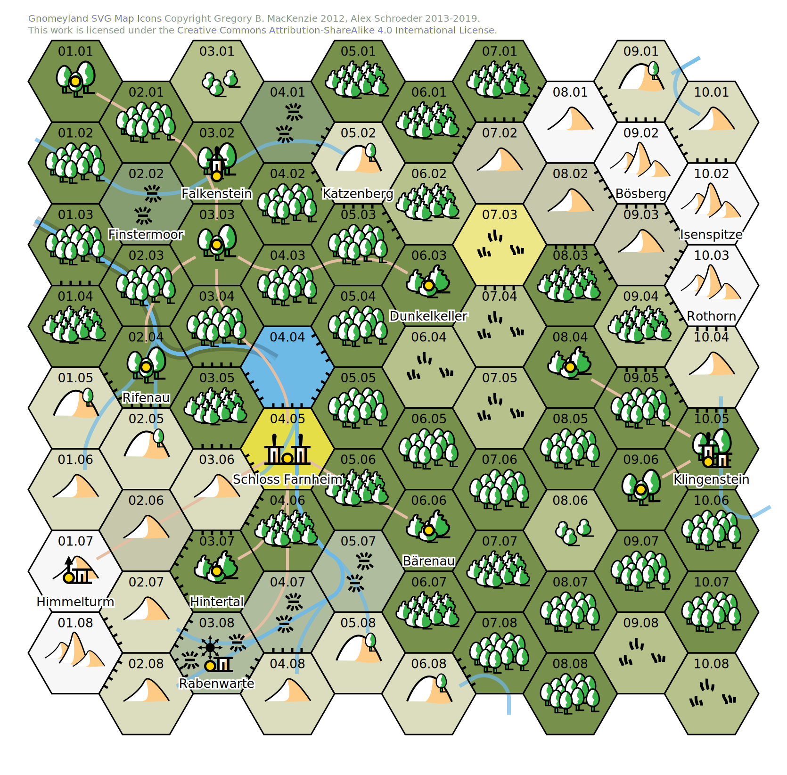

<!--*- ispell-local-dictionary: "swiss8" -*-->
<address>Alex Schroeder, YYYY-MM-DD. Der Autor verzichtet weltweit auf
alle urheberrechtlichen und verwandten Schutzrechte, soweit das
gesetzlich möglich ist. Da die Karte am Ende auf Icons von Gregory B.
MacKenzie basiert, untersteht sie der <a
href="https://creativecommons.org/licenses/by-sa/4.0/">CC BY-SA
4.0</a> Lizenz.</address>

# Helmbarten

## Was machen wir überhaupt?

Du hast ein super einfaches Rollenspiel vor dir. Du brauchst nur ein
paar Freunde und zwei normale, sechs-seitige Würfel, vielleicht noch
Papier und Stift, und schon kann es los gehen. Einer von euch macht
die Spielleitung. Das bist wohl du? Alle anderen Mitspieler denken
sich eine Person aus. Die Spielleitung erträumt sich eine Welt und
Situationen, in denen sich diese ausgedachten Personen befinden; deine
Freunde sagen, wie sie reagieren und du sagst, wie die Welt reagiert,
und so geht es immer weiter. Die Geschichte dieser Personen ist unsere
Geschichte.

Gewürfelt wird, wenn etwas mit spannenden Konsequenzen passiert und
wir den Ausgang dem Zufall überlassen wollen. Gelingt unseren Personen
ihr Vorhaben oder nicht? Und was passiert danach?

## Spielfigurenerschaffung

Falls du Spieler oder Spielerin bist, spielst du eine fiktive Person,
deine Spielfigur. Diesen werden wir jetzt gemeinsam erschaffen.

Zuerst wählst du deinen Namen, dann würfelst du deine Attribute aus.
Du hast sechs Attribute: Kraft, Geschick, Ausdauer, Intelligenz,
Bildung, und Status. Würfle zwei sechsseitige Würfel für jedes
Attribut, zähle sie zusammen (kurz: 2W6) und notiere es.

> Beispiel: Alex nennt seine Spielfigur Adalric und würfelt 8 8 7 9 10
> 8; Berta nennt ihre Spielfigur Brunhilde und würfelt 10 6 9 5 4 4.

Deine Spielfigur ist nun 16 Jahre alt. Nun wählst du eine erste
Karriere. Zur Auswahl stehen Krieger, Magier, oder Taugenichts. Das
Vorgehen ist immer gleich: Aufnahmeprüfung, Talente lernen,
Schicksalsschläge, 4 Jahre älter werden, und dann musst du
entscheiden, ob deine Spielfigur das vier weitere Jahre macht, oder
ein Jahr verwendet, um die Karriere zu wechseln, oder deine Spielfigur
bereit für das Abenteurerleben ist.

Je nach Karriere sind andere Attribute von Vorteil. Krieger brauchen
Kraft oder Ausdauer, Magier brauchen Intelligenz oder Bildung, und
Taugenichts brauchen Geschick oder Status.

Wenn deine Spielfigur die Aufnahme für die gewünschte Karriere nicht
schafft, kann die Karriere nicht mehr gewählt werden. Steht keine
Karriere mehr zur Auswahl, fängt das Abenteurerleben an: würfle auf
der Belohnungstabelle für jede Karriere!

Eine Karriere dauert vier Jahre. Wähle jedes Jahr eine der Tabellen
deiner Karriere und würfle 1W6. Schreibe dir das Talent mit Wert 1
auf, oder erhöhe den Wert, falls du das Talent ein weiteres Mal
lernst. Wenn du „Kämpfen“ lernst, wähle stattdessen eine Waffe:
Spiess, Helmbarte, Degen, Messer, Armbrust oder Lanze (benötigt
Reiten-1 und ein Pferd).

Mit jeder Karriere, die deine Spielfigur gemacht hat, wird die Chance
höher, dass ein Schicksalsschlag deine Spielfigur trifft. Deswegen
macht es durchaus Sinn, irgendwann mit der Spielfigurenererschaffung
aufzuhören und mit dem Abenteurerleben anzufangen.

Wenn deine Spielfigur 36 oder älter ist, musst du am Ende deiner
Karriere schauen, ob der körperliche Verfall seinen Lauf nimmt. Fällt
ein Attribut auf null, stirbt die Spielfigur.

| 1W6 | Alterungstabelle |
|:---:|-----------------:|
| 1   |       Kraft -1   |
| 2   |    Geschick -1   |
| 3   |    Ausdauer -1   |
| 4   | Intelligenz -1   |
| 5   |  Glück gehabt!   |
| 6   |  Glück gehabt!   |

## Krieger Karriere

**Aufnahme**: Würfle 2W6 ≤ Kraft oder Ausdauer (deine Wahl). Du lernst
automatisch Kämpfen-1.

> Beispiel: Brunhilde hat Kraft-10 und Berta würfelt 2. Brunhilde ist
> aufgenommen!

Du verbringst vier Jahre als Krieger und lernst jedes Jahr etwas.
Wähle jedes Jahr eine der folgenden Tabellen und würfle 1W6. Die
Tabelle „Offizier“ darfst du nur wählen, wenn deine Spielfigur 20 oder
älter ist.

| 1W6  | Söldner  | Wache     | Reiter     | Offizier   |
|:----:|---------:|----------:|-----------:|-----------:|
|   1  |Bauen     |Bürokratie |Reiten      |Schrift     |
|   2  |Rennen    |Disziplin  |Singen      |Bürokratie  |
|   3  |Taktik    |Bauen      |Taktik      |Taktik      |
|   4  |Feldscher |Prügeln    |Spionieren  |Diplomatie  |
|   5  |Handwerk  |Brauen     |Kultur      |Benehmen    |
|   6  |Kämpfen   |Kämpfen    |Kämpfen     |Kämpfen     |

> Beispiel: Berta wählt 2× Söldner, 2× Wache, und würfelt 3 2 5 1,
> gibt Taktik-1, Rennen-1, Brauen-1 und Bürokratie-1. Und Kämpfen-1!
> Sie wählt Degen-1.

**Schicksalsschlag**: Würfle 2W6 + Anzahl bisheriger Karrieren ≤ Kraft
oder Ausdauer (deine Wahl) um den Folgen zu entgehen. Anderenfalls
bestimmst du die Folgen mit 1W6.

1. Todfeind: Der Feldzug war ein Erfolg. Drei Tage lang hast du mit
   geplündert. Die Überlebenden werden dir deine Taten nie verzeihen.
2. Belagerung: Die Mangelernährung hat dich frühzeitig altern lassen.
   Würfle auf der Alterungstabelle.
3. Feldzug: Du bist in einen Hinterhalt geraten und schwer verletzt
   worden. Würfle auf der Alterungstabelle.
4. Erlahmt: Nach einem Unfall ist es nie wieder so geworden wie
   früher. Die Kriegerkarriere ist dir von nun an verwehrt.
5. Gefangenschaft: Der Feldzug war ein Fiasko. Du wurdest gefangen
   genommen. Würfle auf der Alterungstabelle. Würfle 3W6 ≤ ein
   Attribut deiner Wahl, um zu entkommen. Gelingt dies nicht, vergehen
   weitere vier Jahre. Würfle wieder auf der Alterungstabelle und
   versuche nochmal – bis du es schaffst, oder stirbst.
6. Verschollen: Der Feldzug war ein grosser Fehler. Die Armee wurde
   zerschlagen. Die Fliehenden wurden niedergeritten. Man hat dich nie
   wieder gesehen.

> Beispiel: Berta würfelt 4+0 und Brunhilde erleidet keinen
> Schicksalsschlag. Brunhilde ist nun 20 Jahre alt. Auf der
> Alterungstabelle muss noch nicht gewürfelt werden.

## Magier Karriere

**Aufnahme**: Würfle 2W6 ≤ Intelligenz oder Bildung (deine Wahl).
Du lernst automatisch Schrift-1.

> Beispiel: Adalric hat Bildung-9 und Alex würfelt 9. Adalric ist
> aufgenommen!

Du verbringst vier Jahre als Magier und lernst jedes Jahr etwas.
Wähle jedes Jahr eine der folgenden Tabellen und würfle 1W6.

| 1W6  | Aggressiv | Passiv  | Manipulativ | Transgressiv     |
|:----:|----------:|--------:|------------:|-----------------:|
|   1  |Feuer      |Heilung  |Bezaubern    |Gestaltwandlung   |
|   2  |Luft       |Schlaf   |Singen       |Nekromantie       |
|   3  |Wasser     |Augen    |Diplomatie   |Transmutation     |
|   4  |Erde       |Türen    |Illusion     |Fusion            |
|   5  |Sturm      |Pflanzen |Menschen     |Tiere             |
|   6  |Kämpfen    |Brauen   |Schrift      |Weltenwandel      |

> Beispiel: Alex wählt 2× Aggresiv, 2× Manipulativ, und würfelt 5 3 5
> 2, gibt Sturm-1, Wasser-1, Menschen-1 und Singen-1. Und Schrift-1!

**Schicksalsschlag**: Würfle 2W6 + Anzahl bisheriger Karrieren ≤
Intelligenz oder Bildung (deine Wahl) um den Folgen zu entgehen.
Anderenfalls bestimmst du die Folgen mit 1W6.

1. Todfeind: Du hast einen Mitschüler blossgestellt. Das wird man dir
   nie verzeihen.
2. Fehlschlag: Das Experiment ging schief und die Energie hat einen
   Weg durch deinen Körper gefunden. Würfle auf der Alterungstabelle.
3. Grenzüberschreitung: Die Forschung hat dich an Orte geführt, die
   man nicht wieder ungesehen machen kann. Ein Dämon hat dich
   *gesehen* und wird dich finden.
4. Übertreten: Du hast dich zu weit in den Raum zwischen den Welten
   getraut, hast fast den Verstand verloren. Die Magierkarriere ist
   dir von nun an verwehrt.
5. Verloren: Du bist in fremden Welten unterwegs gewesen und hast dich
   dort verloren. Würfle auf der Alterungstabelle. Würfle 3W6 ≤ ein
   Attribut deiner Wahl, um den Weg zurück zu finden. Gelingt dies
   nicht, vergehen weitere vier Jahre. Würfle wieder auf der
   Alterungstabelle und versuche es nochmal – bis du es schaffst oder
   stirbst.
6. Ein Opfer: Der Riss zwischen den Ebenen war zu gross, die Energie
   unkontrollierbar, deine Freunde waren fast verloren – doch dann
   hast du dich geopfert. Wer den Ort kennt, weiss wo man dich finden
   kann, doch deine Schreie sind nichts für schwache Nerven.

> Beispiel: Alex würfelt 4+0 und Adalric erleidet keinen
> Schicksalsschlag. Adalric ist nun 20 Jahre alt. Auf der
> Alterungstabelle muss noch nicht gewürfelt werden.

## Taugenichts Karriere

**Aufnahme**: Würfle 2W6 ≤ Geschick oder Status (deine Wahl). Du
lernst automatisch Rennen-1.

> Beispiel: Adalric wechselt Karriere (nun ist er 21 Jahre alt) und
> will Taugenichts werden; er hat Status-10 und Alex würfelt 7. Adalric
> ist aufgenommen!

Du verbringst vier Jahre als Taugenichts und lernst jedes Jahr etwas.
Wähle jedes Jahr eine der folgenden Tabellen und würfle 1W6.

| 1W6 | Dieb       | Schläger | Lügner     | Mörder    |
|:---:|-----------:|---------:|-----------:|----------:|
|  1  |Schleichen  |Kämpfen   |Kultur      |Kämpfen    |
|  2  |Spionieren  |Handwerk  |Benehmen    |Brauen     |
|  3  |Rennen      |Rennen    |Bürokratie  |Feldscher  |
|  4  |Klettern    |Feldscher |Schrift     |Schleichen |
|  5  |Ablenken    |Taktik    |Reden       |Benehmen   |
|  6  |Knacken     |Singen    |Handeln     |Tüfteln    |

> Beispiel: Alex wählt 1× Dieb, 3× Mörder, und würfelt 6 2 2 6, gibt
> Knacken-1, Brauen-2, Tüfteln-1.

**Schicksalsschlag**: Würfle 2W6 + Anzahl bisheriger Karrieren ≤
Geschick oder Status (deine Wahl) um den Folgen zu entgehen.
Anderenfalls bestimmst du die Folgen mit 1W6.

1. Todfeind: Du hast deinen Rivalen gedemütigt. Das wird er oder sie
   dir nie verzeihen.
2. Schulden: Dein Plan ist nicht aufgegangen. Im Gegenteil, man hat
   dich ausgetrickst und nun schuldest du jemandem mehr Geld, als du
   je zurück zahlen kannst.
3. Reingezogen: Du hast Hilfe von Leuten angenommen, dich immer weiter
   verstrickt und nun schuldest du ihnen mehr als nur einen Gefallen.
4. Erwischt: Man hat dich erwischt und an den Pranger gestellt. Jeder
   kennt dein Gesicht. Die Taugenichtskarriere ist dir von nun an
   verwehrt.
5. Gefangenschaft: Der Plan ist aufgeflogen. Du wurdest gefasst.
   Würfle auf der Alterungstabelle. Würfle 3W6 ≤ ein Attribut deiner
   Wahl, um zu entkommen. Gelingt dies nicht, vergehen weitere vier
   Jahre. Würfle wieder auf der Alterungstabelle und versuche es
   nochmal – bis du es schaffst oder stirbst.
6. Verschwunden: Es kam zum Bandenkrieg und du bist verschwunden. Es
   heisst, die Strassenhunde sind fett geworden, dieses Jahr. 

> Beispiel: Alex würfelt 8+1, da er bereits eine Karriere als Magier
> hinter sich hat. Adalric erleidet keinen Schicksalsschlag und ist nun
> 25 Jahre alt.

## Talente

Proben würfeln wir wie folgt: 2W6 ≤ Attribut + Talent. Bei sehr
schweren Proben: 3W6 ≤ Attribut + Talent. Falls kein Talent passt,
oder das passende Talent fehlt, dann +0.

Ein paar Stichworte zu den einzelnen Talenten.
**Ablenken**: Leute von etwas ablenken, damit anderes unbemerkt getan werden kann.
**Augen**: Magie, welche die Fernsicht oder die wahre Sicht erlaubt.
**Bauen**: Bauen von Häusern, Burgen, Belagerungsmaschinen, das Graben von Gruben und Schächten.
**Benehmen**: Wie benimmt man sich in edler Gesellschaft.
**Bezaubern**: Magie, welche Menschen gefügig macht, ihre Gefühle kontrolliert.
**Brauen**: Bier brauen, Kräutertee zusammenstellen, Zaubertränke brauen, Gift mischen.
**Bürokratie**: Ein Verständnis für jeden Verwaltungsapparat und die Menschen, die dort arbeiten.
**Diplomatie**: Das Aushandeln von Verträgen, das Vermeiden von Gewalt, das Stiften von Frieden.
**Disziplin**: Die Kontrolle über Menschengruppen und sich selber entgegen dem natürlichen Instinkt.
**Erde**: Magie, welche mit Steinen, Beben, dem Erdreich, und allem Unterirdischen zu tun hat.
**Feldscher**: Das Reinigen und Nähen von Wunden, das Setzen von Knochen, die Pflege der Kranken.
**Feuer**: Magie, welche mit Flammen, Explosionen und Zerstörung zu tun hat.
**Fusion**: Magie, welche Lebewesen mit anderen Lebewesen und Dingen verschmilzt.
**Gestaltwandlung**: Magie, welche es erlaubt, die Gestalt zu wechseln.
**Handeln**: Das Finden, Auftreiben, Feilschen um und Kaufen von Dingen.
**Handwerk**: Holzwerken, Metallwerken, Feilen, Sägen, Verzieren und Bemalen von Dingen.
**Heilung**: Magie, welche Lebewesen wieder Kraft gibt und Flüche bricht.
**Illusion**: Magie, welche Anderen Dinge vorgaukelt, die nicht wahr sind.
**Klettern**: Das Erklimmen von Felsen und Mauern, die Bewegung im Gebirge.
**Knacken**: Das Öffnen von Schlössern und Türen.
**Kultur**: Ein Verständnis für Legenden, Malereien, Lieder, Sitten und Gebräuche fremder Länder.
**Kämpfen**: Der Umgang mit den Waffen und das Töten.
**Luft**: Magie, welche mit Wind, Fortbewegung und Geräuschen zu tun hat.
**Menschen**: Magie, mit der man Gedanken und Gefühle der Menschen lesen kann.
**Nekromantie**: Magie, welche die Wiederbelebung und den Kontakt mit den Toten erlaubt.
**Pflanzen**: Magie, welche mit Pflanzen und ihrem Wachstum zu tun hat.
**Prügeln**: Die waffenlose Gewalt, das Androhen und das Zufügen von Schmerzen.
**Reden**: Das Überzeugen mit wohl gewählten Worten.
**Reiten**: Das Reiten auf Tieren, meist Pferde.
**Rennen**: Langstreckenlauf, Kurzstreckenlauf, Ansturm.
**Schlaf**: Magie, welche mit dem Schlaf und der Ohnmacht zu tun hat.
**Schleichen**: Das leise Bewegen und das Verstecken.
**Schrift**: Das Lesen und Schreiben.
**Singen**: Das Singen von Liedern und das Spielen von Instrumenten.
**Spionieren**: Das Kundschaften, das Spurenlesen, das Beobachten.
**Sturm**: Magie, welche mit Wind, Regen, Blitz und Donner zu tun hat.
**Taktik**: Das Vorbereiten von Hinterhalten, das Nutzen des Geländes für den Kampf.
**Tiere**: Magie, welche mit Tieren und dem Umgang mit ihnen zu tun hat.
**Transmutation**: Magie, welche Dinge in andere Dinge verwandelt.
**Tüfteln**: Das Bauen von mechanischen Geräten und den Nutzen von Materialeigenschaften.
**Türen**: Magie, welche mit dem Verschliessen und Öffnen von Tür und Tor zu tun hat.
**Wasser**: Magie, welche mit dem Wasser, dem Tauchen, dem Schwimmen, und dem Wasserwandeln zu tun hat.
**Weltenwandel**: Magie, welche mit dem Kontakt zu anderen Welten und dem Übertritt in diese zu tun hat.

## Belohnung

Bevor du mit dem Abenteurerleben beginnst, gibt es noch eine
Belohnung. Würfle für jede Karriere auf der entsprechenden Tabelle.

| 1W6 | Krieger       | Magier        | Taugenichts   |
|:---:|--------------:|--------------:|--------------:|
| 1   |Intelligenz +1 |Intelligenz +2 |Intelligenz +1 |
| 2   |Bildung +2     |Bildung + 1    |Bildung +2     |
| 3   |Status +1      |Status +2      |Status +2      |
| 4   |Geheimbund     |Geheimbund     |Geheimbund     |
| 5   |Pferd          |Gefährte       |Hund           |
| 6   |Land           |Lehrstuhl      |Posten         |

> Beispiel: Adalric hat zwei Karrieren gemacht, 1× Magier und 1×
> Taugenichts. Alex würfelt 4 5, gibt eine Mitgliedschaft in einem
> Geheimbund und einen Hund.

**Geheimbund**: Die Spielleitung stellt drei Bunde zur Auswahl.
Notfalls handelt es sich um die folgenden drei:

* Das Ministerium des Abendlichts
* Die Geschwister der Morgenröte
* Die Nachkommen der Frostriesen

**Gefährte**: Ein junger Mensch, welcher keine Karrieren gemacht hat,
oder ein intelligentes Tier wie eine Katze, eine Eule, oder ein Rabe.
Falls es ein Mensch ist, gib deinem Gefährten oder deiner Gefährtin
einen Namen und würfle die sechs Attribute aus (je 2W6 für Kraft,
Geschick, Ausdauer, Intelligenz, Bildung, und Status).

**Hund**: Ein treuer Gefährte (Schaden 2W6, Ausdauer 3W6, Leben 2W6,
Treffen 1W6+6).

**Pferd**: Ein treues Reittier (Schaden 3W6, Ausdauer 6W6, Leben 3W6,
Treffen 1W6+4). Ein Reiter im Nahkampf kann sein Pferd angreifen
lassen. Ein Reiter kann nur mit der Lanze angreifen; einen Reiter kann
man nur mit Spiess oder Helmbarte angreifen.

**Land**: Ein Stück Land in der Wildnis, welches dir zugesprochen
wurde. Die Inbesitznahme des Landes ist allerdings dir überlassen.
Benenne dein Stück Land.

**Lehrstuhl**: Du bist in deiner Magierschule gerne gesehen und kannst
jederzeit zurück kommen, um den jungen Magierinnen und Magiern etwas
beizubringen. Benenne deine Gönnerin oder deinen Gönner.

**Posten**: Für dich ist in deiner Stadt immer ein Posten frei, sei es
in deiner Bande oder in der Verwaltung. Benenne deine Gönnerin oder
deinen Gönner.

## Abenteurerleben

Willst du etwas tun, dessen Ausgang unsicher ist, einige dich mit der
Spielleitung auf ein Attribut und ein Talent, sofern es ein passendes
Talent gibt. Würfle 2W6 ≤ Attribut + Talent, um Erfolg zu haben. Ist
es sehr schwer, musst du möglicherweise 3W6 ≤ Attribut + Talent
würfeln.

Wenn du erfolgreich angreifst, verursachst du 2W6 Schaden, ausser du
verwendest eine Helmbarte. Diese verursacht 3W6 Schaden. Du kannst in
einem Kampf nur so oft angreifen, wie du Ausdauer hast.

Wirst du zum ersten Mal im Kampf getroffen, musst du den Schaden von
einem zufällig bestimmten physischen Attribut abziehen. Würfle 1W6:
1–2 ist Kraft, 3–4 ist Geschick, 5–6 ist Ausdauer. Bei allen weiteren
Treffern, darfst du die Trefferwürfel selber auf die drei physischen
Attribute verteilen. Einen etwaigen Übertrag musst du von einem
anderen physischen Attribut abziehen.

Sinkt eines deiner physischen Attribute auf 0, bist du leicht verletzt
und brichst ohnmächtig zusammen. Nach 10min wachst du wieder auf.

> Beispiel: Brunhilde hat Kraft-10, Geschick-6, Ausdauer-9. Sie wird
> zum ersten Mal getroffen und muss 4+5=9 Schaden abziehen. Berta
> würfelt eine 1, also muss Brunhilde 9 von Kraft (10-9=1) abziehen.
> Sie wird nicht ohnmächtig! Beim zweiten Mal muss sie 2+6=8 Treffer
> abziehen und entscheidet sich, 2 vom Geschick (6-2=4) und 6 von der
> Ausdauer (9-6=3) abzuziehen. Jetzt wird es knapp…

Nach dem Kampf erholen sich alle Attribute um die Hälfte des fehlenden
Betrages (runde ab). Wenn du von einem Feldscher oder einem Heiler
behandelt wirst, bist du in 30min wieder fit, ansonsten dauert die
Erholung 3 Tage.

> Beispiel: Nach einer Behandlung durch den Feldscher erholen sich
> Brunhildes Attribute auf Kraft 1+4½=5, Geschick 4+1=5, Ausdauer
> 3+3=6.

Sinken zwei deiner physischen Attribute auf 0, bist du schwer
verwundet und brichst ohnmächtig zusammen. Du wachst erst in 3h wieder
auf und nur die Attribute auf 0 erholen sich auf 1. Mit einem
Feldscher-3 oder einem Heiler-3 kannst du dich in einem Lazarett in
5W6 Tagen erholen, andernfalls stirbst du.

Sinken drei deiner physischen Attribute auf 0, stirbst du.

Für allen anderen Lebewesen gibt es zwei physische Attribute: Ausdauer
und Leben. Sinkt ersteres auf 0, werden sie ohnmächtig; sind beide auf
0 gesunken, sterben sie.

> Beispiel: Adalrics Hund Tix hat Ausdauer 3W6, Leben 2W6. Alex würfelt
> 1+4+5=10 und 5+2=7 und notiert 10/7 für den Hund.

## Gegner

Alle weiteren Kapitel in diesem Buch sind für die Spielleitung
bestimmt. Also für dich!

Menschen lassen sich mit den bekannten sechs Attributen abbilden. Du
darf diese frei bestimmen oder sie auswürfeln (2W6). Talente werden
ebenso frei bestimmt (oft 1 oder 2).

Monster und Tiere haben andere: Schaden bestimmt wieviel Schaden sie
bei einem Treffer verursachen; Ausdauer bestimmt, wieviele Runden sie
angreifen können und wieviel Schaden sie einstecken können, ohne ihr
Bewusstsein zu verlieren; darüber hinaus gehender Schaden wird vom
Leben abgezogen; sinkt Leben auf null, sind sie tödlich getroffen;
Angriff bestimmt bei einer Begegnung, ob sie angreifen (2W6 ≤
Angriff); Treffen bestimmt, wie gut sie treffen (2W6 ≤ Treffen); Flucht
bestimmt, ob sie fliehen, falls sie nicht angreifen (2W6 ≤ Flucht).
Falls sie weder angreifen noch fliehen wird geredet.

| 1W6 |     Gegner | Schaden | Ausdauer | Leben | Angriff | Treffen | Flucht |
|:---:|-----------:|:-------:|:--------:|:-----:|:-------:|:-------:|:------:|
| 1   | Nachtlinge | 2W6     | 1W6      | 1W6   | 1W6+4   | 1W6+5   |  1W6+3 |
| 2   |  Raubtiere | 2W6     | 3W6      | 2W6   | 1W6+5   | 1W6+6   |  1W6+2 |
| 3   |     Untote | 2W6     | 3W6      | 4W6   | 1W6+6   | 1W6+7   |  1W6+0 |
| 4   |  Reittiere | 3W6     | 6W6      | 3W6   | 1W6+4   | 1W6+4   |  1W6+2 |
| 5   |     Riesen | 4W6     | 8W6      | 4W6   | 1W6+3   | 1W6+8   |  1W6+0 |
| 6   |    Drachen | 6W6     | 10W6     | 5W6   | 1W6+2   | 1W6+9   |  1W6+0 |

Notiere dir, wenn du etwas auswürfelst und bleibe dabei! Für die
Anzahl Gegner, würfel 2W6 für Nachtlinge und Raubtiere, oder 1W6 für
Untote. Riesen und Drachen sind immer Einzelgänger.

> Beispiel: Claudia macht die Spielleitung und braucht Goblins, die
> auf Riesenspinnen reiten, welche die Vorhut überfallen. Es sind 7.
> Sie verwendet die Zeile der Nachtlinge und der Reittiere. Goblins:
> Schaden-3, Ausdauer-1, Leben-5, Angriff-5, Treffen-9, Flucht-4.
> Riesenspinnen: Schaden-15, Ausdauer-16, Leben-12, Angriff-9,
> Treffen-5, Flucht-7. In dieser Welt sind Goblins eher harmlose
> Gegner, die auf fürchterlichen Riesenspinnen reiten, die aber
> wiederum nicht so gut treffen.

Kündige die kommende Gefahr immer deutlich an, damit Spieler und
Spielerinnen selber entscheiden können, ob sie sich auf einen Kampf
einlassen wollen.

> Beispiel: Claudia beschreibt, wie sich die wagengrossen Schatten
> durch das Unterholz schieben, wie ihr beissende Geruch sich
> ausbreitet und die Tiere im Stall toben.

Wenn es geht, sollen die Spieler und Spielerinnen würfeln, nicht die
Spielleitung. Wollen sie beispielsweise den Gegnern in einen
Hinterhalt locken, oder einen Hinterhalt bemerken, soll in beiden
Fällen jemand gegen Intelligenz + Taktik würfeln.

## Magie

Genau so wie du dir langsam einen Fundus von Gegnern erarbeitest,
musst du mit den Spielern und Spielerinnen ein Verständnis erarbeiten,
wie stark die Magie in etwa ist.

> Beispiel: Wieviele Goblins kann Adalric mit einem Blitz erledigen?
> Alex und Claudia einigen sich darauf, dass ein Blitz eine
> Riesenspinne samt Reiter treffen kann und beiden je 5W6 Schaden
> macht, oder dass ein Kettenblitz fünf Goblins erwischt und ihnen je
> 2W6 Schaden macht.

Auch hier gilt: Notiert euch, was ihr aushandelt und bleibt dabei!

> **Blitzschlag**: trifft einen Gegner und was er trägt für je 5W6 Schaden  
> **Kettenblitz**: trifft bis zu 5 Gegner für je 2W6 Schaden

Da Zaubersprüche stärker als Waffenangriffe sind, sollte man nicht
beliebig viele davon zaubern können. Mit jedem Zauberspruch steigt das
Risiko der Erschöpfung. Deswegen gilt beim Zaubern die abgewandelte
Regel: Würfle 2W6 + Anzahl heutiger Zaubersprüche ≤ Attribut + Talent,
um Erfolg zu haben. Wenn der Wurf fehlschlägt, lässt sich das Talent
heute nicht mehr verwenden.

> Beispiel: Adalric zaubert Regen herbei, für Sichtschutz. Er hat
> Bildung-9, Wasser-1, macht in der Summe 10. Alex würfelt 10 + 0, da
> dies der erste Zauberspruch des Tages war. Es regnet, da 10 ≤ 10.
> Nun folgt ein Kettenblitz: Alex würfelt 5+1=6 und 6 ≤ 10. Damit sind
> fünf Goblins erledigt.

Die Magie führt immer wieder zu Diskussionen. Das muss man mögen –
oder sonst lässt man die Magier Karriere lieber weg. Wie lange kann
man unter Wasser atmen? Kann man unter Wasser zaubern? Was passiert,
wenn man unter Wasser einen Blitz zaubert? Wichtig ist, dass man sich
am Tisch einigt und das Ergebnis aufschreibt.

Nicht alle Magietalente sind gleich stark, oder gleich nützlich. Auch
damit muss man leben können. Gewisse Magietalente eigenen sich für
Druiden, Barden, Heiler.

Es gibt kein Talent für Beschwörungen: stattdessen soll man dies mit
einem Tor auf eine andere Ebene, oder als Weltenwandel gehandhabt
werden. Jeden Dämon muss man selber unterjochen und zu seinen Taten
zwingen.

In meinen Spielen ist die Bezauberung immer eine gewalttätige Sache:
es ist ekelerregend und revoltierend, wenn man zu Dingen gezwungen
wird.

Es ist nicht möglich die Zukunft vorherzusehen. Das würde Spieler und
Spielerinnen entmündigen. Ein Rollenspiel ist keine Sage, das
Schicksal ist nicht vorherbestimmt.

## Kämpfe

Der Kampf wird in Runden unterteilt. Jeder darf 1×/Runde angreifen,
zaubern, oder sonst etwas tun. Alle Beteiligten kündigen ihre Aktion
an, würfeln, und werten gleichzeitig aus. Wird mittels Taktik ein
Vorteil erreicht, ist das Resultat eine Überraschungsrunde, wo der
Gegner nicht zurückschlagen kann.

> Beispiel: Adalric zaubert den Kettenblitz und er ist durch den Regen
> geschützt, doch ein Goblin hat ihn trotzdem erkannt und schiesst mit
> dem Armbrust auf ihn. Der Goblin hat Angriff 5. Claudia würfelt 6 –
> und 6 ≰ 5: verfehlt!

In gewissen Rollenspielen ist das Kämpfen ein grosser Teil des Spiels.
In diesem Spiel liegt nach einer Runde schon vielleicht schon die
Hälfte der Beteiligten am Boden. Krieg ist schrecklich. Meistens gilt
es, dem Kampf aus dem Weg zu gehen.

> Beispiel: Brunhilde hat Kraft-10, Geschick-6, Ausdauer-9, Degen-1.
> Sie versucht, den Hof zu erreichen, doch zwei Goblins sind ihr auf
> den Fersen, mit Schaden-3, Ausdauer-1, Leben-5, Angriff-5,
> Treffen-9, Flucht-4. Brunhilde stellt sich dem Kampf. Erste Runde:
> Berta würfelt 6 und trifft, da 6 ≤ 10+1. Claudia würfelt 5 und 6,
> zwei Treffer für die Goblins, da 6 ≤ 9. Beim ersten Treffer
> entscheidet der Zufall, welches Attribut Brunhilde reduzieren werden
> muss: Berta würfelt eine 4, d.h. Geschick (6-3=3). Die Goblins
> machen immer gleich viel Schaden. Den zweiten Treffer zieht sie von
> der Ausdauer ab (9-3=6). Berta würfelt ihren Schaden aus: 6. Damit
> ist der erste Goblin tödlich verwundet (Ausdauer und Leben beide auf
> 0), doch der andere steht noch.

.jpg)
Schlachtfeld (1521), von Urs Graf
{: .pic }

## Weltenbau

Die Welt baut man am besten dort aus, wo die Spielfiguren sich
engagieren. Wenn sie nach Norden gehen, wird dort angebaut. Wenn sie
sich für Bibliotheken interessieren, werden Bücher und Bibliothekare
wichtig. Wenn sie sich für Geschichte interessieren, werden alte
Schriften und Ruinen wichtig.

Das Spiel bietet keine „Belohnung“ im Sinne von Machtgewinn. Geld zu
finden lohnt sich nicht, es gibt keine spezielle Ausrüstung zu kaufen,
keine Erfahrungspunkte zu gewinnen. Auch deswegen ist es wichtig,
herauszufinden, was die Spieler und Spielerinnen interessiert. Ein
tragisches Ende? Eine Liebesgeschichte? Der Besitz einer Burg? Zum
Ritter geschlagen zu werden? Eine Bande übernehmen? Die Welt zu
bereisen? Und dann fügt man Helfer, Konkurrenten, Schurken und
Unruhestifter zur Welt hinzu. Diese Reibung schärft das Profil. Hier
sehen wir, was unsere Spielfiguren für Menschen sind.

Konkret empfehle ich, ein Dutzend Personen auszuarbeiten. Alle haben
einen Namen, Attribute, ein paar Talente, und gehen einer Tätigkeit
nach. Drei von ihnen gehört zu je einem Geheimbund, drei gehören zu je
einem Tempel, drei gehören zu je einer Burg, und drei gehören zu je
einer Magierschule. Alle diese Organisationen haben einen Namen und
ein Hauptquartier. Und sowohl Personen als auch Organisationen wollen
je drei Dinge und bieten je drei Belohnungen. Wenn sich die Wünsche
zum Teil überschneiden und widersprechen, um so besser.

| 1W6 | Tätigkeit    | Geheimbund 1   | Geheimbund 2     | Götter | Dämonen  |
|:---:|--------------|----------------|------------------|--------|----------|
| 1   | Ritter       | Miliz          | der Pyramide     | Odin   | Set      |
| 2   | Barde        | Schreiberlinge | des Mondes       | Freya  | Orcus    |
| 3   | Dieb         | Pentarchen     | des Kreises      | Thor   | Pazuzu   |
| 4   | Magier       | Schüler        | der Geschichte   | Mitra  | Nergal   |
| 5   | Bibliothekar | Diener         | des Bewusstseins | Marduk | Hel      |
| 6   | Händler      | Kooperation    | der Ordnung      | Ishtar | Zathogga |

Die ersten paar Namen von Dörfern, Burgen und Hexentürme kann man sich
mit den folgenden Tabellen generieren.

| 1W6 | Burg 1   | Burg 2   | Burg 3  | Dorf   | Magie 1  | Magie 2 | Magie 3 |
|:---:|----------|----------|---------|--------|----------|---------|---------|
| 1   | Schauen- | Falken-  | -burg   | -dorf  | Hexen-   | Feuer-  | -turm   |
| 2   | Alten-   | Farn-    | -berg   | -thal  | Raben-   | Toten-  | -warte  |
| 3   | Bären-   | Froh-    | -fels   | -wil   | Teufels- | Tempel- | -stein  |
| 4   | Neuen-   | Klingen- | -stein  | -ach   | Finster- | Hohen-  | -wald   |
| 5   | Guten-   | Ram-     | -zwinge | -ingen | Dunkel-  | Himmel- | -keller |
| 6   | Sternen- | Rifen-   | -au     | -furt  | Eis-     | Katzen- | -feste  |

Für die Namen von Personen suche ich mir gerne eine Namenslisten für
Babies online und verwende diese dann für meine Welt. Hier ein paar
Tabellen für fränkisch angehauchte Namen. Gerne auch mit -o, -a oder
-e am Ende, oder vertauscht (Chlodobert, Theudebald, Hildebart,
Gertrud).

| 1W6 | Name 1 | Name 2  | Name 3 | Name 4 | Name 5 | Name 6 |
|:---:|--------|---------|--------|--------|--------|--------|
| 1   | Adal-  | Chlodo- | -ger   | -burg  | Ada    | Chloe  |
| 2   | Amal-  | Charde- | -man   | -gard  | Berta  | Gregor |
| 3   | Bald-  | Gunde-  | -mund  | -gund  | Gyso   | Frieda |
| 4   | Bert-  | Os-     | -ric   | -hild  | Dodo   | Siggo  |
| 5   | Brun-  | Sigi-   | -hard  | -lind  | Hilde  | Ardo   |
| 6   | Ger-   | Theude- | -sind  | -trud  | Inge   | Gisela |

Intelligente Monster und Berge sollten auch Namen haben. Für Riesen
und Drachen nehme ich gerne Namen, die auf Naturgewalten hindeuten.

| 1W6 | Name 1    | Drachen | Riesen   | Berg 1   | Berg 2  |
|:---:|-----------|---------|----------|----------|---------|
| 1   | Eis-      | -rachen | -hammer  | Nadel-   | -berg   |
| 2   | Frost-    | -atem   | -schmied | Bös-     | -horn   |
| 3   | Feuer-    | -speier | -macher  | Scheid-  | -egg    |
| 4   | Gift-     | -nadel  | -vater   | Finster- | -höhe   |
| 5   | Pest-     | -hauch  | -mutter  | Rot-     | -flue   |
| 6   | Schatten- | -rauch  | -zahn    | Isen-    | -spitze |

Schätze, welche diese Personen, Riesen und Drachen möglichweise haben,
und die sie sich gegenseitig abluchsen wollen. Hierfür sollte man sich
noch zwei oder drei wichtige Personen aus der Vergangenheit ausdenken:
Propheten, Heldinnen, und so weiter; sowie den Namen eines dunklen
Herrschers und seines Reiches. Namen sind wichtig!

| 1W6 | Was     | Wozu                | Wer hat es erfunden?                   |
|:---:|---------|---------------------|----------------------------------------|
| 1   | Ring    | der Unsichtbarkeit  | der Herrschers der Nacht               |
| 2   | Schwert | der Unbesiegbarkeit | die Herrin vom See                     |
| 3   | Krone   | der Macht           | der erste Richter                      |
| 4   | Speer   | der Zerstörung      | aus den letzten Tagen des Reichs       |
| 5   | Buch    | des Heiligen        | (eine bekannte Person)                 |
| 6   | Kelch   | der Erlösung        | (ein Gott, eine Göttin oder ein Dämon) |

All diese Dinge werden festgehalten und führen hoffentlich auch gleich
zu Querverbindungen und Inspirationen. Im nächsten Kapitel hat es den
Anfang einer solchen Ausgangslage – fertig schreiben musst du sie
allerdings selber!

## Beispiel

① **Brunmund** der Magier von Dunkelkeller ist Fleischmagier und
Wolfsmensch, wild, frei, ungebildet: Kraft-7, Geschick-10, Ausdauer-7,
Intelligenz-12, Bildung-2, Status-9, Fusion-3, Gestaltwandlung-3,
Tiere-2, Nekromantie-2, Wasser-1, Pflanzen-1, Singen-1, Schrift-1.
Er begehrt den Ring der Unsichtbarkeit des Riesen Eiszahn vom Bösberg,
den Osrica einmal getragen hat. Er möchte, dass Amalgund von
Falkenstein aus seiner Burg vertrieben wird. Er liebt die Hexe Getrud
vom Katzenberg. Sein Wald wird von riesigen Wölfen verteidigt, auf
denen Schattenelfen reiten.

**Wolf** … Erstellen wie ein Raubtier.

**Schattenelf** … Erstellen wie ein Nachtling.

② **Amalgund** der Baron von Falkenstein. Attribute auswürfeln. Je
eine handvoll Würfel auf den verschiedenen Kriegertabellen. Auch er
liebt die Hexe Gertrud vom Katzenberg. Seine Tochter Inge wird vom
Riesen Eiszahn gefangen gehalten. Gerne würde er ihren Retter zum
Ritter oder zur Ritterin der Burg Rifenstein machen.

③ **Gertrud** die Hexe vom Katzenberg … Je eine handvoll Würfel auf
den verschiedenen Magiertabellen. Will die Pentarchen des Kreises
aufdecken und beseitigen. Sucht das Buch der Macht. Wird von
Raubkatzen beschützt.

**Panther** … Erstellen wie ein Raubtier.

④ **Theudetrud** von Bärenau ist eine der fünf Pentarchen des Kreises,
einem Geheimbund von Magiern, welche sich der Aufrechterhaltung des
ewigen Friedens verschworen haben. Entsprechend gibt sie sich
natürlich nicht als Magierin zu erkennen sondern führt ein Doppelleben
als Bierbrauerin für die umliegenden Güter. Sie sucht ebenfalls das
Buch der Macht. Aus ihrer Sicht gilt es, auch die Drachen zu schützen,
denn sonst wird sich alles ändern.

⑤ **Hildegard** von der Rabenwarte ist Hohepriesterin des Pazuzu,
geschützt von einem verfluchten Nebel über dem grossen Sumpf, in dem
sich der Drache Pesthauch umher treibt. Sie hat das Buch der Macht und
damit hat sie den grossen Sumpf zu einer tödlichen Falle gemacht. Will
jemanden bei Gertrud einschleusen, um Einfluss zu gewinnen.

**Pesthauch** ist ein Drache im grossen Sumpf, der Hildegard
verfallen.

**Eiszahn** ist der Riese vom Bösberg … Er hält die schöne Inge von
Falkenstein gefangen. Jede Nacht streifen die toten Büsser über seinen
Gletscher.

**Tote Büsser** … Klagende Untote, barfuss auf dem Eis.

**Feuervater** ist der Riese vom Rothorn. Ein mächtiger
Klingenschmied. Er hat damals das Schwert der Osrica geschmiedet.
Diesen Fehler möchte er nicht wiederholen.

⑥ **Chlodogunda** ist die Feldherrin von Klingenstein, zurückgekehrt
aus dem Krieg in fernen Ländern, um in Besitz zu nehmen, was ihr
vermeintlich gehört. Sie ist umgeben von einer Hunderschaft von
Reisläufern. Der Anführer ihrer Nachhut ist Siegbert. Sie will das
Schwert der Osrica finden.

**Reisläufer** … Söldner. Krieger mit Hellebarden: Schaden-3W6,
Ausdauer-9, Leben-9, Angriff-9, Flucht-5, Anzahl: 10.

⑦ **Gyso** von den Federn ist Vorsitzender der Silbernen
Schreiberlingen, einer Geheimbund von Chronisten und Gelehrten, die
Bücher kopieren und das Wissen alter Zeiten durch diese dunklen Jahre
retten wollen. Er will das Buch der Macht, welches der dunkle
Herrscher vor seinem Ende noch geschrieben hat.

⑧ **Siegbert** gehört der „Miliz der Pyramide“ an, einem Geheimbund
der Söldner, die auf den Feldzügen gegen die Steppenreiter das
Wüstenland erreicht haben, und dort die alten Pyramiden gesehen haben.
Ihm stünde wohl der Sinn nach einer Heirat. Er lässt sich leicht von
der Macht verführen. Gerne würde er sich ein Schwert schmieden lassen,
so wie Osrica eines hatte.

⑨ **Frieda** vom Himmelturm ist die Hohepriesterin des Marduk in
Midgard. Marduk schützt die Menschen vor den Monstern, und deswegen
ist ihr grösster Wunsch die drei Drachen getötet zu wissen: Pesthauch,
Frostatem, und Schattenspeier.

**Frostatem** ist der Drache der Isenspitze. In seinem Hort liegt das
Schwert der Osrica.

⑩ **Wisigarde** ist die berühmte Sängerin vom Schloss Farnheim, und
die Geliebte der Vuldetrada. Ihr Chor ist gleichzeitig auch eine
Schule für Diplomatie, Menschenkenntnis, Illusionsmagie, und vieles
mehr.

⑪ **Vuldetrada** ist die Baronin vom Schloss Farnheim, reich und
ledig.

⑫ **Gundobad** ist Ritter von Rifenau, und würde gerne Vuldetrada
heiraten. Doch bis jetzt ist er kläglich gescheitert. Er besässe gerne
den Kelch der Erlösung, von Set gesegnet, mit dem man Wasser zu Gift
verwandeln kann. Es gehört zum Hort von Schattenspeier.

**Schattenspeier** ist der Drache vom Finstermoor. In seinem Hort
befindet sich der Kelch der Erlösung, von Set gesegnet, mit dem man
Wasser zu Gift verwandeln kann.

Und irgendwann heisst es natürlich: Spielen! Spielerkontakt wirkt
Wunder. Erst so erfährst du, ob die Spieler sich für die Drachen, die
Riesen, die Geschichte von Osrica, das Buch der Macht, den Kampf gegen
Hildegard oder gegen Chlodogunda suchen, ob sie Amalgund helfen, oder
selber im Hintertal ein Herrschaft errichten wollen.

Man kann nicht alles vorbereiten. Irgendwann muss es los gehen.

## Karte

Eine Karte finde ich sehr stimmungsvoll, muss aber nicht zwingend
sein.

Die Weltkarte für den Anfang
{: .pic }

## Lesematerial

[Die Schweizer: Reisläufer aus den
Alpen](http://www.kriegsreisende.de/voelker/schweizer.htm), von Frank
Westenfelder.

[Stammliste der
Merowinger](https://de.wikipedia.org/wiki/Stammliste_der_Merowinger),
auf Wikipedia, für die Personennamen. [Frankish
Names](https://www.s-gabriel.org/names/guntram/franks.htm), sehr kurz,
von Guntram von Wolkenstein.

[Text Mapper](https://campaignwiki.org/text-mapper/), um Karten für
das Spiel zu erstellen. Mir gefallen die
[Alpinen](https://campaignwiki.org/text-mapper/alpine/random) Karten.

[Helmbarten Spielfigurengenerator](https://campaignwiki.org/helmbarten/),
um schnell ein paar Spielfiguren oder eine Anfangssituation zu
erstellen.

[Farnthal Replay](https://alexschroeder.ch/pdfs/Farnthal.pdf) erzählt,
wie meine erste Kampagne verlaufen ist.
