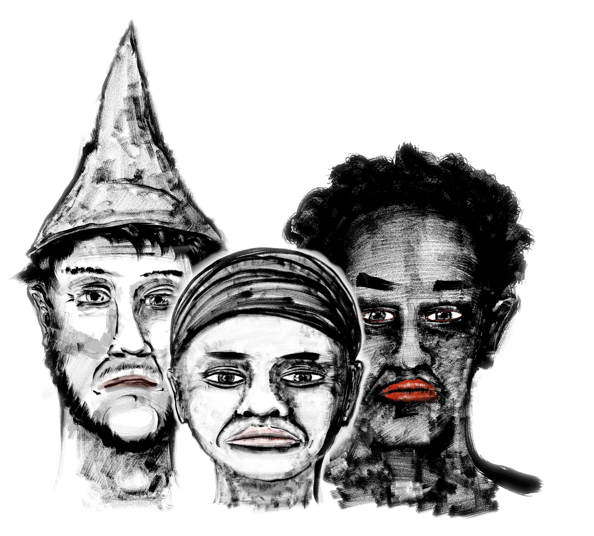

<address>Alex Schroeder</address>

# Just Halberds

## What is this?

This is a super simple role-playing game using just two six sided dice
(2d6). One person is the referee (you?) and your friends play people
in an imagined world. The referee imagines the setting and the
situations these imaginary people come across, your friends say how
the people they are playing react, the referee says how the setting
reacts, and on it goes. The story of these people is your story.

The dice come into play when something of consequence is going to
happen and you want to leave the outcome to chance. Whenever people
struggle, you'd roll dice. Do they succeed or do they fail? And what
are the consequences going to be?

## Making characters

Each player needs to make a character in the game. This is the person
they control.

1. a name
2. a profession
3. a skill
4. a special ability

A profession is something anybody could have learned in their youth:
tinker, tailor, soldier, spy. A skill is something could learn as part
of their adventuring life style: sword fighting, hunting, fishing. A
special ability is something you could learn from a master in the
game: a spell, a special technique.

After every game session, the referee might add a new skill or a new
special ability to one of the characters. If you kept trying to ride a
horse, you might the riding skill. If you kept trying to punch people,
you might learn the boxing skill. If you asked the elves to teach how
to sing their songs, you might get the special ability to sing songs
of sadness. If you asked the treasure hunter to teach you a new spell,
you might get the new special ability to shoot icicles.

## Rolling dice

The player and the referee both roll two six sided dice (2d6). The
player's roll indicates how well they did and the referee's roll
indicates how hard it was. If the player rolls higher, they win; if
the referee rolls higher, they fail; if they roll the same number,
something new and unexpected happens.

When you roll your dice, add one for every profession, skill and
special ability that applies. If you're Fo Pi, the fist-fighting
fire-mage shooting fireballs from your palms (profession: fire-mage;
skill: fist-fighting; special ability: fireball) then you might get to
add one for being a fire-mage and one for shooting fireball in a
fight.

Similarly, the referee might add one to the roll if you're fighting
orcs in melee because that's what they're good at, or the referee
might even add two to the roll if you're fighting the orc boss, or
three if the boss is wielding a magic mace.

The effect of your actions are going to be decided by the referee.
Feel free to negotiate, but don't overdo it. Keep the game flowing and
roll with the punches. I promise it's going to be an entertaining game
even if – and specially if – you have to suffer the occasional
setback.

## Hits

Every character can take three hits.

- Light armour grant an extra hit but prevent spell casting.

- Heavy armour grants two extra hits but prevents spell casting,
  sneaking, climbing, running, and swimming.

- A shield grants an extra hit and also prevents spell casting,
  sneaking, climbing, running, and swimming.

Thus, a magic user without armour can take three hits. A thief in
light armour can take four hits. A warrior in full gear can take six
hits.

When you're rolling dice, the losing side usually takes damage:

- If the difference is small (say one or two), this is one hit.

- If the difference is big (say three or four), this is two hits.

- If the difference was huge (five or more), apply extra effects if
  you have special abilities, or make it three hits.

- If you're down to two hits, you've taken a beating.

- If you're down to one hits, you're injured and that prevents you from
  doing anything strenuous.

- If you're down to zero hits, you're down and out. If your enemies
  want to kill you, they can. Recovery takes many days.

## Initiative

Whoever acts first has the initiative. When you land a hit, you keep
the initiative and determine who goes next. This continues until the
defenders get a better result.

Example: Fo Pi the fire-mage is fighting some orcs. The orcs are
surprised and so Fo Pi's player gets to say what Fo Pi does. Fo Pi is
going to fireball the orcs. If Fo Pi misses, the orcs get the
initiative. They decide to grapple Fo Pi. Thus, the side with
initiative determines what gets used in the attack and this constrains
what the defenders can use. It's hard to imagine how one would use
fire-magic and fireballs against a bunch of grappling orcs.

## Agreeing on special effects

You can use special abilities to get add one when rolling your dice,
as described above. In addition to that, they have special effects.
The exact effects are determined at the table.

Let us return to Fo Pi, the fist-fighting fire-mage shooting a
fireball at five orcs. You roll a seven and add two, so your result is
nine. The orcs roll six and add one because they're tough warriors.
There is a difference of two. What does it mean? There's an explosion.
Fire is everywhere. The orcs are flying through the air. One of them
doesn't get back up. They're dead.

Fo Pi's player might think that the fireball ought to kill them all
and challenges the result. Here's why I think one dead is good enough:

- The difference between the two results was small. It's worth one
  hit. Orcs have one hit in my game. One dead is fair.

- Fo Pi is a newbie mage. A mighty fire-mage might have collected many
  more powerful spells: wall of fire, hellfire. The fireball having a
  minor effect is appropriate.

- I'm picturing Fo Pi's fireball like a simple ball of fire, about as
  powerful as a superb kick from a distance.
  
If players argue that they think it should be a huge explosion
instead, ask the other people at the table. Do they think that's fair?
How about the players of fighters and thieves, do they agree? Is there
some other limit on the use of fireballs? Agree on what the special
effect does and continue playing. The next time you run into a similar
situation, you'll remember and there won't be a discussion.
