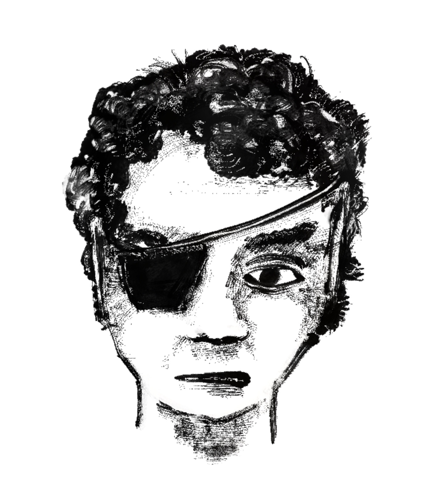

<address>Written by Alex Schroeder. Based on a translation by Frotz
Self and Peter Fröhlich, YYYY-MM-DD. To the extent possible under law,
the authors of this work has waived all copyright and related or
neighboring rights to this work.</address>

# Knives

## What are we even doing?

You have a super simple RPG in front of you. All you need are some
friends and two regular six-sided dice, maybe some pen and paper, and
you’re good to go. One of you will referee the game. Is that you? All
other players think up a person. The referee dreams up a world and
situations for these imaginary people; the players say how they react
and the referee says how the world reacts, and so it goes on and on.
The story of these people is our story.

The dice are rolled when something with exciting consequences happens
and you want to leave the outcome to chance. Do people succeed in
their project or not?

This is a variant of the *Halberts* game where your character doesn’t
start fully fleshed out. Instead, you start as a young adult, with
nothing but a knife. And you’re not trained in knife fighting.

## Character Creation

If you are a player, you play a fictional person, your character.

First you choose your name, then you roll your attributes. You have
six attributes: Strength, Dexterity, Endurance, Intelligence,
Education, and Status. Roll two six-sided dice for the first four
attributes, add the two dice together (short: 2d6) and write it down.
You either inherit Education and Status from your parents (if you’ve
played them, up to a maximum of 7), or you start as an orphan with
Education-2 and Status-2.

> Example: Alex names his character Adalric and rolls 8 8 7 9;
> Berta names her character Brunhilde and rolls 10 6 9 5.
{ #stats }

Your character begins at age 16. You have no special talents. If you
want to begin the game with more experience, take a look at the
*Halberts* rules.

Your first job will be to make friends and connections.

.jpg)
A mercenary looking at a lake (1514), by Urs Graf
{: .pic .small }

## No money, no items

The only item of significance you own at first is a knife. In fact,
the only items of significance in this game are weapons: knife, spear,
halberd, épée, bow, lance.

The world of adventure is a medieval world beyond the reaches of
empire. There are no taxes to pay, no coins to earn and nothing to
buy. Everything is a question of *gifts* and *boons*. Make friends and
perhaps they’ll give you a gift, hoping for a gift in return. Render a
service to a powerful person and hope to be granted a boon. If you
find treasure, gift it to somebody with resources. You might make a
powerful friend.

### Gifts and boons

**Talent**: With every year that passes, you get to gain new talents.
Naturally you’re just not focusing on a single talent. The year is
long, after all. This is why you get to pick an appropriate table to
roll on during the winter phase. You’ll get one of the talents on the
list, but chance still plays a role.

**Weapon**: Join a militia and get a spear to fight with. Go to war
and you’ll be given a halberd. Rise to the rank of nobility and your
lord or lady gifts you an épée. Become a hunter and make your own bow.
Be knighted and get a lance and a horse.

**Secret Society**: Secret societies are always looking for new
members. There are secret societies for all walks of life. If they are
are crime rings, they’re looking for gangsters and thugs. If they are
guilds, the are looking for artisans. If they are magic schools,
they’re looking for mages. Prove your worth and you’ll be allowed to
join.

**Companion**: A young apprentice looking to learn from you, or a
talking animal such as a cat, an owl, or a raven. If your companion is
human, roll the six attributes (2d6 each for Strength, Dexterity,
Endurance, Intelligence, Education, and Status). They gain talents,
just like you. If they surpass you in your best talent, they leave.

**Dog**: You find a loyal friend. Damage 2d6; Endurance 3d6; Life 2d6.
Dogs require food.

**Horse**: Knighthood earns you a loyal mount from your liege. Riding
a horse allows you to wield a lance. The horse requires care and
feeding. Damage 3d6; Endurance 6d6; Life 3d6.

**Land**: Saving the life of a noble or winning a war with them might
get you a grant to a piece of land in the wilderness. Taking
possession of said land is up to you, of course.

**Chair**: Your talents as a mage have been recognised and a sponsor
offers you a teaching position at a magic school.

**Posts**: Your services to a community, be it gangsters or
administrators of the realm are recognised and once there’s a position
for you, they’ll think of you.

## Talents

Roll checks as follows: 2d6 ≤ attribute + talent. On very hard tests,
roll 3d6 ≤ attribute + talent. If no talent fits, or the matching
talent is missing, then -2. A +1 talent is good enough to do it for a
living.

The chance of rolling a target number or less on 2d6:

| 2    | 3    | 4    | 5     | 6     | 7     | 8     | 9     | 10    | 11    | 12    |
|:----:|:----:|:----:|:-----:|:-----:|:-----:|:-----:|:-----:|:-----:|:-----:|:-----:|
| 3%   | 8%   | 17%  | 28%   | 42%   | 58%   | 72%   | 83%   | 92%   | 97%   | 100%  |
| 1/36 | 3/36 | 6/36 | 10/36 | 15/36 | 21/36 | 26/36 | 30/36 | 33/36 | 35/36 | 36/36 |

A few key words about the individual talents.
**Air**: Magic related to wind, movement, and sound.
**Animals**: Magic related to animals and handling them.
**Behavior**: How to behave in noble company.
**Brawling**: The unarmed force, threats, and infliction of pain.
**Brewing**: Brew beer, concoct herbal tea, brew potions, mix poison.
**Bureaucracy**: An understanding of every administrative apparatus and the people who work there.
**Charm**: Magic that subdues people, controls their emotions.
**Climbing**: Climbing rocks and walls, moving in the mountains.
**Construction**: Building houses, castles, siege engines, digging pits and shafts.
**Crafts**: Woodworking, metalworking, filing, sawing, decorating and painting things.
**Culture**: An understanding of legends, paintings, songs, manners and customs of foreign countries.
**Diplomacy**: Negotiating treaties, avoiding violence, making peace.
**Discipline**: Control over groups of people and oneself against natural instinct.
**Distract**: Distracting people from something so that something else can be done unnoticed.
**Doors**: Magic that has to do with locking and opening doors and gates.
**Earth**: Magic dealing with rocks, tremors, the earth, and everything subterranean.
**Eyes**: Magic that allows distant or true vision.
**Fighting**: Weapon handling and killing.
**Fire**: Magic dealing with flames, explosions and destruction.
**First Aid**: Cleaning and stitching up wounds, setting bones, caring for the sick.
**Fusion**: Magic that fuses living things with other living things and things.
**Healing**: Magic that restores power to living beings and breaks curses.
**Illusion**: Magic that makes others believe things that are not true.
**Literacy**: Reading and writing.
**Necromancy**: Magic that allows resurrection and contact with the dead.
**Oratory**: Convincing with well-chosen words.
**People**: Magic used to read people’s minds and emotions.
**Pick**: Opening locks and doors.
**Planeswalk**: Magic that has to do with contact with other worlds and transition into them.
**Plants**: Magic related to plants and their growth.
**Riding**: Riding on animals, mostly horses.
**Running**: Long Distance Run, Short Distance Run, Rush.
**Shapeshift**: Magic that allows you to change shape.
**Singing**: Singing songs and playing instruments.
**Sleep**: Magic related to sleep and fainting.
**Sneaking**: Moving silently and hiding.
**Spying**: Scouting, tracking, observing.
**Storm**: Magic related to wind, rain, lightning and thunder.
**Tactics**: Setting up ambushes, using the terrain for combat.
**Tinker**: Building mechanical devices and using material properties.
**Trading**: Finding, sourcing, haggling, buying, and selling things.
**Transmutation**: Magic that transforms things into other things.
**Water**: Magic related to water, diving, swimming, and waterwalking.

## Gaining talents

With every year that passes, you get to gain new talents. Pick an
appropriate table to roll on during the winter phase and gain the
talent or increase the talent if you already have it.
{ #gaining-talents }

When you learn “Fighting”, choose a weapon instead: knife, spear,
halberd, épée, bow, lance. Note that you do not start with the Knife
talent even though you own a knife.

If you’ve spent the summer doing warrior things, pick one of the
following tables to roll on.

| 1d6 | Mercenary    | Guard        | Rider    | Officer     |
|:---:|--------------|--------------|----------|-------------|
| 1   | Construction | Bureaucracy  | Riding   | Literacy    |
| 2   | Running      | Discipline   | Singing  | Bureaucracy |
| 3   | Tactics      | Construction | Tactics  | Tactics     |
| 4   | First Aid    | Brawling     | Spying   | Diplomacy   |
| 5   | Craft        | Brewing      | Culture  | Behavior    |
| 6   | Fighting     | Fighting     | Fighting | Fighting    |

If you’ve spent the summer doing mage things, pick one of the
following tables to roll on.

| 1d6 | Aggressive | Passive | Manipulative | Transgressive |
|:---:|------------|---------|--------------|---------------|
| 1   | Fire       | Healing | Charm        | Shapeshift    |
| 2   | Air        | Sleep   | Singing      | Necromancy    |
| 3   | Water      | Eyes    | Diplomacy    | Transmutation |
| 4   | Earth      | Doors   | Illusion     | Fusion        |
| 5   | Storm      | Plants  | People       | Animals       |
| 6   | Fighting   | Brewing | Literacy     | Planeswalk    |

If you’ve spent the summer living a life of crime, pick one of the
following tables to roll on.

| 1d6 | Thief    | Thug      | Liar        | Murderer  |
|:---:|----------|-----------|-------------|-----------|
| 1   | Sneaking | Fighting  | Culture     | Fighting  |
| 2   | Spying   | Crafting  | Behavior    | Brewing   |
| 3   | Running  | Running   | Bureaucracy | First Aid |
| 4   | Climbing | First Aid | Literacy    | Sneaking  |
| 5   | Distract | Tactics   | Oratory     | Behavior  |
| 6   | Pick     | Singing   | Trading     | Tinker    |

Players can also [increase their status](#status-increase) by doing
appropriate deeds.

## Adventurer’s Life

If you want to do something and the outcome is uncertain, discuss with
the referee an attribute and a talent to use, provided there is a
suitable match. Roll 2d6 ≤ attribute + talent to succeed. If it’s very
hard, you might have to roll 3d6 ≤ attribute + talent.

If you attack successfully, you deal 2d6 damage unless you use a
halberd. This deals 3d6 damage. You can only attack as many times in a
fight as you have Endurance.

When you are first hit in combat, you must subtract the damage from a
random physical attribute. Roll 1d6: 1–2 is Strength, 3–4 is
Dexterity, 5–6 is Endurance. For all other hits, you may distribute
the hit dice yourself among the three physical attributes. You must
subtract any carryover from another physical attribute.

If one of your attributes drops to 0, you are slightly injured and
pass out. After 10 minutes you wake up again.

> Example: Brunhilde has Strength-10, Dexterity-6, Endurance-9. She
> gets hit for the first time and has to subtract 4+5=9 damage. Berta
> rolls a 1, so Brunhilde must subtract 9 from Strength (10-9=1). She
> won’t pass out! The second time she has to subtract 2+6=8 hits and
> chooses to subtract 2 from Dexterity (6-2=4) and 6 from Endurance
> (9-6=3). Now it’s getting close…

After the fight, all attributes recover half of the missing amount
(round down). If you are being treated by First Aid or a healer, you
are fit again in 30 minutes, otherwise the recovery takes 3 days.

> Example: After being treated with First Aid, she recovers.
> Brunhilde’s attributes: Strength 1+4½=5, Dexterity 4+1=5, Endurance
> 3+3=6.

If two of your attributes drop to 0, you are severely wounded and pass
out. You don’t wake up again for 3h and only the attributes from 0
recover to 1. With First Aid-3 or Healing-3 you can recover in an
infirmary in 5d6 days, otherwise you die.

If three of your attributes drop to 0, you die.

For all other creatures there are only Endurance and Life instead of
the known six attributes. When Endurance drops to 0, they faint; when
Life drops to 0, they die.

> Example: Adalric’s dog Tix has Endurance 3d6, Life 2d6. Alex rolls
> 1+4+5=10 and 5+2=7 and writes down 10/7 for the dog.

Hitting opponents wearing a metal cuirass is hard: roll 3d6 ≤
attribute + talent. The reason metal cuirasses are so rare is that
they are so hard to make. They are kept in armories for times of war.
You only put them on when marching into battle. They slow you down
when plundering and when fleeing; they are cumbersome to carry around
and they give you sores. Soldiers do not like wearing them.

## Character Sheet

<table>
<tr><th colspan="2">Attributes</th><th colspan="2">Weapons</th></tr>
<tr><td>Strength</td><td>__</td><td>Knife</td><td>__</td><td>Secret societies</td><td colspan="3">_____________________</td></tr>
<tr><td>Dexterity</td><td>__</td><td>Spear</td><td>__</td><td></td><td colspan="3">_____________________</td></tr></tr>
<tr><td>Endurance</td><td>__</td><td>Halberd</td><td>__</td><td>Allegiances</td><td colspan="3">_____________________</td></tr>
<tr><td>Intelligence</td><td>__</td><td>Épée</td><td>__</td><td></td><td colspan="3">_____________________</td></tr></tr>
<tr><td>Education</td><td>__</td><td>Bow</td><td>__</td><td>Patrons</td><td colspan="3">_____________________</td></tr>
<tr><td>Status</td><td>__</td><td>Lance</td><td>__</td><td></td><td colspan="3">_____________________</td></tr>
<tr><th style="padding-top: 1em" colspan="4">Mundane Talents</th><th style="padding-top: 1em" colspan="4">Magic Talents</th></tr>
<tr><td>Behaviour</td><td>__</td><td>Brawling</td><td>__</td><td>Air</td><td>__</td><td>Animals</td><td>__</td></tr>
<tr><td>Brewing</td><td>__</td><td>Bureaucracy</td><td>__</td><td>Charm</td><td>__</td><td>Doors</td><td>__</td></tr>
<tr><td>Climbing</td><td>__</td><td>Construction</td><td>__</td><td>Earth</td><td>__</td><td>Eyes</td><td>__</td></tr>
<tr><td>Crafts</td><td>__</td><td>Culture</td><td>__</td><td>Fire</td><td>__</td><td>Fusion</td><td>__</td></tr>
<tr><td>Diplomacy</td><td>__</td><td>Discipline</td><td>__</td><td>Healing</td><td>__</td><td>Illusion</td><td>__</td></tr>
<tr><td>Distract</td><td>__</td><td>First Aid</td><td>__</td><td>Necromancy</td><td>__</td><td>People</td><td>__</td></tr>
<tr><td>Literacy</td><td>__</td><td>Oratory</td><td>__</td><td>Planeswalk</td><td>__</td><td>Plants</td><td>__</td></tr>
<tr><td>Pick</td><td>__</td><td>Riding</td><td>__</td><td>Shapeshift</td><td>__</td><td>Sleep</td><td>__</td></tr>
<tr><td>Running</td><td>__</td><td>Singing</td><td>__</td><td>Storm</td><td>__</td><td>Transmutation</td><td>__</td></tr>
<tr><td>Sneaking</td><td>__</td><td>Spying</td><td>__</td><td>Water</td><td>__</td><td></td><td></td></tr>
<tr><td>Tactics</td><td>__</td><td>Tinker</td><td>__</td></tr>
<tr><td>Trading</td><td>__</td><td></td><td></td></tr>
</tbody>
</table>

### Summary of the rules

Character creation: Roll 2d6 for Strength, Dexterity, Endurance and
Intelligence. Use Education-2 and Status-2 unless you’re inheriting
from your parents. You start without talents.

Task resolution: Roll 2d6 ≤ attribute + talent to succeed. If it’s
very hard, you might have to roll 3d6 ≤ attribute + talent. If you
hit, you deal 2d6 damage unless you use a halberd. This deals 3d6
damage. You can only attack as many times in a fight as you have
Endurance.

When you are first hit in a fight, you must subtract the damage from a
random physical attribute. Roll 1d6: 1–2 is Strength, 3–4 is
Dexterity, 5–6 is Endurance. For all other hits, you may distribute
the hit dice yourself among the three physical attributes. You must
subtract any carryover from another physical attribute (Strength,
Dexterity or Endurance).

If one of your attributes drops to 0, you are lightly wounded and pass
out. If two of your attributes drop to 0, you are mortally wounded and
you’ll die unless you are treated by somebody with First Aid-3 or
Healing-3. If three of your attributes drop to 0, you die.

## Combat

Combat is divided into rounds. Everyone may attack, cast magic, or do
something else once per round. All participants announce their action
and roll the dice. Everything happens at the same time so it is
possible for two opponents to take each other out in the same round.

> Example: Brunhilde has Strength-10, Dexterity-6, Endurance-9, and
> Fighting-1. She tries to reach the farm, but two goblins are hot on
> her tail, with Damage-3, Endurance-1, Life-5, Fight-5, Attack-9,
> Escape-4. She turns to fight. First round: Berta rolls a 6 and hits
> because 6 ≤ 10+1. Claudia rolls 5 and 6 for the goblins and hits
> twice since 6 ≤ 9. Berta rolls 6 damage which kills a goblin (both
> Endurance and Life are reduced to zero), but the other still stands.
> When Brunhilde takes the first hit, chance decides which attribute
> to reduce: Berta rolls a 4, which is Dexterity. The goblins deal 3
> every time they hit (6-3=3). Berta decides to deduct the second hit
> from Brunhilde’s Endurance (9-3=4).

When an advantage is gained through tactics, the result is often a
surprise round where the opponent cannot strike back.

Expect to see half the participants down or dying after the first
round. War is terrible. Try to avoid it.

.jpg)
Battlefield (1521), by Urs Graf
{: .pic }

And with that we come to the end of the player facing rules. The rest
of this book is advice for the referee. If you want to referee a game,
read on!

## Opponents

People can be described with a few words. If they attempt to do things
that can succeed or fail and it might result in an interesting plot
twist, use one of the well-known six attributes: either choose freely
(the average is 7) or roll for the attribute you need right now (2d6).
Talents are also freely determined (often 1 or 2).

Monsters and animals have different characteristics that describe
their behaviour: Count determines how many one is most likely to
encounter (the number of mounts matches the number of riders); Damage
determines how much damage they deal if they hit; Endurance determines
how many rounds they’ll fight and how much damage they can take; if it
drops to zero, they faint; excess damage is subtracted from Life; if
it drops to zero, they are mortally wounded; Fight determines whether
they fight when encountered (2d6 ≤ fight); Attack determines how well
they hit (2d6 ≤ attack), and Escape determines if they attempt to
escape when they’re not attacking (2d6 ≤ escape). If they neither
fight nor escape, they want to talk or interact in some other way.
{ #opponents }

| 1d6 | Opponents  | Count  | Damage | Endurance | Life | Fight | Attack | Escape |
|:---:|------------|:------:|:------:|:---------:|:----:|:-----:|:------:|:------:|
| 1   | Nightlings | 2d6    | 2d6    | 1d6       | 1d6  | 1d6+4 | 1d6+5  | 1d6+3  |
| 2   | Predators  | 1d6    | 2d6    | 3d6       | 2d6  | 1d6+5 | 1d6+6  | 1d6+2  |
| 3   | Undead     | 1d6    | 2d6    | 3d6       | 4d6  | 1d6+6 | 1d6+7  | 1d6+0  |
| 4   | Mounts     | varies | 3d6    | 6d6       | 3d6  | 1d6+4 | 1d6+4  | 1d6+2  |
| 5   | Giants     | 1      | 4d6    | 8d6       | 4d6  | 1d6+3 | 1d6+8  | 1d6+0  |
| 6   | Dragons    | 1      | 6d6    | 10d6      | 5d6  | 1d6+2 | 1d6+9  | 1d6+0  |

Note down when you roll something and keep using those numbers. This
is how players learn about the strengths and weaknesses of the
opposition.

> Example: Claudia referees the game and needs goblins that ride on
> giant spiders that ambush the vanguard. There are 7. She uses the
> line of nightlings and mounts. Goblins: Damage-3, Endurance-1,
> Life-5, Fight-5, Attack-9, Escape-4. Giant Spiders: Damage-15,
> Endurance-16, Life-12, Fight-9, Attack-5, Escape-7. In this
> campaign, goblins are rather harmless opponents who ride on terrible
> giant spiders, which, oddly enough, are not very good at hitting
> things.

Always announce impending danger clearly, so that the players can
decide for themselves whether they want to engage in a fight.

> Example: Claudia describes how the car-sized shadows push through
> the undergrowth, how their acrid smell spreads and the animals in
> the barn panic.

If possible, the players should roll the dice, not the referee. For
example, if they want to lure the opponent into an ambush, or notice
an ambush, someone should roll against Intelligence + Tactics in both
cases.

## Magic

Just like you slowly build up a pool of enemies, you need to work out
an understanding of just how powerful magic is with the players.

> Example: How many goblins can Adalric kill with lightning? Alex and
> Claudia agree that lightning can hit a giant spider including its
> rider, doing 5d6 damage to each, or chain lightning can hit five
> goblins, doing 2d6 damage to each.

The same applies here: Make a note of what you negotiate and stick to
it!

> **Lightning**: hits an enemy and what they are carrying for 5d6 damage each  
> **Chain Lightning**: hits up to 5 enemies for 2d6 damage each

Since spells are stronger than weapon attacks, one shouldn’t be able
to cast any number of them. With each spell cast, the risk of
exhaustion increases. Therefore, when casting spells, the modified
rule applies: roll 2d6 + number of spells cast today ≤ attribute +
talent to succeed. If the check fails, the talent can no longer be
used today.

> Example: Adalric conjures rain for privacy. He has Intelligence 9,
> Water-1, making a total of 10. Alex rolls 10 + 0 since this was the
> first spell of the day. It’s raining because 10 ≤ 10. Chain
> Lightning follows: Alex rolls 5+1=6 and 6 ≤ 10. That kills five
> goblins.

Magic always leads to discussions. You have to like that – otherwise
you should skip the Mage career. How long can you breathe underwater?
Can you do magic underwater? What happens when you cast lightning
underwater? The important thing is to agree at the table and to write
down the result.

Not all magic talents are equally powerful, or equally useful. You
also have to live with that. Certain magic talents lend themselves to
druids, bards, healers.

### Some notes on particular spell effects

*Summoning*. There is no talent to summon demons or elementals.
Instead, use planeshifting and subjugate some demons in person.

*Charm*. Being forced into doing things you don’t want to do is
nauseating and revolting. When the magic ends, the anger starts.

*Prophecy*. It is not possible to foresee the future. A role-playing
game is not a saga; fate is not predetermined.

## Campaigns

A campaign is the long game. Maintaining interest over multiple years
time can be tricky. In addition to that, you can’t prepare the whole
game before it starts. This section helps you run the long game.

The following elements all generate and maintain long term interest:

* The changes player actions effect on the game world
* The changing game play for players as their characters grow in power
* The changed understanding of the world as time progresses

The long game promises ever changing game-play. Here are some
suggested changes you can first foreshadow and then institute:

*Interventions*. People ask for help and when player characters help
out, the situation changes for the better – visibly, permanently.

An example would be a village that suffer from raids by spider
goblins. As the party arrives, the villagers beg the party to rid the
village of the goblins. If the party succeeds, the villagers will
remember. Whenever the party passes through, there is a feast and the
villagers sing their song.

To foreshadow this, make a list of a handful of interventions that
non-player characters have made, such as: “Thidrek slew the giant Grim
sword Nagelring which the dwarf Alberich had made for Thidrek.” It
connects two non-player characters that can be met, it introduces an
important item that can be gained, it establishes a bit of history of
the setting that promises more to learn – this one sentence pulls a
lot of weight.

.jpg)
A town by the lake shore (1514), by Urs Graf
{: .pic .small }

*Reputation.* Non-player characters have a reputation for at least
one thing they did in the past, big or small. The sentence above
with Thidrek slaying the giant is a non-player character having a
reputation. It foreshadows that reputation can be gained.

As soon as the player characters have done something similar, have
people react to the reputation this engenders. Give players epithets
like “dragon slayers” or have people remember how they stole
Alberich’s cloak of invisibility. This is the reputation they gain.

*Reactions*. The reputation gained has an effect on the world. When
the player characters are young, the beggar king of Signisport
harasses them. When the player characters are older, the beggars of
Signisport report to them and try to win their favour.

Don’t hold back with positive reactions. This is not a valley of
tears. The adventure game is entertaining because it allows us to
overcome adversity. We are powerless enough in the real world. Let’s
not put that into our games for the sake of “realism”.

*Power levels*. Every increase in talent unlocks new powers. You need
to decide what the range of power levels is going to look like. A good
range would be from 1 to 5. An Education-11 Fire-5 Pyromancer is able
to pass a difficult check with 3d6 ≤ 16 with 98% chance of success.
Thus the entire span of talents fits into the range from 1 to 5: First
Aid-1 is good enough to do the job of a field medic, but only a First
Aid-3 or Healing-3 will save a man doomed to die. Similarly, a
sorceress with Fire-5 knows the secrets of Muspelheim and has spoken
with Sutr, the lord of fire.

.jpg)
Mercenaries gathering (1515), by Urs Graf
{: .pic .right }

*World changing events*. If the players aren’t changing the setting,
it changes of its own accord. This is why you shouldn’t invest too
much in the present state of affairs. Instead of thinking about the 28
cousins of the duke, invest some time in 4 cousins of the duke and be
ready to overthrow the duke and his family.

To foreshadow this, make sure that you occasionally mention how things
used to be different. Remember how quickly times change. Here are
Celts, they want to move but Caesar conquers Gaul instead. Not long
after that, the Romans leave, the Goths come. Then the Franks. Then
the Vikings. The Normans. All of that in the span of a few hundred
years. Have a list of two or three previous periods to refer to. The
invasion of the Huns. The reign of the Völsung.

*The present*. Make sure big changes are not a thing of the distant
past. The era when giants ruled the earth is interesting lore and
explains the existence of giant castles, but it doesn’t mean much
unless they’re coming back in the next handful of sessions. Then
again, if they are – more power to you!

To foreshadow this, have visible agents of future change show up.
There are rebels in the imperial capital – the rebellion is brewing
right here, right now. There are reports of war bands signalling
coming invasion. There are refugees from the recent floods and the
oracles say it’s going to get worse come rainy season. These people
show up in the next session. Change is afoot!

*Understanding*. Some players feel happy when they find an explanation
for how things work, why things are the way they are. Perhaps humans
have a tendency towards searching for causes. In order to satisfy this
curiosity, create (very short) histories for places and cultures that
can be discovered through play. Don’t have players learn about these
through books or sages. Have them discover these secrets.

To foreshadow this, knowledgeable non-player characters are always
eager to learn more, willingly part with information they have and are
always happy to get updates from player characters. Don’t lock
knowledge away. Don’t make sages tight-lipped and cagey. Instead, let
them be librarians, always eager to add new books to the library (and
place books liberally in your setting). In exchange for books found,
librarians divulge more secrets, and place new burial mounds, new
ruined castles and new entrances to the underworld onto the players’
map. This is easily combined with “interventions” above: The sages and
librarians ask the players to follow up on cues and are grateful when
they do. Another virtuous cycle ensues.

An example for such a chain of secrets would be this: The power of the
king is due to the riches he amassed → he got these riches from a
dragon’s hoard → he got this heard with an invisibility cape → he got
this cape from a dwarf king → this dwarf king still lives in Niflheim
and has cursed the gold. These chains don’t have to be too long. Five
steps is a good start. Make sure to have several such chains.

Here’s another example: The king’s wife used to be a ferocious fighter
→ she had promised to marry only the one would best her in a wrestling
match → the king didn’t stand a chance and had implored his best
friend to help him – using the invisibility cape → this best friend
then got to marry the most beautiful woman in the land.

Each link in the chain is a secret to be uncovered, each can be an
aside learned in an adventure. The adventure is never just about
learning such a secret. The secret is icing on the cake.

*The short game*. If you’re just interested in a handful of sessions,
pick *Halberts* and start with older, more powerful characters,
potential movers and shakers in the world. *Knives* doesn’t have long
lists of monsters to fight, or magic items to win, or spells to learn.
Those imply a kind of changing game-play over time. That’s why you
need to focus on all the other aspects touched upon in this section.

## Running the game

Questions can inspire us to think about issues and they make it clear
that our input is required. Reading a setting or an adventure book is
less useful because it takes a long time and when you’re in trouble,
your instinct will be to turn back to the book you’ve been reading.
This slows you down and you’ll feel inadequate. Don’t do it. Questions
let you know that whatever you come up with is OK.

There are different kinds of questions that are important to the game.
Think of them as table techniques.

### A question of style

A simple question to ask is how things are accomplished or how they
fail. Players announce what they want their characters to achieve, you
clarify the intent and indicate what a successful outcome would
entail, you warn them about consequences of failure, you suggest the
attribute and the talent and whether to roll two or three dice. If the
players accept, they pick up the dice and roll.

Once you know about success or failure, and having established the
consequences, you can move on – or you can linger for a bit. Give that
character a little spotlight and ask about how they did it, why they
did it, how they felt as they did it. Why did that speech fail, was it
something they did? Perhaps the player doesn’t have an answer. No
problem, you already agreed on the consequences. But maybe the player
feels like embellishing it or putting their own spin on it. This is
the moment! You ask them a question and they get to tell us about
their character. It’s an entertaining moment of character exposition
at the table.

### A question about the past

In-game knowledge is not covered by the rules. There is no history or
geography talent, for example. And yet, characters probably do know
something. So if the characters are about to enter Hunland, they might
ask you about the inhabitants. You can turn that around and ask the
players whether any of their players had previous experience with a
guest from Hunland or whether their parents had ever taken them there.

These questions are about player characters and their backgrounds. If
the player likes to improvise these details, they get to entertain
everybody at the table and to enrich the game and everybody gets a
glimpse into the past of a fellow character. It’s a short moment of
spotlight within the context of the game. The answer given by the
player colours the answer you’re going to give about the inhabitants
of Hunland. The questions build on each other. It’s a virtuous cycle.

### A question of character

Cultivate a sense of wonder about the player characters. What are they
doing, what are they thinking, what are they feeling? Don’t ask these
questions at the table but keep them in mind when daydreaming. These
questions are asked and answered through play. If Isolt and a player
character are on a ship, start wondering about the player character.
Are they faithful to their partner? Are they loyal to their king? Let
Isolt fall in love with the character and you’re all going to find
out!

The situation develops into a question directed at players. Does the
character elope with Isolt and prove to be a lover, not a fighter?
Let’s see. Actions count more than words, both in the game and out of
the game.

Questions for players work on two levels. The first level is: What do
you do? The bandits are asking for the tribute they demanded last
year. Are you helping to defend the village or are you leaving? The
second level is: How hard is your soul? The headman begs you to stay.
The miller asks you to protect the mill that’s outside the perimeter.
The farmer hides his daughter from you. All these questions pop up as
you daydream about the bandits, the village, the player characters,
and you wonder: What are they doing, what are they thinking, what are
they feeling?

### Questions for referees

Players can ask you questions: Are there any consequence for killing
the baron? Can we get rid of Rasputin?

Sometimes players will let you know what they have in mind. Sometimes
you’ll have to ask them. Sometimes they don’t know. If player’s don’t
know what they want, then that’s OK. Present them with more choices.
It’s your turn to ask them questions. See the next sections.

If you know what the players are wondering, set up situations that
allow us all to find out. Are there consequences for killing the
baron, of getting rid of Rasputin? Of course there are! How are the
players going to find out? An assassination needs to be planned.
Allies need to be found. Plans for a succession need to be made.
Friends need to be in place. Moles have to be planted.

As players ask the question, you start to dream. Perhaps you remember
reading about the assassination of Rasputin? Look it up, think about
the parts you find fascinating. The tables turn and now you get to ask
questions. How are the going to find allies? Once they do find allies,
use the ally to tell players more. The ally is worried about the power
vacuum. Who’s going to succeed the baron? Who’s going to talk to the
guards? The players wanted to know, and you’re giving it to them in a
way that leads to more questions. It’s more of that virtuous cycle.

### Guiding questions

Guiding questions guide you through unfamiliar dreamlands. Why are the
dwarves undermining the castle? It’s not giant moles, it’s not purple
worms, it’s small and skinny dwarves like Alberich and Mime from the
Niebelungenlied. The question implies the existence of dwarves and
asks you about their motivation. Your input is required.

As you daydream about the setting, imagining landscapes and people and
problems, the questions can be a guide into an unfamiliar dreamland.
The questions get you into the mood for a game that’s unfamiliar to
you.

You often need to make up stuff. You read your notes and remember your
ideas and then you fill in the gaps at the table. You present a world
to the players that is apparently seamless and ongoing, forever
conjuring up new material. Wherever player characters go, there’s more
to see and more to discover. Sometimes, you didn’t prepare for this.
In these moments, you fall back to what is familiar. Falling back to
familiar ideas is something all referees do.

Between sessions, however, you prepare for the game. The conjuration
at the table are not arbitrary. Sessions are short and between
sessions, you prepare again. This is why guiding questions are
important. They help you prepare the unfamiliar. You’ll fall back to
the familiar at the table, when you’re stressed, and that’s OK.

### Taking questions off the list

Review the questions after a few sessions, note which of them have
been answered and move on. There’s no point in dwelling on them.
Replace the questions that have been answered and the questions you no
longer care for with new questions.

.jpg)
Recruiting (1521), by Urs Graf
{: .pic }

## Adventures

Where do ideas for adventures come from?

*Player needs come first*. The character needs are only of interest in
so far as consistency increases our willingness to believe in the
fantasy world and therefore it entertains us. If the actions of
characters hurt a player, then it’s time for them to go. Let the
player make a new character who’s a better fit. If the adventure bores
the table, then it’s time to change track. Move the characters into a
different situation.

*Mutual entertainment*. This means that players must care for the
other players at the table. Lift each other up. Engage with each other
and the situation. If one character is a morose pyromaniac or a secret
devil worshipper, try to be a good friend to them and see where that
tension takes you. If one character is a lighthearted religious
fighter, try to be a serious religious fanatic, a serious atheist. If
one characters is a fighting machine, call upon them to solve problems
with violence, treat them like a thug. Or try to educate them and lift
them up. The point is to pick something in your friends’ characters
that you can engage with, and do it. Don’t make their lives miserable
– look for just the right level of banter between the characters.
Something to say to each other during the game.

*Player agency*. In a game that takes place in your imagination, the
greatest asset we have is the freedom of it all. We can make decisions
and the imaginary world reacts. We can try things we don’t usually do, be
the people we don’t usually are. This is why decision making is
essential. Skip the long monologues, the long descriptions, the long
transitions – move quickly until the game needs players to make a
decision. “What do you do?” These can be big decisions or small
decisions. Do you join the court of Etzel? Do you fight the dragon? Do
you support the dwarves? Do you taunt the mermaids? Are you courteous
to the librarian? Do you flirt with the mercenary? Don’t invalidate
choice by asking for a decision that has no weight.

*Risk taking*. Making a decision is exciting when there’s something at
risk. It’s like betting. A character stays in the fight because the
player is betting on them winning that last exchange. A character
flirts with the mercenary betting to win them over without a fight.
Emphasise the danger and highlight the reward until it’s a hard
decision to make. The risks must always be worth it. Some players like
to play it safer than others. Encourage them with non-player
characters, help them control the risk, don’t push them too hard. Aim
for those butterflies.

*Community building*. When villagers are grateful, when prisoners are
rescued, when the downtrodden are lifted up, there’s your opportunity
to get into community building. This is an example of goals players
can set themselves. Encourage this by having non-player characters
suggest it. Have the grateful ruler present a character with a land
grant. Once community building begins, the community members have
needs that must be met. Use these as inspiration for future
adventures.

*Buildings*. Buildings can house your community or they can act as
signs of power and influence. Build a castle to house retainers. Build
a ditch, a palisade or a wall to protect the village. Build a
fortified bridge to defend against pirates raiding inland on their
ships. Have non-player characters suggest and organise it so that you
can take their needs into account when thinking about future
adventures.

Usually nobody at the table knows what exactly is required for
buildings. Assume that everything is handled by the builder with a few
exceptions. It’s these exceptions that turn into adventures: These are
building blocks that the builder could not organise. Organising them
involves an adventure.

*Family*. Encourage characters to raise a family. You can look at it
as a particular way of building community, but it also plays into our
expectations. Let players play the relatives and children of their
deceased character. This encourages other players to raise a family.
Finding a partner and rising in status to find a good match provides
more ideas for adventures.

*Status*. Each Status score qualifies a character for certain events
that raise their status even further. In marriage proposals and in the
choice of boons granted by superiors, the current status of a
character is essential. Families do not consent to a child’s marriage
below their station. Lord and ladies don’t grant land to orphans.
{ #status-increase }

The following table reflects a society of nobles and warriors where an
intellectual is always inferior to a warrior and a warrior is always
inferior to a noble. The last column provides ideas for future
adventures. By succeeding in an appropriate adventure, player
characters get the option of increasing their Status by 1 that year,
in addition to [rolling for a talent increase](#gaining-talents).

| Status | Examples                 | Qualifies for…                    |
|:------:|--------------------------|-----------------------------------|
| 2      | orphan, beggar           | a job                             |
| 3      | worker, peasant, artisan | confidence, secret plans          |
| 4      | citizen of good standing | secret society membership         |
| 5      | member of society        | public office, public works       |
| 6      | officer                  | a position to teach               |
| 7      | magister                 | a position as an advisor at court |
| 8      | warrior                  | being knighted, a land grant      |
| 9      | knight, lady             | building a castle                 |
| 10     | baron, baroness          | leading an army                   |
| 11     | duke, duchess            | being crowned, winning a war      |
| 12     | royalty                  | empire, conquest                  |
| 13     | emperor                  | eternal life and undeath          |

*Education*. By succeeding in an appropriate adventure, player
characters get the option of increasing their Education by 1 that
year, in addition to [rolling for a talent increase](#gaining-talents).
What are appropriate adventures? Diplomatic missions, expeditions to
foreign lands, time spent in other realms, library adventures.
{ #education-increase }

*Growing old*. People work the fields in spring, go on adventure in
summer, bring in the harvest in autumn, cut wood, raise a barn, study.
They grow old. When characters or their companions are 36 years old,
and every four years after that, they need to check for physical
decline. If an attribute falls to zero, the character dies.

| 1d6 |     Aging Table |
|:---:|----------------:|
| 1   |     Strength -1 |
| 2   |    Dexterity -1 |
| 3   |    Endurance -1 |
| 4   | Intelligence -1 |
| 5   |          Lucky! |
| 6   |          Lucky! |

After a certain number of years, the health of animals starts to
decline as well. Horses start to lose 1 Life per year after 20 years
of service. Dogs start to lose 1 Life per year after 10 years of
service.

*Death*. When a character dies, their land, buildings, animals, and
weapons are divided fairly between surviving partners and children.

*Children*. Raising a child as your own, allows it to inherit
Education and Status up to 7 when it reaches 16 years of age. Children
raised by more than one parent get to chose which Education and Status
they inherit.

This game doesn’t care about the dangers of child birth, of disease,
the difficulty of raising a family, the sanctity of marriage, the sex
lives of characters. Run the game you want and let players experiment
with leading different lives.

.jpg)
A warrior with woman and two children (1508), by Urs Graf
{: .pic .small }

## Fragments of Play

This section offers examples from an imaginary game illustrating all
the ideas. The three people involved Alex, Berta and Claudia. Alex
plays Adalric and Berta plays Brunhilde; Claudia is the referee.

### Preparation for the first game

Before meeting for the first time, Claudia already knows that the two
characters have Status-2 because it’s the start of the campaign. These
two kids did not inherit Education or Status. Looking at the
[Status](#status-increase) table, this means they’ll need a job. The
[Education](#education-increase) section mentions library adventures.
Should either of the two plan on playing a mage, increasing Education
is going to be on their mind.

Visiting somebody in a library and getting a book is the adventure.
Questions: Who needs the book? Who opposes this? Other urchins that
didn’t get the job: Urs the bully, with Status-3 (also an orphan but
with slightly better Status) and Discipline-1 (which I just assigned).
He’s not much of a boss, but there’s also Strength-8 (above average)
and Brawling-1 (also assigned). If Discipline and Brawling are his
only talents, he’s 18 years old, two years older than the new
characters Alex and Berta are going to make.

Question for later: Does Urs have friends? Does he have enemies? Play
to find out! He probably has a lackey, and there’s probably a love
interest as well, right?

The library belongs to a wizard. Claudia needs a name and picks
“Ulrike the Beautiful”. The starting village also needs a name. Maybe
the village has always belonged to Ulrike’s family and the rulers all
have names that sound similar: Ulrich, Ulberth, Ulberga. Ulrichen!

This makes her wonder about Urs the bully. The name sounds similar to
Ulrike. Are they related? A question to save for later.

Claudia needs some more adventure ideas. How about adding a secret
society? “The Brothers and Sisters of Horned Mask” – a society that
wears masks at their meetings. They all know each other in real life
but within their society, they also represent the animal or demon of
their mask. So miss Trudeberg, the head of a large family farm, wears
the wooden mask of a devil with deer horns and red pearls hanging from
its ears. It’s the local “Cherry Devil”, known to tempt the young with
poisonous fruit. And indeed, she is a talented brewer of potions and
poisons. Maybe she needs the book. Why doesn’t she fetch it herself?

Trudeberg is looking for a particular fruit, the “Black Eye Grape”. It
grows in the ruin of Hawk Rock, rumoured to be home to a “wild man”,
a forest creature that doesn’t speak and hates all humans.

All of these ideas show that some random tables for quick name
generation are in order because names are important. They allow
everybody at the table to write down a name and add more information.
This is how the imaginary world gets fixed in our imagination.

### Secret societies

Secret societies consist of three parts: a pompous prefix, the kind of
organisation, the word “of” and some sort of political goal or
aspiration.

Pompous prefixes: Most Agreeable, Almighty, Great, Formidable,
Invisible, Ever Present.

Kinds of organisations: Association, Brothers and Sisters, Bund,
Cooperative, Fellows, Fellowship, Friends, Soulmates.

Goals: Daredevils, Everlasting Peace, Health and Longevity, Joy and
Happiness, Revenge, a Glorious Future, the Imperial Restoration, the
Rebellion, the Resurrection of the Emperess, the Resurrection of the
Emperor.

Examples: The Most Agreeable Association of Everlasting
Peace, The Formidable Friends of the Imperial Restoration. The Ever
Present Cooperative of a Glorious Future.

### Short names

Women: Ada, Anna, Berta, Chloe, Dora, Elsa, Frieda,
Gisela, Hilde, Inge, Ulrike.

Men: Ardo, Dodo, Else, Etzel, Gregor, Gundobad, Gyso, Hagen, Iring,
Otto, Siggo.

### Long names

Long names consist of a prefix and a suffix. You can generate a name
for a man and append either -a or -e to turn it into a name for a
woman. Examples: Gerfrieda, Osrate, Sigisinde.

Prefixes: Adal-, Albe-, Amal-, Bald-, Bert-, Bote-, Brun-, Charde-,
Chari-, Charle-, Childe-, Chilpe-, Chlodo-, Chrodo-, Clot-, Crot-,
Dago-, Dank-, Ecke-, Gel-, Ger-, Ger-, Gib-, Gisel-, Gote-, Gunde-,
Gunt-, Hade-, Hel-, Her-, Hilde-, Horn-, Hu-, Ingo-, Krim-, Lude-,
Man-, Mero-, Nant-, Nor-, Ort-, Os-, Pil-, Ram-, Rich-, Rit-, Ro-,
Rudi-, Rum-, Schili-, Schru-, Sieg-, Sigi-, Sind-, Theude-, Tris-,
Ul-, Vorti-, Vulde-, Wal-, Walt-, Werb-, Wich-, Wisi-, Wite-, Wolf-.

Suffixes for women: -berga, -burg, -fled, -gard, -gund, -hild, -lind,
-trud. Examples: Adalberga, Waltburg, Gerfled, Rogund, Sindgard,
Wolftrud.

Suffixes for men: -ald, -bart, -bert, -boge, -bung, -brand, -chart,
-dung, -fried, -ger, -gang, -gast, -grim, -hard, -her, -land, -lieb,
-lung, -man, -mer, -mund, -mung, -nold, -not, -old, -rat, -ric, -sind,
-tan, -tram, -wart, -wech, -win. Examples: Dagobart, Manhard,
Tristram.

### Village names

Use a name of a person or an animal and a village suffix to name
villages.

Suffixes for villages: -ach, -berg, -burg, -en, -gau, -ingen, -lingen.
Examples: Hornach, Normungen, Ritliebingen, Ulrichen, Eelgau,
Lioningen, Ravensburg.

### Starting the first session

Claudia says, “Alright, Adalric and Brunhilde live in Ulrichen.
Anything we need to know about them? Parents? Siblings?”

Alex says, “Adalric is a slightly above average guy. Pretty smart.
He’d like to be a mage one day. He has a cloak and that’s more than
many kids his age have.”

Berta says, “Brunhilde is not very smart by pretty strong. I’m sure
she’ll be a good fighter one day. She has long brown hair in a thick
braid.”

Claudia says, “Right. Ulrichen has the tower of Ulrike the Beautiful,
a recluse and a wizard. You’ve both been called by lady Trudeberg, a
powerful head of a large farm, mother of many and grandmother of
countless children. She looks at you and says: ‘Adalric, I need you to
go up to the tower and ask lady Ulrike for a book called The Grapes of
Eelgau. Brunhilde will look after you.’ She waits. Do you agree?”

Alex says, “Sure, I want to meet the wizard!”

Berta says, “Brunhilde grumbles, why am I being commanded to be his
bodyguard?”

Claudia says, “You’re asking Trudeberg, yeah? She says she is sending
you because she knows you’re not afraid of anything and if you she’ll
have her daughter Gerfled teach you about stick fighting.”

Berta nods. “Let’s go.”

As you can see, Claudia improvised as she was talking. Berta seemed to
expect some sort of reward and she hadn’t prepared anything so she
looked at the list of names and picked a name for the stick fighting
daughter without missing a beat. At the end of the year, the players
get to pick one talent to increase. There is no stick-fighting talent
so this is an invitation to have Brunhilde learn Brawling-1, if Berta
wants to.

Note how neither of the players asked why protection was needed or why
the book was required. That’s fine. No exposition is necessary if
nobody is asking.

At the beginning we see how neither Alex nor Berta are into describing
their characters. A detail like a piece of clothing or a detail about
their looks is all it takes. Both looked at [their stats](#stats) and
improvised a little description. That’s all that’s required.

Claudia says, “As you walk through the village, you see some kids
driving pigs along the way. One of them is Urs. He sees you two with
your clean clothes and smirks. Then he drives the pigs your way.”

Alex says: “Ugh.”

Berta says, “Are you looking for a fight, Urs? I’ll give you a fight
if you want to.”

### Asking for rolls

Claudia says, “It’s a question of self-discipline to face a dozen pigs
on a muddy road without making a fool of yourself. How about a roll of
Intelligence + Discipline?”

Berta says, “Maybe. But courage in the face of a dozen pigs doesn’t
seem like something that depends on brains. How about brawns? Strength
gives confidence!”

Claudia says, “Allright, Strength + Discipline it is. If you fail, you
have to fall back. There’s no -2 penalty because I don’t think this
requires military discipline and experience. This is just a question
of courage.”

Berta rolls 2d6 and gets an 8 which is ≤ 10, Brunhilde’s Strength.
“Come here, Urs! Come and face me! Brunhilde pushes through the pig
herd.”

Alex rolls 2d6 and also gets an 8 which is ≤ 8, Adalric’s Strength.
“Yeah, Urs! You can’t hide behind the pigs. I see you!”

Claudia says, “I think he’s going to try and punch Adalric.”

Berta says, “And I’m going to punch him!”

Claudia rolls 2d6 and gets 5 which is ≤ 8 + 1; Berta rolls 2d6 and
gets 8 again, which is ≤ 10 - 2 (no Brawling!) – both Urs and
Brunhilde hit!

Claudia says, “As you beat Urs with a higher result, you have no
problem getting to him. You punch him just as he shoved Adalric into
the mud. I don’t think there’s going to be much of fight here, right?
They all just part ways?”

Berta says, “Yeah. I tell him: Don’t you ever touch my friend again,
you understand?”

Claudia says, “He’s holding his jaw and follows his pigs. This might
not have been the last of him.”

Claudia improvised the pigs. All she knew is that Urs was going to
show up and establish that he was not friendly, giving Brunhilde a
chance to show what kind of bodyguard she was. Apparently she’s loyal
and quick to strike. Adalric, on the other hand, appears to be meek
and willing to let her do the talking and posturing. We learned
something about player and non-player characters!

The part where Berta suggests a different attribute to use for the
roll is par for the course. The whole table gets to decide how things
are going to be resolved. It’s the referee’s responsibility to figure
out how to the world reacts to the player characters, but it is not
the case that the referee is the only one to decide what rules to
apply.

The fact that when both sides roll a success the one who rolls higher
is somehow more successful than the other is something Claudia decided
on the spot, based on her experience with another game she played a
few years ago.

### A powerful non-player character

Claudia says, “Adalric and Brunhilde are climbing the winding trail
that leads up to the tower of Ulrike the Beautiful. It’s a hot day in
spring and the crickets are loud. A crow seems to be watching you,
always retreating uphill as you approach.”

Silence. Alex and Berta don’t know what to do with the crow info.

Claudia jumps forward in time, “You arrive at the tower. It stands
right at the precipice overlooking the Ulrichen valley. You see that a
gap of a few meters separates Ulrike’s tower from the rest of the
mountain. It stands on a stone column of its own.”

Berta says, “It’s well defended. Do we see the witch?”

Claudia says, “As you look around, you see the face of a woman
appearing in a narrow window above the gate that opens into the void
separating the tower from you. ‘What do you want, kids?’”

Alex says, “I’ve come to fetch the Grapes of Eelgau for lady
Trudeberg!”

Claudia says, “I see… she wiggles her head and mumbles a few words.
The stone on both sides of the gap stretches, as if there were giant
hands beneath the surface trying to touch each other. You can walk
over these stone fingers to the door. It opens and there she is,
Ulrike the Beautiful.”

Alex says, “All right! I explain about the book. Lady Trudeberg needs
it. We’re just here to fetch the book. Or is she going to teach me a
spell?”

Claudia says, “She’ll let you take a look at her books for a day if
you’ll go up the mountain and pick some Blue Roaring Ears at the Lake
of Tears. Just be nice to the marmot man who lives by the lake. You
get the feeling that this could be the start of a working
relationship. Maybe also not the last errand you’ll run for her if you
agree.”

Alex looks at Berta and she shrugs. He says, “OK, we’ll do it.”

When the players handled Urs, Claudia realised she hadn’t prepared
much for Ulrike. What sort magic did she have? No time to roll dice.
That would have to come later. So a quick look at the
[list](#gaining-talents) and she jotted down Healing, Sleep, Doors,
Plants, Brewing, Charm, Diplomacy, Illusion, Literacy – classic
Passive and Manipulative careers.

After the game, Claudia picks Ulrike’s age, say 50. So we have about
34 years and therefore 34 dice to roll. Let’s take 4d6 and roll four
times on the Passive table, four times on the Manipulative table, and
add each of the skills we listed above at 1. Using 2d6 for attributes,
this is Ulrike the Beautiful: Strength-8 Dexterity-8 Endurance-12
Intelligence-6 Education-8 Status-3 Healing-2 Sleep-6 Eyes-4 Doors-2
Plants-5 Brewing-2 Charm-5 Singing-4 Diplomacy-4 Illusion-3 People-3
Literacy-4. Surprisingly fit! She probably does a lot of hiking up
here in the mountains. And fantastic Sleep, Plants and Charm talents!

### Encounters

The players are heading up into the mountains. Why is the lake called
the Lake of Tears?

Claudia says, “The way up is hard going. It’s steep and the wind is
cold. You’ve been hearing the marmots whistling and you’ve been seeing
the bearded vultures circling. How about you give me an Endurance roll
to see how well you’re holding up.”

Alex says, “What happens when we fail?”

Claudia says, “How about you need to send the night because you’re
exhausted?”

Alex rolls 10 which is higher than 7. Berta rolls a 12 which is higher
than 9. Neither has the Climb talent. Berta says, “It’s going to be a
long night.”

When Claudia had mentioned the marmot man, she didn’t have anything
particular in mind. Some kind of fay creatures – and so she rolls for
a [Nightling](#opponents): Damage-10 Endurance-6 Life-4 Fight-9
Attack-6 Escape-7. It’s aggressive and deals a lot of damage! Maybe he
wields a devil blade? Or is it some sort of desiccation magic that he
wields via the twigs of a sacred tree? She goes with that.

Now, questions: Is the marmot man evil? Why is he opposed to humans
gathering Blue Roaring Ears? How might he be convinced to part with
them? Why does he live up there? She jots down some ideas for later:
devil, giant, ice magic. How does he react?

.jpg)
A bearded man bearing a twig and wearing a pointy hat (1515), by Urs Graf
{: .pic .right }

| 2d6 | Reaction                              |
|:---:|---------------------------------------|
| 2   | attempt to kidnap and ransom you      |
| 3   | rob you, take your stuff              |
| 4   | threaten you and your friends         |
| 5   | demand help and cooperation           |
| 6   | refuse to cooperate                   |
| 7   | be sceptical, doubt your competence   |
| 8   | be wavering, doubt your success       |
| 9   | only take safe bets, stay in the back |
| 10  | cooperate, take reasonable orders     |
| 11  | be friendly, offer sympathy           |
| 12  | be helpful, offer advice              |

Don’t feel that the answers to all these questions should have been
prepared ahead of time. The players go in unexpected directions and
the world needs to expand, seamlessly. Wherever players look, more
stuff gets added. What we need to do is prepare the bones. Assembly
happens at the table.

### Between sessions

Adalric and Brunhilde spent then night up in the mountains, managed to
run from the wolves, met the marmot man and were courteous and he let
them gather some Blue Roaring Ears if they brought back Little Man
Moss to Ulrike and made sure she taught it all she knew about botany
for a year and a day. They agreed to that and went back, convinced
Ulrike to take the little green creature, got the book, brought it to
Lady Trudeberg, and Adalric was invited to read some books along with
Little Man Moss and Brunhilde was invited to come train with Lady
Trudeberg’s daughter Waltrud.

The sessions, people go home or log off, and Claudia is daydreaming
about the game. Time to think about all the non-player characters and
add some notes. Are Ulrike and the Marmot Man friends or foes? Maybe a
competitive relationship? Power over the plants and mushrooms? Is
there a passage to Myrkheim and the Ur-forest of the mushroom king?
Which side would the players pick? If they meet again, Marmot Man is
going to send them on a mission to Myrkheim. Ulrike is going to tell
them how to steal the secret of sleeping spores from the mushroom king
and the players will have to decide where their loyalties lie.

And what about Ulrike? With Sleep-6 she must have been to the
dreamlands, maybe she had a long love affair with Orpheus himself
which ended in opium-fueled nightmare battles and charms and counter
charms. And finally she left, retired to this place, started weaving a
net of plants and charms. This would be something to discover. What
would be the little secrets along the way? Orpheus’ ring. Also a great
treasure that somebody might want to steal – a new secret society,
perhaps? Books of nightmares and curses, dreamland violence. Those
books might be there for Adalric to discover, to ask Ulrike about
them, to see her mien freeze and hear her speak in the fell voice of
Cold Charm…

Claudia is throwing out words without knowing what they mean, but
it’ll be easy to add more words later, once she knows that the players
are in fact going to be interested. She just wants to stay one or two
steps ahead. If more stuff gets added wherever players look, that also
means that stuff remains open and vague as long as nobody is looking.
For now, she needs more seeds of conflicting loyalties, of love
interests, of envy and jealousy…

Lady Trudeberg and The Brothers and Sisters of Horned Mask, what about
them? Claudia reviews her notes and sees the grape was supposed to
grows in the ruin of Hawk Rock, which didn’t make an appearance and
that the “forest creature” there hates all humans. Since Claudia had
forgotten about it, Hawk Rock must be a ruin somewhere else and the
forest creatures is probably a bugbear. She prepares bugbears and
rolls on the [Nightling](#opponents) table again: Damage-5 Endurance-3
Life-5 Fight-9 Attack-9 Escape-9. Quick to attack, quick to run,
squishy, that’s the local bugbears.

What about Urs and his love interest? Claudia doesn’t want to add
domestic violence to the game, so perhaps the girl is Krimlind,
daughter of Krimhild, and there should be a scene where The Brothers
and Sisters of Horned Mask meet and some potion is shared, and
Krimlind is there and looking at Adalric and Brunhild across the room.
Let’s see if either of them reacts.

<!-- ### Work in progress -->

<!-- It’s difficult for players to focus on multi-year projects if they -->
<!-- keep getting distracted by “important” work. One way to solve it would -->
<!-- be to reduce the distractions. But where is the adventure in that? If -->
<!-- the point is an adventure game, the opposite is our goal: multi-year -->
<!-- projects manage themselves. -->

<!-- So here’s a classic task: let’s build a castle. You can’t buy a -->
<!-- castle, so how are you going to build it? Let there be a non-player -->
<!-- manager, a famous Construction-5 castle builder. He makes the plans -->
<!-- and spares us the details. What he does is make demands. He tells the -->
<!-- players what to do. We need tables to roll up his demands and -->
<!-- associated adventure bones. -->

<!-- *Arrange a marriage abroad.* You need more of the marble from foreign -->
<!-- lands. Do you know how to get there? Travel there by ship and travel -->
<!-- up river? Face pirates, cheating merchants, bandits, find a stowaway -->
<!-- and be chased by their enemies. There is no payment for the marble but -->
<!-- a promise of marriage for the marble quarry owner. You’re bringing -->
<!-- pictures and a negotiator to the table. The negotiator is a difficult -->
<!-- person but if you befriend them, you might have a connection to a -->
<!-- partner of your own. What kind of partner are you looking for? What -->
<!-- about the quarry owner’s family? Will you let yourself fall in love, -->
<!-- risk the mission and make a big career ending move – for your heart’s -->
<!-- desire? -->

<!-- *Mines.* There’s a problem with the iron mines, the gypsum dig, the -->
<!-- coal pit, the freestone cavern. Somebody has to go there, figure -->
<!-- what’s wrong and solve it: Maybe it is a werewolf has been killing -->
<!-- miners, or dwarves have shown up from below and demanded that the -->
<!-- digging stop. Why is that? And what about the robber knight and his -->
<!-- mercenaries that promised to return and sack the mining town unless -->
<!-- the protection money is paid are you going to do something about it? -->
<!-- Perhaps the mine operator has been replaced by a shapechanger who -->
<!-- loves to drink fine and eat piglets every day, a dozen eggs and more, -->
<!-- with expensive spices from foreign lands, all paid for by the -->
<!-- resources of the mine, or so they say. Find out, and decide how much -->
<!-- violence you are willing to apply in order to find a solution -->
<!-- agreeable to your lord and lady. Have the miners broken into an -->
<!-- ancient grave site and seen the dead sorcerers stirring? Calm the -->
<!-- miners and have them return to work. -->

<!-- *Quarry*. The quarry is in uproar. Kobolds have been pranking the poor -->
<!-- sods, stealing their clothes, filling their tents with spiders, having -->
<!-- their meat rot away. Can you find the invisible flying pranksters, -->
<!-- these cursed fairies, and can you put and end to their antics? They -->
<!-- hate the rackets the hammers are making, the chisels are grating on -->
<!-- their ears and the iron saws are turning the milk sour. Can you set -->
<!-- the necessary traps? Can you catch them and force those contracts that -->
<!-- will banish them for a year and a day, time enough to finish that -->
<!-- castle? -->

<!-- *Logging*. The loggers refuse to work. Wild men have been spotted. -->
<!-- Giants, they say. Or was it hairy beast men, naked and armed with -->
<!-- clubs? The Alder King is sending them, they say. Is it true? Who is -->
<!-- the Alder King? Do the spider goblin knights from the deep hills fight -->
<!-- for him? Is the troll on his side? Can you stop them all? Can you make -->
<!-- your way to the Alder King and take those long stairs leading you to -->
<!-- the goblin market? Do you know the rules governing that place? -->

<!-- ### More -->

<!-- This needs tons of ideas for a social setting with lords and ladies, secret societies, magic schools, gangs of thieves, mercenary bands, each with missions you can undertake for them, services you can render for them, big and small. Each comes with rewards. Whenever you roll the Fighting talent, you get granted an appropriate weapon, if you don’t have it already. -->

<!-- * Bring back the horses the men of Amalgard of Bearhall stole. If you do it, roll on the Thief or Mercenary list. -->
<!-- * Bring these donkeys and their load to Falconthorpe. If you do it, roll on the Guard. If you befriended Chrodotrud, you may roll on the Passive list instead. -->
<!-- * Go to the ruins of Frosthall and see if you can catch an Owl-wolf for Siggo the Aeromant. If you do it, roll on the Mercenary or Aggressive table. If you decide to spend the winter in Ramdale, receive a dog companion instead. -->
<!-- * Join the raid against Amalgard of Bearhall. If you do it, roll on the Mercenary table. If you helped steal any horses, you may keep one. -->
<!-- * Falconthorpe has been struggling with a manipulator. If you manage to drive him away, roll on the Mercenary table. If you decide to spend the winter there, in his house, studying the books, roll on the Manipulative or Transgressive table and tell us what sort of books you read. -->

<!-- What about treasure? If you find the Book of Redemption for Bishop Gregor, you can become a member of the secret society of the Librarian Militia of the Moon. There’s no point in getting rich yourself. The treasure you find allows you to barter for boons: land grants, titles, marriage proposals, memberships in knightly orders, secret societies, and so on. Those would also be part of the setting and adventure book. -->

<!-- Don’t write a setting with a timeline, a map, and names. Instead, write a pamphlet. Describe what to aim for, how to do it, with random tables to help you get started. More names. More missions. More treasure. More monsters. Conflicts with neighbours. Invaders. Unrest. Rebellions. Cultists. Wars. Tables. Tables. An essay or two. More tables. -->

<!-- ⁂ -->

<!-- Ideas by Judd Karlmann: -->
<!-- https://www.reddit.com/r/DMAcademy/comments/10rymic/comment/j6yka56/ -->

<!-- Build: Cathedral, Castle, Bridge, Tunnel, Mine -->

<!-- Diplomacy: End long war, stop war before it happens, support kingdom on the edge of chaos, support creation of a republic -->

<!-- Study: Ancient ruins, ancient technology, lost people, lost deity, alien incursion -->

<!-- Support (a cool organization that everyone believes in): an arcane library, a well meaning hospital, a diverse city, a wise temple, a druid’s grove -->

<!-- Destroy: a tyrant, systemic monsters, colonial oppression, a corrupt government -->

<!-- ⁂ -->

<!-- @starmonkey@dice.camp says: Feels like what I wanted Burning Wheel to -->
<!-- be like. Beliefs from BW feel like “personal questions” to be answered -->
<!-- in Knives. -->

<!-- Idea: Halberds Spells & Spellcasters PDFs with Knives - replace all -->
<!-- the magic talents with spells, go study with a mage to learn new ones. -->
<!-- Keep the exhaustion mechanic from Knives. -->

## Reading material

[Generator](https://campaignwiki.org/generator), a generator of characters and a mini-setting

[Halberts](https://alexschroeder.ch/pdfs/Halberts.pdf), a very similar game without advancement

[2d6 Math](https://alexschroeder.ch/pdfs/2d6-Math.pdf), some thoughts on probabilities

[Knave](https://questingbeast.itch.io/knave), a d20 game

[Simple Fantasy Adventure](https://winterstargames.itch.io/simple-fantasy-adventure), a 2d6 game

The images used are by Urs Graf. He lived in Solothurn, Switzerland,
around 1485–1527/28. The images are in the public domain. I got them
from the [online collection of the Kunstmuseum
Basel](https://sammlungonline.kunstmuseumbasel.ch/eMP/eMuseumPlus ).

.jpg)
Four mercenaries playing the transverse flute (1514), by Urs Graf
{: .pic .small }
